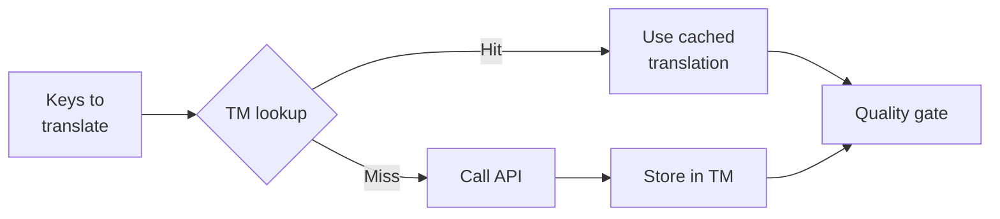

# Translation Memory

Translation Memory (TM) là lớp caching được tích hợp sẵn của rosetta. Nó lưu trữ mọi bản dịch được khóa (keyed) theo văn bản nguồn + locale + phương thức, vì vậy việc chạy lại `sync` chỉ gọi API cho các key thực sự đã thay đổi.

## Tại sao cần có TM

Nếu không có TM, mỗi lần `sync` sẽ dịch lại mọi key bị sửa đổi — ngay cả khi bạn đã dịch chính xác cùng một văn bản tiếng Anh cho cùng một locale trong lần chạy trước. Các tình huống phổ biến gây lãng phí tiền bạc:

| Tình huống | Không có TM | Có TM |
|----------|-----------|---------|
| Chạy lại sync sau khi thay đổi 1 key (500 key × 10 locale) | 5.000 lần gọi API | 10 lần gọi API |
| Hoàn tác một key về giá trị tiếng Anh trước đó | Gọi toàn bộ API | Trúng cache (cache hit) ngay lập tức |
| Cùng một cụm từ xuất hiện trong 3 file locale | 3 × lần gọi API | 1 lần gọi API + 2 lần trúng cache |
| Chạy thử (dry-run) → sync thật | Gọi toàn bộ API ở cả hai lần | Lần đầu lưu cache, lần sau tái sử dụng |

TM được **bật theo mặc định** và không yêu cầu cấu hình. Các bản dịch được tự động lưu cache trong mỗi lần `sync` và được phục vụ cho các lần chạy tiếp theo.

## Cách thức hoạt động

### Cache Key

Mỗi mục TM được khóa bằng mã băm SHA-256 của ba giá trị:

```
SHA-256( sourceValue + '\x00' + locale + '\x00' + method )
```

| Thành phần | Lý do nằm trong key |
|-----------|-------------------|
| `sourceValue` | Văn bản tiếng Anh khác nhau → bản dịch khác nhau |
| `locale` | "Hello" được dịch sang tiếng Pháp sẽ khác với tiếng Nhật |
| `method` | Kết quả của Google Translate ≠ kết quả của GPT-4o |

Dấu phân cách null byte (`\x00`) giúp ngăn chặn xung đột giữa `"ab" + "c"` và `"a" + "bc"`.

### Trong quá trình Sync



1. Trước khi gọi API dịch thuật, rosetta phân chia các key thành **TM hits** (trúng TM) và **TM misses** (trượt TM)
2. Các hit được phục vụ ngay lập tức từ cache — không cần gọi API, không có độ trễ, không tốn chi phí
3. Các miss sẽ đi qua luồng (pipeline) dịch thuật bình thường
4. Các bản dịch mới từ API được lưu trữ trong TM cho các lần chạy sau
5. Tất cả các bản dịch (đã lưu cache + mới) đều đi qua cổng kiểm tra chất lượng (quality gate)

### Lưu trữ

TM được lưu trữ tại `.rosetta/tm.json` trong thư mục gốc dự án của bạn. File này sử dụng định dạng JSON thu gọn (không có pretty-printing) để giữ kích thước ở mức dễ quản lý. Mỗi mục lưu trữ:

| Trường | Mô tả |
|-------|-------------|
| `t` | Văn bản đã dịch |
| `ts` | Timestamp chuẩn ISO-8601 của thời điểm lưu cache |
| `l` | Mã locale đích (dùng cho thống kê/lọc) |
| `m` | Tên phương thức dịch (dùng cho thống kê/lọc) |

Với 50 ngôn ngữ × 500 key = 25.000 mục, file sẽ có dung lượng khoảng ~2-3 MB.

## Quản lý Cache

### Xem thống kê

```bash
i18n-rosetta tm stats
```

Hiển thị số lượng mục, kích thước file và phân tích chi tiết theo từng locale:

```
  Translation Memory — .rosetta/tm.json

  Entries:      2,847
  File size:    1.2 MB
  Created:      2026-05-20
  Last entry:   2026-05-24

  By locale:
    fr       482 entries  (llm: 380, llm-coached: 102)
    de       471 entries  (llm: 471)
    ja       465 entries  (llm: 465)
```

### Xóa Cache

```bash
# Clear everything (with confirmation prompt)
i18n-rosetta tm clear

# Clear without prompt (CI environments)
i18n-rosetta tm clear --yes

# Clear only one locale
i18n-rosetta tm clear --locale fr
```

### Bỏ qua TM cho một lần chạy

```bash
# Force fresh API calls for all keys (useful when switching providers)
i18n-rosetta sync --no-tm
```

Việc này không xóa cache — nó chỉ bỏ qua cache trong lần chạy này và không lưu kết quả mới.

## Khi nào TM không có tác dụng

TM sẽ không tạo ra cache hit khi:

- **Văn bản nguồn thay đổi** — mã băm thay đổi, do đó sẽ là một miss
- **Phương thức thay đổi** — việc chuyển từ `llm` sang `google-translate` đồng nghĩa với các cache key khác nhau
- **Lần chạy đầu tiên** — khởi động lạnh (cold start), chưa có mục nào
- **Cờ `--no-tm`** — chỉ định rõ việc bỏ qua cache

## Bạn có nên commit `.rosetta/tm.json` không?

**Nhìn chung là không.** TM là một tối ưu hóa dành cho developer ở môi trường local. Nó được điền tự động trong quá trình sync và chỉ hữu ích khi chạy lại sync trên cùng một máy. Tuy nhiên, bạn có thể cân nhắc commit nó nếu:

- Nhóm của bạn dùng chung một CI runner để sync các bản dịch
- Bạn muốn có các bản build có thể tái tạo (reproducible builds) mà không cần gọi API
- Bạn đang lưu trữ các bản dịch để tuân thủ quy định (compliance)

Thêm `.rosetta/tm.json` vào `.gitignore` cho các trường hợp sử dụng thông thường.

---

## Xem thêm

- [Cách thức hoạt động của Sync](/docs/concepts/how-sync-works) — vị trí của TM trong pipeline
- [Tham chiếu CLI — tm](/docs/reference/cli#tm) — tham chiếu câu lệnh
- [Tham chiếu CLI — sync --no-tm](/docs/reference/cli#sync) — bỏ qua TM