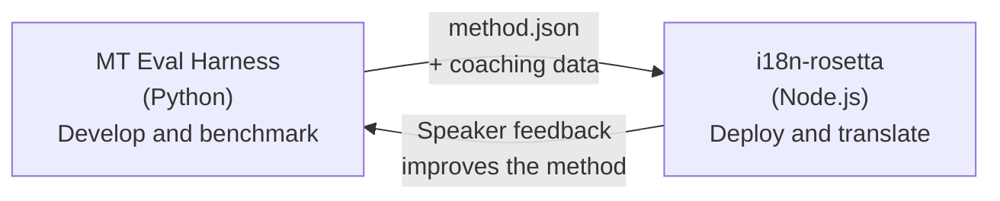

# Cầu nối Eval Harness

i18n-rosetta và MT Eval Harness là hai công cụ riêng biệt tạo thành một hệ sinh thái. Harness là nơi các phương pháp dịch thuật được **chứng minh**. Rosetta là nơi các phương pháp đã được chứng minh được **triển khai**. Chúng kết nối với nhau thông qua một định dạng plugin chung.



## Quy trình: Nghiên cứu → Sản xuất

### 1. Xây dựng một phương pháp trong harness

Bất kỳ lớp Python nào triển khai `async translate(entries, config) → [{id, predicted}]` đều có thể cắm vào harness. Harness không quan tâm đến những gì diễn ra bên trong — LLM được prompt, mô hình được huấn luyện tùy chỉnh, các quy tắc tất định, hay bất cứ thứ gì.

### 2. Đánh giá chuẩn

Harness chấm điểm phương pháp của bạn dựa trên một kho ngữ liệu tiêu chuẩn với các số liệu có thể tái tạo: chrF++, mức độ chấp nhận FST (đối với các ngôn ngữ phong phú về hình thái), độ chính xác về hình thái và chấm điểm ngữ nghĩa.

### 3. Xuất dưới dạng plugin

Khi phương pháp của bạn đạt đến chất lượng có thể chấp nhận được, hãy đóng gói nó thành một plugin rosetta — một tệp manifest `method.json` với dữ liệu huấn luyện (coaching data) tùy chọn.

:::info CLI xuất đang được lên kế hoạch
Hiện tại, bạn phải tạo tệp manifest method.json theo cách thủ công. Lệnh `mt-eval export` sẽ tự động hóa việc này. Xem [Giao diện phương pháp](https://mtevalarena.org/docs/specifications/methods) để biết định dạng plugin đầy đủ.
:::

### 4. Cài đặt vào rosetta

```bash
i18n-rosetta plugin install ./my-method-plugin/
```

### 5. Dịch nội dung thực tế

```bash
i18n-rosetta sync
```

Phương pháp đã được đánh giá chuẩn của bạn hiện đang tạo ra các bản dịch thực tế trong môi trường sản xuất.

## Quy trình: Sản xuất → Nghiên cứu

Các bản dịch được triển khai sẽ được những người nói song ngữ đánh giá. Phản hồi của họ giúp xác định các lỗi hệ thống (sai mẫu thì, thiếu từ vựng, cách diễn đạt thiếu tự nhiên). Nhà nghiên cứu cập nhật phương pháp trong harness, đánh giá chuẩn lại, xuất lại và triển khai lại. Hệ thống học hỏi từ quá trình sử dụng.

## Định dạng Plugin

Tệp manifest `method.json` là bản hợp đồng giữa hai công cụ:

```json
{
  "name": "crk-coached-v3",
  "type": "llm-coached",
  "version": "3.0.0",
  "description": "Coached LLM translation for Plains Cree",
  "locales": ["crk"],
  "config": {
    "model": "google/gemini-3.5-flash",
    "temperature": 0.3
  },
  "benchmarks": {
    "crk": {
      "composite_score": 0.67,
      "fst_acceptance": 0.82,
      "corpus_size": 150
    }
  }
}
```

Xem [Đặc tả Plugin](/docs/reference/plugin-spec) để biết định dạng đầy đủ.

## Những gì đã xây dựng so với Kế hoạch

| Thành phần | Trạng thái |
|-----------|--------|
| Giao thức TranslationProcess | ✅ Đã xây dựng |
| Trình chạy đánh giá chuẩn Harness | ✅ Đã xây dựng |
| Định dạng plugin method.json | ✅ Đã xây dựng |
| `rosetta plugin install/remove/list` | ✅ Đã xây dựng |
| Tải dữ liệu huấn luyện | ✅ Đã xây dựng |
| CLI `mt-eval export` | 🔲 Đã lên kế hoạch |
| Giao diện đánh giá từ cộng đồng | 🔲 Đã lên kế hoạch |
| Đánh giá tập kiểm tra mật mã học | 🔲 Đã lên kế hoạch |

## Đọc thêm

- [Các phương pháp dịch thuật](/docs/guides/translation-methods) — tất cả các phương pháp khả dụng và cách chúng hoạt động
- [Đặc tả Plugin](/docs/reference/plugin-spec) — định dạng method.json
- [Cung cấp phương pháp qua API](/docs/guides/serving-a-method) — lưu trữ phương pháp ở phía máy chủ
- [Chủ quyền dữ liệu](https://mtevalarena.org/docs/sovereignty/data-sovereignty) — OCAP, CARE và bảo vệ bằng mật mã học
- [Dành cho các nhà nghiên cứu MT](https://mtevalarena.org/docs/leaderboard/rules) — tài liệu về eval harness