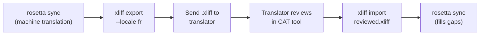

# Làm việc với các Dịch giả Chuyên nghiệp

Rosetta tạo ra các bản dịch máy, nhưng một số dự án cần con người đánh giá — nội dung pháp lý, văn bản nhạy cảm với thương hiệu hoặc UI quan trọng. Quy trình làm việc XLIFF cho phép bạn xuất các bản dịch để đánh giá chuyên môn và nhập chúng lại một cách liền mạch.

## XLIFF là gì?

XLIFF (XML Localization Interchange File Format) là định dạng trao đổi tiêu chuẩn ngành dành cho các công cụ dịch thuật. Mọi công cụ CAT (Computer-Assisted Translation) chuyên nghiệp đều hỗ trợ định dạng này:

- **memoQ** — nhập XLIFF, đánh giá theo ngữ cảnh, xuất tệp đã đánh giá
- **SDL Trados Studio** — hỗ trợ XLIFF gốc
- **Phrase (Memsource)** — tải lên các công việc XLIFF cho các nhóm dịch giả
- **Smartling** — luồng tiếp nhận XLIFF
- **OmegaT** — công cụ CAT miễn phí/mã nguồn mở có hỗ trợ XLIFF

Rosetta tạo ra XLIFF 1.2 (phiên bản được hỗ trợ phổ biến) thay vì 2.0+ để đạt được khả năng tương thích tối đa với các công cụ.

## Quy trình làm việc



### Bước 1: Tạo Bản dịch Máy

Chạy `sync` trước để có bản dịch máy cơ sở:

```bash
i18n-rosetta sync
```

### Bước 2: Xuất XLIFF

Xuất cặp nguồn + đích dưới dạng XLIFF:

```bash
i18n-rosetta xliff export --locale fr
```

Lệnh này sẽ ghi `.rosetta/xliff/fr.xliff` bao gồm:
- Mọi khóa nguồn cùng với giá trị tiếng Anh của nó
- Bản dịch máy hiện tại (nếu có) dưới dạng `<target>`
- Các khóa không có bản dịch được đánh dấu là `state="new"`

```xml
<trans-unit id="hero.title" xml:space="preserve">
  <source>Welcome to our platform</source>
  <target state="translated">Bienvenue sur notre plateforme</target>
</trans-unit>
```

### Bước 3: Gửi cho Dịch giả

Gửi tệp `.xliff` cho dịch giả của bạn hoặc tải nó lên nền tảng CAT của bạn. Dịch giả sẽ thấy bản nguồn và bản đích song song với nhau, và có thể:

- Chỉnh sửa các bản dịch máy
- Điền các bản dịch còn thiếu
- Đánh dấu các vấn đề về chất lượng
- Áp dụng bộ nhớ dịch và cơ sở thuật ngữ của riêng họ

### Bước 4: Nhập Tệp đã Đánh giá

Khi dịch giả gửi lại `.xliff` đã được đánh giá, hãy nhập nó:

```bash
# Preview what will change
i18n-rosetta xliff import .rosetta/xliff/fr.xliff --dry

# Apply changes
i18n-rosetta xliff import .rosetta/xliff/fr.xliff
```

Đầu ra:
```
  ✓ Imported 142 translations for fr
    Updated:    23 (changed from existing)
    Added:      0 (new keys)
    Unchanged:  119
    Written to: locales/fr.json
```

### Bước 5: Điền các Phần còn thiếu

Nếu các khóa mới được thêm vào sau khi XLIFF được xuất, hãy chạy `sync` để dịch chúng:

```bash
i18n-rosetta sync
```

Rosetta chỉ dịch các khóa vẫn còn thiếu — các bản dịch đã được đánh giá từ quá trình nhập XLIFF sẽ được giữ nguyên.

## Mẹo

### Xuất Đường dẫn Tùy chỉnh

```bash
# Export to a specific directory
i18n-rosetta xliff export --locale ja --out ./for-review/

# Export with a specific filename
i18n-rosetta xliff export --locale de --out ./review/german.xliff
```

### Nhiều Ngôn ngữ (Locales)

Xuất riêng từng ngôn ngữ:

```bash
for locale in fr de ja ko; do
  i18n-rosetta xliff export --locale $locale
done
```

### Kiểm soát Phiên bản

Thêm `.rosetta/xliff/` vào `.gitignore` — Các tệp XLIFF là các tạo tác tạm thời, không phải là mã nguồn dự án:

```gitignore
.rosetta/xliff/
```

### Khi nào nên sử dụng XLIFF so với chỉ dùng `sync`

| Tình huống | Khuyến nghị |
|----------|---------------|
| Ứng dụng nội bộ, chất lượng 90%+ là chấp nhận được | Chỉ cần `sync` — dịch máy là đủ tốt |
| Văn bản tiếp thị hướng tới người dùng | Xuất XLIFF để con người đánh giá |
| Nội dung pháp lý/quy định | Xuất XLIFF — bắt buộc con người đánh giá |
| Hơn 50 ngôn ngữ, thời hạn gấp | `sync` trước, chỉ xuất XLIFF cho 5 ngôn ngữ hàng đầu |
| Dịch giả đã sử dụng công cụ CAT | XLIFF là định dạng bàn giao tự nhiên |

---

## Xem thêm

- [Tham chiếu CLI — xliff](/docs/reference/cli#xliff) — tham chiếu lệnh
- [Bộ nhớ Dịch](/docs/concepts/translation-memory) — lưu trữ bộ nhớ đệm các bản dịch đã đánh giá
- [Các phương pháp Dịch](/docs/guides/translation-methods) — các tùy chọn dịch máy