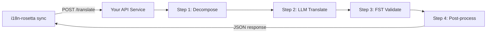

# Phục vụ một Custom Method dưới dạng API

**Phương thức `api`** của i18n-rosetta cho phép bạn trỏ bất kỳ cặp dịch thuật nào đến một HTTP endpoint bên ngoài. Đây là cách bạn tích hợp các pipeline quá phức tạp đối với một prompt LLM đơn lẻ — morphological analyzers (trình phân tích hình thái), finite-state transducers (FSTs), multi-step LLM chains (chuỗi LLM nhiều bước), hoặc bất kỳ phương pháp nghiên cứu tùy chỉnh nào mà bạn đã xây dựng.

## Tại sao lại là một API Service?

Một số translation pipeline không thể chạy trong một chu kỳ prompt-response đơn giản:

| Bước trong pipeline | Ví dụ |
|---|---|
| **Morphological decomposition** | Tách các từ đa tổng hợp thành các hình vị trước khi dịch |
| **FST validation** | Loại bỏ các kết quả đầu ra vi phạm các quy tắc âm vị học hoặc hình thái học |
| **Multi-step LLM chains** | Các chu kỳ tạo (Generate) → xác minh (verify) → sửa lỗi (correct) với các model khác nhau |
| **Dictionary lookup** | Đối chiếu chéo với một từ điển song ngữ được chọn lọc ở giữa pipeline |
| **Human-in-the-loop** | Đưa các bản dịch không chắc chắn vào hàng đợi để chuyên gia đánh giá |

Phương thức `api` coi pipeline của bạn như một hộp đen (black box) — i18n-rosetta gửi các chuỗi nguồn, service của bạn trả về các bản dịch. Những gì diễn ra bên trong hoàn toàn do bạn quyết định.

## Kiến trúc



## Thiết lập Service của bạn

API service của bạn phải triển khai một endpoint duy nhất chấp nhận và trả về JSON:

### Định dạng Request

rosetta gửi chính xác nội dung JSON này (xem [api.js](https://github.com/gamedaysuits/i18n-rosetta/blob/main/lib/methods/api.js)):

```json
POST /translate
Content-Type: application/json
Authorization: Bearer <ROSETTA_API_KEY>

{
  "source_locale": "en",
  "target_locale": "crk",
  "method": "crk-coached-v1",
  "keys": {
    "greeting": "Hello, welcome to our app",
    "farewell": "Goodbye and thanks"
  }
}
```

| Trường | Kiểu dữ liệu | Mô tả |
|-------|------|-------------|
| `source_locale` | string | Mã ngôn ngữ nguồn BCP 47 |
| `target_locale` | string | Mã ngôn ngữ đích BCP 47 |
| `method` | string | Tên plugin hoặc `"default"` |
| `keys` | object | Map của key → chuỗi nguồn cần dịch |
```

### Response Format

Your service must return a `translations` object. An optional `meta` object can include cost and diagnostic info:

```json
{
  "translations": {
    "greeting": "tânisi, pê-kîwêw ôta",
    "farewell": "ekosi mâka, kinanâskomitin"
  },
  "meta": {
    "model": "my-custom-pipeline/v1",
    "cost_usd": 0.0042,
    "method": "decompose-translate-validate"
  }
}
```

| Field | Type | Required | Description |
|-------|------|----------|-------------|
| `translations` | object | ✅ | Map of key → translated string |
| `meta` | object | — | Optional metadata |
| `meta.cost_usd` | number | — | If present, displayed in rosetta's output |
| `errors` | object | — | For partial success (HTTP 207): map of key → `{ message }` |

### Minimal Express Server

```javascript
import express from 'express';

const app = express();
app.use(express.json());

/**
 * rosetta API contract:
 *
 * Request:  { source_locale, target_locale, method, keys: { "key": "source" } }
 * Response: { translations: { "key": "translated" }, meta: { ... } }
 */
app.post('/translate', async (req, res) => {
  const { source_locale, target_locale, method, keys } = req.body;

  const translations = {};

  for (const [key, source] of Object.entries(keys)) {
    // --- Your pipeline goes here ---
    // Step 1: Morphological decomposition
    const morphemes = await decompose(source, source_locale);

    // Step 2: LLM translation with context
    const draft = await llmTranslate(morphemes, target_locale);

    // Step 3: FST validation
    const validated = await fstValidate(draft, target_locale);

    // Step 4: Post-processing (orthography normalization, etc.)
    translations[key] = await postProcess(validated);
  }

  res.json({
    translations,
    meta: {
      model: 'my-custom-pipeline/v1',
      method: 'decompose-translate-validate',
    },
  });
});

app.listen(3001, () => {
  console.log('Translation API running on http://localhost:3001');
});
```

## Configuring i18n-rosetta

Point a translation pair at your running service in `i18n-rosetta.config.json`:

```json
{
  "inputLocale": "en",
  "pairs": {
    "en:crk": {
      "method": "api",
      "endpoint": "http://localhost:3001/translate",
      "register": "Formal Plains Cree. Use SRO orthography."
    }
  }
}
```

Then run sync as usual:

```bash
npx i18n-rosetta sync
```

i18n-rosetta will POST your source strings to the endpoint and write the returned translations to `crk.json`.

## Case Study: Plains Cree Pipeline

:::info Under Development
The Plains Cree pipeline described below is **under active development** and is not yet running in production. Details here reflect the current design direction and may change as the project evolves.
:::

The **gds-mt-eval-harness** project demonstrates this pattern. Its Plains Cree pipeline uses:

1. **Morphological decomposition** — Break polysynthetic Cree words into translatable morpheme chains
2. **LLM translation** — Context-enriched GPT-4o translation with coaching data (SRO orthography rules, register instructions)
3. **FST validation** — Finite-state transducer checks that outputs conform to Cree phonological rules
4. **Confidence scoring** — Each translation gets a confidence score based on FST pass rate and dictionary coverage

The entire pipeline runs as a single HTTP endpoint that i18n-rosetta calls via the `api` method.

### Running Evaluations

After translating, you can evaluate output quality using the harness directly:

```bash
# Clone the harness
git clone https://github.com/gamedaysuits/gds-mt-eval-harness.git
cd gds-mt-eval-harness
pip install -e .

# Run the evaluation against your method's output
python eval/baseline_experiment.py --dataset data/edtekla-dev-v1.json --submit
```

This produces structured evaluation records with chrF++, BLEU, and exact match scores that can be used as regression baselines.

## Authentication

If your API requires authentication, set the `apiKey` field or use an environment variable:

```json
{
  "pairs": {
    "en:crk": {
      "method": "api",
      "endpoint": "https://my-mt-service.example.com/translate",
      "apiKey": "${CRK_API_KEY}"
    }
  }
}
```

## Data Sovereignty & OCAP Principles

The `api` method is particularly important for **Indigenous language communities**. By self-hosting the translation pipeline, a community keeps full control over:

- **Proprietary coaching data** — register instructions, orthography rules, and domain glossaries never leave community infrastructure.
- **Linguistic resources** — curated dictionaries, FST grammars, and elder-verified translations remain under community ownership.
- **Access policies** — the community decides who can call the endpoint and under what terms.

This aligns with [OCAP® principles](https://mtevalarena.org/docs/community/low-resource-languages#ocap-principles) (Ownership, Control, Access, Possession), ensuring that sensitive language data is governed by the community rather than a third-party platform.

:::tip
Combine the `api` method with a private deployment (e.g., a community-hosted VM or on-prem server) for the strongest data-sovereignty posture. See [Support a Low-Resource Language](https://mtevalarena.org/docs/community/low-resource-languages) for a full walkthrough.
:::

## Cost Estimation

The `api` method returns `null` for cost estimation by default — your service controls pricing. If you want to provide cost transparency, have your API return a `cost` field in the metadata:

```json
{
  "translations": { "...": "..." },
  "metadata": {
    "cost": {
      "estimatedCost": 0.0042,
      "currency": "USD",
      "source": "my-service-pricing"
    }
  }
}
```

## Các phương pháp hay nhất

1. **Trả về chuỗi rỗng khi thất bại** — Đừng trả về chuỗi nguồn như một "bản dịch". Hãy trả về `""` và để cơ chế fallback prefix của i18n-rosetta xử lý.
2. **Bao gồm điểm tin cậy (confidence scores)** — Nếu pipeline của bạn có thể ước tính chất lượng, hãy trả về nó trong metadata. Điều này giúp ích cho việc kiểm toán chất lượng.
3. **Triển khai health checks** — Thêm một endpoint `GET /health` để i18n-rosetta có thể xác minh kết nối trước khi bắt đầu một đợt đồng bộ (sync) lớn.
4. **Xử lý rate limit một cách khéo léo** — Nếu pipeline của bạn có giới hạn thông lượng (throughput limits), hãy trả về mã trạng thái `429`. Hệ thống batch của i18n-rosetta sẽ tự động lùi lại (back off).
5. **Ghi log mọi thứ** — Các multi-step pipeline có thể gặp lỗi ngầm (fail silently). Hãy ghi log đầu vào/đầu ra của từng bước để phục vụ việc gỡ lỗi (debugging).

## Cấp phép

Mô hình phương thức `api` hoàn toàn mở — không có hạn chế nào về giấy phép khi đóng gói translation pipeline của riêng bạn thành một HTTP service. `gds-mt-eval-harness` được cung cấp theo giấy phép MIT cho các bản triển khai tham chiếu (reference implementations).

## Xem thêm

- [Các phương thức dịch thuật](/docs/guides/translation-methods) — tổng quan về mọi phương thức tích hợp sẵn (`openai`, `google`, `api`, v.v.)
- [Đặc tả Plugin](/docs/reference/plugin-spec) — schema đầy đủ cho `i18n-rosetta.config.json` bao gồm các trường phương thức `api`
- [Hỗ trợ ngôn ngữ ít tài nguyên](https://mtevalarena.org/docs/community/low-resource-languages) — hướng dẫn toàn diện (end-to-end) cho các ngôn ngữ thiếu tài nguyên, bao gồm các nguyên tắc OCAP
- [Kiến trúc](/docs/concepts/architecture) — cách thức hoạt động của vòng lặp đồng bộ (sync loop), xử lý hàng loạt (batching) và điều phối phương thức (method dispatch) của i18n-rosetta
- [Đánh giá MT](https://mtevalarena.org/docs/leaderboard/rules) — phương pháp đánh giá, các chỉ số (metrics) và quy trình gửi kết quả lên bảng xếp hạng (leaderboard)
- [Bảng xếp hạng phương thức](/leaderboard) — xếp hạng chất lượng trực tiếp trên các phương thức và cặp ngôn ngữ