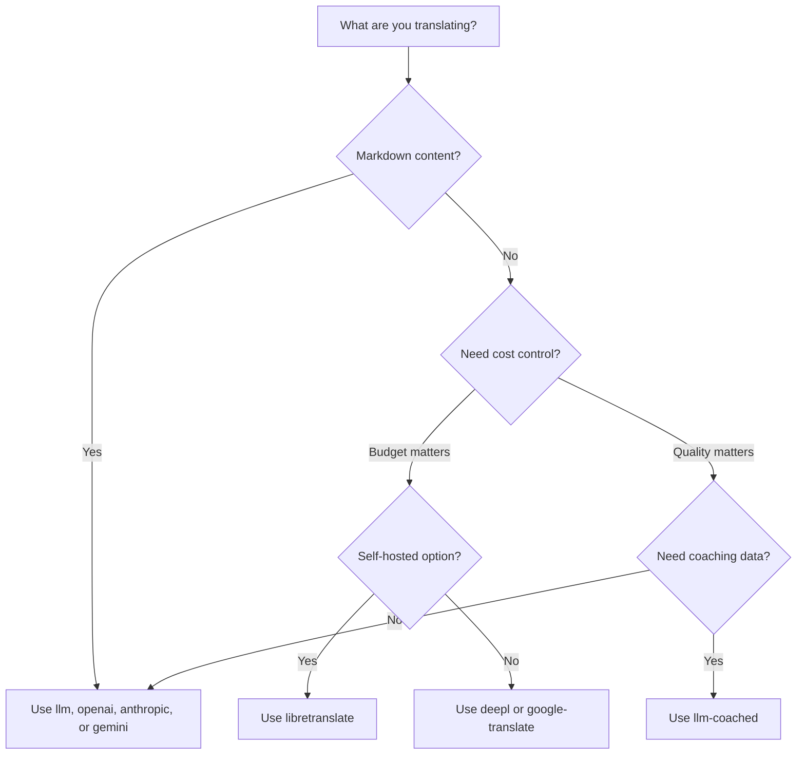

# Các Phương Pháp Dịch Thuật

Rosetta hỗ trợ mười phương pháp dịch thuật. Mỗi cặp ngôn ngữ có thể sử dụng một phương pháp khác nhau — bạn không bị khóa vào một cách tiếp cận duy nhất cho toàn bộ dự án của mình.

## So Sánh Các Phương Pháp

### Các Nhà Cung Cấp LLM

Tập trung vào chất lượng, nhận diện Markdown, tương thích với huấn luyện (coaching). Tốt nhất cho các dự án nhiều nội dung.

| Phương pháp | Khóa | Chức năng |
|--------|-----|-------------|
| `llm` (mặc định) | `OPENROUTER_API_KEY` | LLM qua OpenRouter — hơn 200 mô hình, tự động định tuyến |
| `llm-coached` | `OPENROUTER_API_KEY` | LLM + quy tắc ngữ pháp, từ điển, ghi chú văn phong |
| `openai` | `OPENAI_API_KEY` | OpenAI API trực tiếp (gpt-4o, gpt-4o-mini) |
| `anthropic` | `ANTHROPIC_API_KEY` | Anthropic API trực tiếp (Claude Sonnet, Haiku, Opus) |
| `gemini` | `GEMINI_API_KEY` | Google Gemini API trực tiếp (Flash, Pro) — gói miễn phí |

### Dịch Máy (MT) Truyền Thống

Tập trung vào tốc độ và chi phí. Tốt nhất cho số lượng lớn các cặp key-value.

| Phương pháp | Khóa | Chức năng |
|--------|-----|-------------|
| `google-translate` | `GOOGLE_TRANSLATE_API_KEY` | Google Cloud Translation API v2 (hơn 130 ngôn ngữ) |
| `deepl` | `DEEPL_API_KEY` | DeepL API có hỗ trợ bảng thuật ngữ (hơn 30 ngôn ngữ) |
| `microsoft-translator` | `MICROSOFT_TRANSLATOR_API_KEY` | Azure Cognitive Services Translator (hơn 100 ngôn ngữ) |
| `libretranslate` | *(tự lưu trữ)* | LibreTranslate tự lưu trữ (AGPL, miễn phí) |

### Cơ Sở Hạ Tầng

| Phương pháp | Khóa | Chức năng |
|--------|-----|-------------|
| `api` | *(theo nhà cung cấp)* | Thin HTTP client cho bất kỳ REST translation endpoint nào |

## Cây Quyết Định



---

## `llm` — Dịch Thuật LLM (Mặc định)

Dịch thông qua bất kỳ LLM nào trên [OpenRouter](https://openrouter.ai). Đây là phương pháp mặc định và linh hoạt nhất.

**Cách hoạt động:**
1. Gom nhóm các khóa (mặc định 30 khóa/nhóm) cùng với các chỉ thị về văn phong và ngữ cảnh
2. Gửi đến OpenRouter dưới dạng một prompt có cấu trúc
3. Phân tích cú pháp phản hồi JSON
4. Xác thực từng bản dịch thông qua [cổng kiểm soát chất lượng](/docs/concepts/quality-gate)
5. Ghi lại các bản dịch đạt yêu cầu, thử lại hoặc từ chối các bản dịch lỗi

**Khi nào nên dùng:** Hầu hết các dự án. Đặc biệt là các trang web nhiều nội dung có sử dụng Markdown, nơi các khối mã (code block) và shortcode cần được bảo vệ.

**Cấu hình:**

```json
{
  "defaultMethod": "llm",
  "model": "google/gemini-3.5-flash"
}
```

## `llm-coached` — Dịch Thuật LLM Có Huấn Luyện (Coached)

Giống như `llm`, nhưng có thêm các quy tắc ngữ pháp, từ điển thuật ngữ và ghi chú văn phong được đưa vào mỗi prompt.

**Cách hoạt động:**
1. Tải dữ liệu huấn luyện từ `.rosetta/coaching/<locale>.json` hoặc thư mục `coaching/` của plugin
2. Đưa các quy tắc ngữ pháp, thuật ngữ từ điển và ghi chú văn phong vào system prompt
3. Các thuật ngữ từ điển khớp với khóa nguồn sẽ được đưa vào làm thuật ngữ bắt buộc
4. Quá trình dịch diễn ra giống như `llm`, với dữ liệu huấn luyện giúp tăng độ chính xác

**Khi nào nên dùng:** Các ngôn ngữ ít tài nguyên, thuật ngữ chuyên ngành (pháp lý, y tế), văn phong trang trọng, hoặc bất kỳ trường hợp nào mà kết quả từ LLM thông thường không đủ chính xác.

**Định dạng dữ liệu huấn luyện:**

```json title=".rosetta/coaching/fr.json"
{
  "grammar_rules": [
    "French adjectives agree in gender and number with the noun they modify",
    "Use 'vous' for formal contexts, 'tu' for informal"
  ],
  "dictionary": {
    "dashboard": "tableau de bord",
    "deployment": "déploiement",
    "settings": "paramètres"
  },
  "style_notes": "Prefer active voice. Avoid anglicisms where a native French term exists."
}
```

Xem thêm: [Hướng Dẫn Dành Cho Ngôn Ngữ Ít Tài Nguyên](https://mtevalarena.org/docs/community/low-resource-languages)

---

## `openai` — OpenAI API Trực Tiếp

Dịch trực tiếp thông qua OpenAI Chat Completions API. Không qua trung gian OpenRouter — khóa của bạn, tài khoản của bạn, bảng điều khiển sử dụng của bạn.

**Các mô hình:** `gpt-4o` (mặc định), `gpt-4o-mini`

**Tính năng:**
- ✅ Nhận diện Markdown (dịch nội dung)
- ✅ Hỗ trợ huấn luyện (quy tắc ngữ pháp, ghi đè từ điển, ghi chú văn phong)
- ✅ Chế độ JSON cho đầu ra key-value có cấu trúc
- ✅ Exponential backoff kèm tính năng thử lại

**Cấu hình:**

```json
{
  "pairs": {
    "en:fr": { "method": "openai", "model": "gpt-4o-mini" }
  }
}
```

```bash
export OPENAI_API_KEY=sk-proj-...
```

Lấy khóa của bạn tại [platform.openai.com/api-keys](https://platform.openai.com/api-keys).

## `anthropic` — Anthropic API Trực Tiếp

Dịch trực tiếp thông qua Anthropic Messages API. Sử dụng tham số `system` cho dữ liệu huấn luyện, cho phép sử dụng tính năng prompt caching của Anthropic.

**Các mô hình:** `claude-sonnet-4-6` (mặc định), `claude-haiku-4-5`, `claude-opus-4-7`

**Tính năng:**
- ✅ Nhận diện Markdown (dịch nội dung)
- ✅ Hỗ trợ huấn luyện (quy tắc ngữ pháp, ghi đè từ điển, ghi chú văn phong)
- ✅ System prompt caching (chia đều chi phí huấn luyện qua các đợt dịch)
- ✅ Exponential backoff kèm tính năng thử lại

**Cấu hình:**

```json
{
  "pairs": {
    "en:ja": { "method": "anthropic", "model": "claude-haiku-4-5" }
  }
}
```

```bash
export ANTHROPIC_API_KEY=sk-ant-...
```

Lấy khóa của bạn tại [console.anthropic.com](https://console.anthropic.com/settings/keys).

## `gemini` — Google Gemini API Trực Tiếp

Dịch trực tiếp thông qua Google Gemini `generateContent` API. **Có gói miễn phí** — điểm khởi đầu tốt nhất với chi phí 0 đồng.

**Các mô hình:** `gemini-2.5-flash` (mặc định), `gemini-2.5-pro`

**Tính năng:**
- ✅ Nhận diện Markdown (dịch nội dung)
- ✅ Hỗ trợ huấn luyện (quy tắc ngữ pháp, ghi đè từ điển, ghi chú văn phong)
- ✅ Chế độ phản hồi JSON thông qua `responseMimeType`
- ✅ Gói miễn phí (hạn mức hàng ngày hào phóng)
- ✅ Exponential backoff kèm tính năng thử lại

**Cấu hình:**

```json
{
  "pairs": {
    "en:ko": { "method": "gemini", "model": "gemini-2.5-pro" }
  }
}
```

```bash
export GEMINI_API_KEY=AI...
```

Lấy khóa của bạn tại [aistudio.google.com/apikey](https://aistudio.google.com/apikey).

### Xác Thực Mô Hình

Các nhà cung cấp LLM trực tiếp (`openai`, `anthropic`, `gemini`) sẽ xác thực chuỗi mô hình của bạn ở lần sử dụng đầu tiên. Điều này giúp phát hiện ba loại lỗi sau:

**Sai định dạng phương pháp** — Sử dụng đường dẫn mô hình kiểu OpenRouter với một nhà cung cấp trực tiếp:

```
[WARN] OpenAI: model "google/gemini-3.5-flash" looks like an OpenRouter path.
       Direct providers use bare model names (e.g., "gpt-4o").
       To use OpenRouter models, set method to 'llm' instead.
```

**Sai nhà cung cấp** — Sử dụng mô hình từ một nhà cung cấp hoàn toàn khác:

```
[WARN] Gemini: model "claude-sonnet-4-6" is an Anthropic model.
       This provider (gemini) cannot serve Anthropic models.
       Use --method anthropic or set "method": "anthropic" in config.
```

**Mô hình bị ngừng hỗ trợ hoặc viết sai chính tả** — Trong lần gọi API đầu tiên, rosetta sẽ lấy danh sách mô hình trực tiếp của nhà cung cấp và đối chiếu mô hình của bạn với danh sách đó:

```
[WARN] Gemini: model "gemini-1.5-flash" not found in available models.
       Similar models: gemini-2.0-flash, gemini-2.5-flash, gemini-2.5-pro
       The API call will proceed — the provider will give the final verdict.
```

:::note Đây là các cảnh báo, không phải lỗi
Việc xác thực mô hình sẽ ghi lại các cảnh báo nhưng không chặn lệnh gọi API. API của nhà cung cấp sẽ đưa ra phán quyết cuối cùng — một tên mô hình trong tương lai có thể khớp với một mẫu khác, và chúng tôi không muốn chặn dựa trên các phỏng đoán (heuristics).
:::

---

## `google-translate` — Google Cloud Translation API

Tích hợp trực tiếp với Google Cloud Translation API v2. Sử dụng REST API — không cần SDK, không cần service account. Chỉ cần API key.

**Khi nào nên dùng:** Số lượng lớn các cặp chuỗi key-value, nơi tốc độ và chi phí quan trọng hơn sắc thái ngôn ngữ. Hỗ trợ sẵn hơn 130 ngôn ngữ.

**Hạn chế:**
- ⚠️ **Không nhận diện Markdown.** Sẽ làm hỏng các khối mã, shortcode và các biến nội suy.
- Không kiểm soát được văn phong/giọng điệu
- Không hỗ trợ huấn luyện hoặc bắt buộc sử dụng thuật ngữ

```bash
npx i18n-rosetta sync --method google-translate
```

:::tip Tự động phát hiện
Nếu chỉ có `GOOGLE_TRANSLATE_API_KEY` được thiết lập (không có khóa OpenRouter), rosetta sẽ tự động chuyển sang Google Translate. Không cần thay đổi cấu hình.
:::

## `deepl` — DeepL API

Tích hợp trực tiếp với API dịch thuật DeepL. Hỗ trợ bảng thuật ngữ (glossary) để đảm bảo tính nhất quán của thuật ngữ.

**Khi nào nên dùng:** Các ngôn ngữ châu Âu mà DeepL có thế mạnh (tiếng Đức, tiếng Pháp, tiếng Tây Ban Nha, tiếng Hà Lan, tiếng Ba Lan, v.v.). Hỗ trợ bảng thuật ngữ giúp bắt buộc sử dụng thuật ngữ nhất quán mà không cần dữ liệu huấn luyện.

**Tính năng:**
- ✅ Tự động phát hiện endpoint miễn phí/trả phí (hậu tố `:fx` trên các khóa miễn phí)
- ✅ Tạo và quản lý bảng thuật ngữ
- ✅ Kiểm soát mức độ trang trọng
- ⚠️ **Không nhận diện Markdown** — chỉ hỗ trợ các cặp key-value

**Cấu hình:**

```json
{
  "pairs": {
    "en:de": { "method": "deepl" }
  }
}
```

```bash
export DEEPL_API_KEY=your-key-here
```

Lấy khóa của bạn tại [deepl.com/pro-api](https://www.deepl.com/pro-api).

## `microsoft-translator` — Azure Cognitive Services

Tích hợp trực tiếp với Microsoft Translator Text API v3.

**Khi nào nên dùng:** Môi trường doanh nghiệp đã có sẵn cơ sở hạ tầng Azure. Hỗ trợ hơn 100 ngôn ngữ bao gồm nhiều ngôn ngữ mà Google Translate không hỗ trợ.

**Tính năng:**
- ✅ Lên đến 100 phân đoạn mỗi yêu cầu (thông lượng cao)
- ✅ Tham số khu vực (region) tùy chọn để tối ưu hóa độ trễ
- ⚠️ **Không nhận diện Markdown** — chỉ hỗ trợ các cặp key-value
- ⚠️ **Không dịch nội dung** — chỉ hỗ trợ các cặp key-value

**Cấu hình:**

```json
{
  "pairs": {
    "en:ar": { "method": "microsoft-translator" }
  }
}
```

```bash
export MICROSOFT_TRANSLATOR_API_KEY=your-key
export MICROSOFT_TRANSLATOR_REGION=global  # optional
```

Lấy khóa của bạn từ [Azure Portal](https://portal.azure.com) → Cognitive Services → Translator.

## `libretranslate` — Dịch Thuật Tự Lưu Trữ (Self-Hosted)

Dịch thuật mã nguồn mở tự lưu trữ sử dụng LibreTranslate. Chạy cục bộ hoặc trên cơ sở hạ tầng của riêng bạn — không tốn chi phí API, hoàn toàn làm chủ dữ liệu.

**Khi nào nên dùng:** Các dự án yêu cầu dịch ngoại tuyến, tuân thủ quyền riêng tư dữ liệu (GDPR), hoặc vận hành với chi phí 0 đồng. Đặc biệt hữu ích cho các CI pipeline không nên phụ thuộc vào các API bên ngoài.

**Tính năng:**
- ✅ Tự lưu trữ — không có lệnh gọi API bên ngoài
- ✅ Miễn phí và mã nguồn mở (AGPL-3.0)
- ✅ Có sẵn bản triển khai Docker
- ⚠️ **Không nhận diện Markdown** — chỉ hỗ trợ các cặp key-value
- ⚠️ **Không dịch nội dung** — chỉ hỗ trợ các cặp key-value
- ⚠️ Chất lượng thay đổi tùy theo cặp ngôn ngữ

**Thiết lập:**

```bash
# Run LibreTranslate locally with Docker
docker run -d -p 5000:5000 libretranslate/libretranslate

# Configure (optional — defaults to localhost:5000)
export LIBRETRANSLATE_API_URL=http://localhost:5000/translate
```

```json
{
  "pairs": {
    "en:es": { "method": "libretranslate" }
  }
}
```

---

## `api` — Remote Translation API

Một thin HTTP client dành cho các translation endpoint do cộng đồng lưu trữ hoặc được bảo vệ IP. Rosetta gửi các khóa đi và nhận lại các bản dịch — nó không chứa bất kỳ logic dịch thuật nào.

**Khi nào nên dùng:** Khi các phương pháp dịch thuật được lưu trữ ở phía máy chủ (ví dụ: dữ liệu huấn luyện độc quyền, các mô hình tinh chỉnh, các FST pipeline không thể phân phối).

```json
{
  "pairs": {
    "en:crk": {
      "method": "api",
      "endpoint": "https://api.example.com/v1/translate",
      "apiKey": "your-key"
    }
  }
}
```

:::note Dịch Thuật Cộng Đồng Tương Thích OCAP
Phương pháp `api` là cầu nối đến **dịch thuật do cộng đồng lưu trữ tương thích với OCAP**. Các cộng đồng ngôn ngữ bản địa và thiểu số có thể tự lưu trữ các translation endpoint của riêng họ — giữ dữ liệu huấn luyện, các mô hình tinh chỉnh và IP ngôn ngữ dưới sự kiểm soát của cộng đồng — trong khi Rosetta kết nối với họ như một thin client.

Xem [Hỗ Trợ Ngôn Ngữ Ít Tài Nguyên](https://mtevalarena.org/docs/community/low-resource-languages) để biết toàn bộ hướng dẫn lưu trữ cộng đồng, và [Cung Cấp Phương Pháp Qua API](/docs/guides/serving-a-method) để biết các yêu cầu về endpoint.
:::

---

## Cấu Hình Theo Từng Cặp Ngôn Ngữ

Sức mạnh thực sự nằm ở việc kết hợp các phương pháp cho từng cặp ngôn ngữ:

```json title="i18n-rosetta.config.json"
{
  "version": 3,
  "pairs": {
    "en:fr": { "method": "deepl" },
    "en:ja": { "method": "openai", "model": "gpt-4o" },
    "en:ko": { "method": "gemini" },
    "en:ar": { "method": "microsoft-translator" },
    "en:crk": { "methodPlugin": "crk-coached-v1" }
  }
}
```

Ví dụ này dịch tiếng Pháp qua DeepL (hỗ trợ bảng thuật ngữ), tiếng Nhật qua OpenAI (chất lượng), tiếng Hàn qua Gemini (gói miễn phí), tiếng Ả Rập qua Microsoft Translator (độ bao phủ), và tiếng Plains Cree qua một plugin có huấn luyện (chuyên biệt).

## Các Plugin

Các plugin là những công thức dịch thuật được đóng gói sẵn cho các cặp ngôn ngữ cụ thể. Chúng là các tệp manifest JSON — không phải mã nguồn — cho rosetta biết nên sử dụng phương pháp nào, với cài đặt ra sao, và chất lượng đã được đo lường (benchmark) như thế nào.

:::tip Từ eval harness đến production chỉ với một lệnh
Các plugin được phát triển và chứng minh trong [eval harness](https://mtevalarena.org/docs/specifications/harness) có thể được cài đặt trực tiếp — phương pháp bạn xác thực ở đó sẽ được triển khai ở đây chỉ bằng một lệnh `plugin install` duy nhất. Xem [Đánh Giá MT](https://mtevalarena.org/docs/leaderboard/rules) để biết toàn bộ quy trình đánh giá.
:::

```bash
i18n-rosetta plugin install ./french-formal-v1/
i18n-rosetta plugin list
i18n-rosetta plugin remove french-formal-v1
```

Xem [Đặc Tả Plugin](/docs/reference/plugin-spec) để biết định dạng manifest đầy đủ.

---

## Chuyển Đổi Nhà Cung Cấp

Bạn muốn chuyển đổi giữa các phương pháp? Định dạng mô hình và biến môi trường (env var) sẽ thay đổi — dưới đây là bản đồ hướng dẫn:

### OpenRouter → Nhà Cung Cấp Trực Tiếp

```diff title="i18n-rosetta.config.json"
 {
   "pairs": {
     "en:fr": {
-      "method": "llm",
-      "model": "openai/gpt-4o"
+      "method": "openai",
+      "model": "gpt-4o"
     }
   }
 }
```

```diff title="Environment variables"
- export OPENROUTER_API_KEY=sk-or-v1-...
+ export OPENAI_API_KEY=sk-proj-...
```

**Các điểm khác biệt chính:**
- OpenRouter sử dụng định dạng `provider/model` (ví dụ: `openai/gpt-4o`). Các nhà cung cấp trực tiếp sử dụng tên mô hình trần (ví dụ: `gpt-4o`).
- Mỗi nhà cung cấp trực tiếp có biến môi trường riêng (`OPENAI_API_KEY`, `ANTHROPIC_API_KEY`, `GEMINI_API_KEY`).
- Nếu bạn sử dụng sai định dạng mô hình, rosetta sẽ cảnh báo bạn — xem phần [Xác Thực Mô Hình](#model-validation).

### Nhà Cung Cấp Trực Tiếp → OpenRouter

```diff title="i18n-rosetta.config.json"
 {
   "pairs": {
     "en:ja": {
-      "method": "anthropic",
-      "model": "claude-sonnet-4-6"
+      "method": "llm",
+      "model": "anthropic/claude-sonnet-4-6"
     }
   }
 }
```

:::tip Khi nào nên dùng OpenRouter thay vì Trực Tiếp
**Sử dụng OpenRouter** khi bạn muốn chuyển đổi giữa các mô hình mà không cần thay đổi biến môi trường, hoặc khi bạn muốn truy cập hơn 200 mô hình từ một khóa duy nhất. **Sử dụng các nhà cung cấp trực tiếp** khi bạn muốn thanh toán đơn giản hơn, độ trễ thấp hơn (không qua trung gian), hoặc truy cập các tính năng dành riêng cho nhà cung cấp như prompt caching của Anthropic.
:::

---

## So Sánh Chi Phí

Chi phí ước tính cho mỗi 1.000 khóa được dịch (giả định ~10 token mỗi khóa, 30 khóa mỗi đợt):

| Phương pháp | Chi phí / 1K Khóa | Tốc độ | Chất lượng | Tốt nhất cho |
|--------|----------------|-------|---------|----------|
| `gemini` (Flash) | **Miễn phí** (trong giới hạn gói) | Nhanh | Tốt | Bắt đầu, dự án cá nhân |
| `google-translate` | ~$0.02 | Nhanh nhất | Đạt yêu cầu | Số lượng lớn, ngôn ngữ châu Âu |
| `deepl` | ~$0.02 | Nhanh | Tốt | Ngôn ngữ châu Âu, thuật ngữ |
| `microsoft-translator` | ~$0.01 | Nhanh | Đạt yêu cầu | Hệ thống dùng Azure, độ bao phủ ngôn ngữ rộng |
| `libretranslate` | **Miễn phí** (tự lưu trữ) | Thay đổi | Khá | Mạng cách ly (air-gapped), GDPR, CI pipeline |
| `gemini` (Pro) | ~$0.07 | Trung bình | Rất tốt | Yêu cầu chất lượng cao, có hạn mức miễn phí |
| `openai` (GPT-4o-mini) | ~$0.01 | Nhanh | Tốt | LLM tiết kiệm chi phí |
| `openai` (GPT-4o) | ~$0.10 | Trung bình | Rất tốt | Yêu cầu chất lượng cao |
| `anthropic` (Haiku) | ~$0.01 | Nhanh | Tốt | LLM tiết kiệm chi phí |
| `anthropic` (Sonnet) | ~$0.10 | Trung bình | Rất tốt | Yêu cầu chất lượng cao |
| `anthropic` (Opus) | ~$0.50 | Chậm | Xuất sắc | Chất lượng tối đa |
| `llm` (OpenRouter) | Tùy theo mô hình | Thay đổi | Thay đổi | So sánh mô hình, thử nghiệm |

:::note Đây là các ước tính
Chi phí thực tế phụ thuộc vào độ dài văn bản nguồn, kích thước đợt dịch và những thay đổi về giá của nhà cung cấp. Vui lòng kiểm tra trang định giá hiện tại của từng nhà cung cấp để biết mức giá chính xác.
:::

---

## Xem Thêm

- [Các Ngôn Ngữ Được Hỗ Trợ](/docs/reference/supported-languages)
- [Dữ Liệu Huấn Luyện](/docs/concepts/coaching-data)
- [Hỗ Trợ Ngôn Ngữ Ít Tài Nguyên](https://mtevalarena.org/docs/community/low-resource-languages)
- [Đặc Tả Plugin](/docs/reference/plugin-spec)
- [Cung Cấp Phương Pháp Qua API](/docs/guides/serving-a-method)
- [Cổng Kiểm Soát Chất Lượng](/docs/concepts/quality-gate)
- [Kiến Trúc](/docs/concepts/architecture)
- [Khắc Phục Sự Cố](/docs/guides/troubleshooting) — lỗi mô hình, vấn đề API