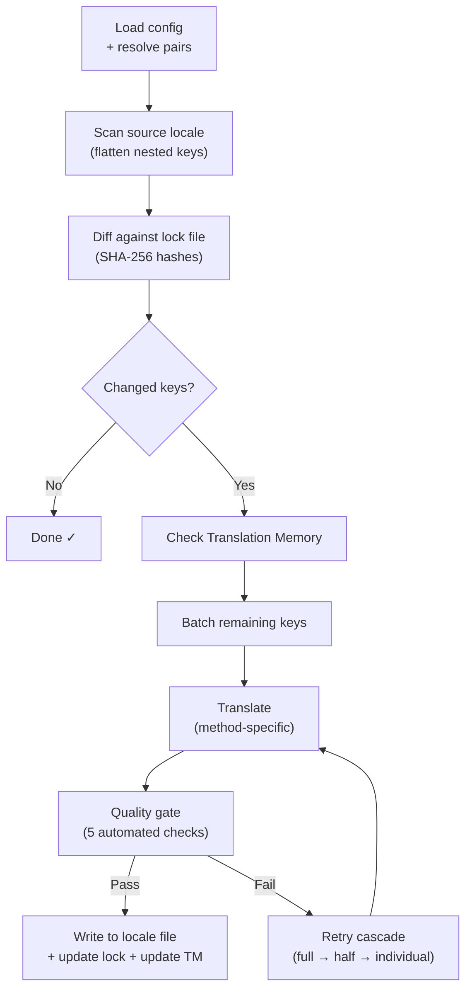

# Cách i18n-rosetta hoạt động

i18n-rosetta dịch các tệp locale của ứng dụng của bạn chỉ với một lệnh. Dưới đây là những gì diễn ra ở hậu trường.

## Luồng xử lý

Khi bạn chạy `npx i18n-rosetta sync`, rosetta sẽ thực thi một luồng xử lý gồm sáu giai đoạn:



**Các quyết định thiết kế chính:**

- **Phát hiện thay đổi thông qua mã băm SHA-256.** Rosetta theo dõi mọi giá trị nguồn bằng một mã băm trong `.i18n-rosetta.lock`. Khi bạn cập nhật một chuỗi tiếng Anh, chỉ khóa (key) đó mới được dịch lại. Đây là lý do tại sao `sync` chạy rất nhanh trong những lần lặp lại — nó chỉ thực hiện khối lượng công việc tối thiểu.

- **Lưu bộ nhớ đệm Translation Memory.** Trước khi thực hiện bất kỳ lệnh gọi API nào, rosetta sẽ kiểm tra `.rosetta/tm.json` để tìm các bản dịch đã được lưu trong bộ nhớ đệm (được lập chỉ mục theo văn bản nguồn + locale + phương pháp). Trong một lần đồng bộ lại (re-sync) điển hình sau khi thay đổi một khóa, 142 khóa sẽ được lấy từ bộ nhớ đệm và 1 khóa sẽ gọi API.

- **Cổng kiểm tra chất lượng (Quality gate) trước khi ghi.** Mọi bản dịch đều phải vượt qua năm bài kiểm tra tự động (trống, lặp lại bản gốc, vòng lặp ảo giác, tăng độ dài bất thường, tuân thủ hệ thống chữ viết) trước khi được ghi vào tệp của bạn. Các lỗi sẽ được ghi log lại, không bao giờ được chấp nhận một cách âm thầm.

- **Thử lại theo tầng (Retry cascade) khi thất bại.** Nếu một lô (batch) thất bại (lỗi phân tích cú pháp JSON, API timeout), rosetta sẽ thử lại với các lô nhỏ dần: toàn bộ → một nửa → từng cái một. Điều này giúp cô lập khóa gây ra sự cố mà không làm gián đoạn phần còn lại.

## Các phương pháp dịch

Rosetta hỗ trợ bốn phương pháp dịch, mỗi phương pháp phù hợp với các kịch bản khác nhau:

| Phương pháp | Cách hoạt động | Phù hợp nhất cho |
|--------|-------------|----------|
| **`llm`** | Prompt có cấu trúc gửi đến bất kỳ mô hình OpenRouter nào | Các ngôn ngữ có nhiều tài nguyên |
| **`llm-coached`** | Cùng prompt đó + quy tắc ngữ pháp, từ điển và ghi chú văn phong | Các ngôn ngữ mà LLM thường mắc lỗi có thể đoán trước |
| **`google-translate`** | Yêu cầu hàng loạt (batch request) qua Google Cloud Translation API | Các ngôn ngữ có nhiều tài nguyên và được Google Translate hỗ trợ tốt |
| **`api`** | HTTP POST đến endpoint của riêng bạn | Các luồng xử lý tùy chỉnh, các mô hình do cộng đồng kiểm soát |

Các phương pháp được cấu hình theo từng cặp ngôn ngữ. Bạn có thể sử dụng `google-translate` cho tiếng Pháp nhưng lại dùng `llm-coached` cho tiếng Plains Cree — mỗi cặp sẽ có phương pháp hoạt động hiệu quả nhất cho nó.

## Dữ liệu hướng dẫn

Đối với các cặp `llm-coached`, dữ liệu hướng dẫn cung cấp cho LLM kiến thức ngôn ngữ rõ ràng: các quy tắc ngữ pháp, thuật ngữ bắt buộc và tùy chọn văn phong. Dữ liệu này được đưa vào mọi prompt dưới dạng ngữ cảnh có cấu trúc.

```json title="coaching/crk.json"
{
  "grammar_rules": ["Animate nouns take different plural forms than inanimate nouns"],
  "dictionary": {"welcome": "ᑕᓂᓯ", "settings": "ᐃᑕᐢᑌᐘᐃᓇ"},
  "style_notes": "Use Standard Roman Orthography (SRO) unless explicitly configured otherwise."
}
```

Dữ liệu hướng dẫn là cơ chế chính để cải thiện chất lượng bản dịch mà không cần tinh chỉnh (fine-tuning) mô hình. Thay đổi quy tắc → chạy lại quá trình đồng bộ → xem kết quả có cải thiện không. Quá trình lặp lại diễn ra ngay lập tức.

## Plugin

Plugin là các công thức dịch được đóng gói sẵn cho các cặp ngôn ngữ cụ thể. Chúng là các tệp manifest JSON — không phải mã nguồn — cho rosetta biết nên sử dụng phương pháp nào, với cài đặt ra sao và chất lượng nào đã được đo lường (benchmark).

```bash
i18n-rosetta plugin install ./crk-coached-v3/
i18n-rosetta sync   # uses the installed plugin for en→crk
```

Plugin thu hẹp khoảng cách giữa nghiên cứu và môi trường thực tế (production): một phương pháp đạt điểm cao trong [MT Eval Arena](https://mtevalarena.org) có thể được đóng gói thành plugin và triển khai tại đây.

## Bức tranh toàn cảnh

i18n-rosetta là một nửa của hệ sinh thái gồm hai phần:

- **[MT Eval Arena](https://mtevalarena.org)** — nơi các phương pháp dịch được **phát triển và kiểm chứng** bằng các bài đánh giá (benchmark) có thể tái tạo
- **i18n-rosetta** — nơi các phương pháp đã được kiểm chứng được **triển khai** để dịch nội dung thực tế

[Eval Harness Bridge](/docs/guides/bridge) kết nối hai phần này. Một phương pháp chứng minh được hiệu quả trong Arena sẽ được triển khai tại đây. Phản hồi của người bản ngữ từ môi trường thực tế sẽ giúp cải thiện phiên bản tiếp theo.

---

## Tìm hiểu sâu hơn

- [Cách quá trình đồng bộ hoạt động](/docs/concepts/how-sync-works) — hướng dẫn chi tiết từng bước về luồng xử lý
- [Cổng kiểm tra chất lượng](/docs/concepts/quality-gate) — năm bài kiểm tra tự động
- [Translation Memory](/docs/concepts/translation-memory) — lưu bộ nhớ đệm và tiết kiệm chi phí
- [Các phương pháp dịch](/docs/guides/translation-methods) — so sánh chi tiết các phương pháp
- [Kiến trúc](/docs/concepts/architecture) — tổng quan về thiết kế hệ thống