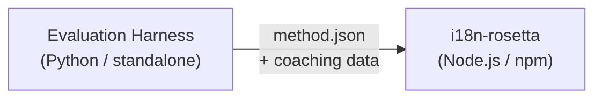

# Đặc tả Plugin Phương thức

> **Phiên bản**: 1.1  
> **Đối tượng**: Các nhà phát triển plugin  
> **Lược đồ chuẩn**: [`schemas/rosetta-plugin.schema.json`](https://github.com/gamedaysuits/i18n-rosetta/blob/main/schemas/rosetta-plugin.schema.json)

## Tổng quan

i18n-rosetta sử dụng một **hệ thống phương thức có thể cắm (pluggable)**. Mỗi cặp ngôn ngữ có thể sử dụng một phương thức dịch thuật khác nhau (LLM, coached, script-converter, v.v.). Các phương thức được đăng ký trong `lib/translate.js` và được phân giải cho từng cặp thông qua `lib/pairs.js`.

Nhiệm vụ của eval harness là **phát triển, kiểm thử và xuất** các phương thức dịch thuật. Nhiệm vụ của i18n-rosetta là **tiêu thụ và thực thi** chúng. Harness không bao giờ chạy bên trong rosetta.

### Luồng dữ liệu



---

## Định dạng Method Plugin

Một method plugin là một tệp JSON duy nhất (`method.json`) kèm theo các tệp dữ liệu coaching tùy chọn.

### `method.json` — Bắt buộc

```json
{
  "name": "french-formal-v1",
  "type": "llm-coached",
  "version": "1.0.0",
  "description": "Formally-tuned French with terminology enforcement and grammar coaching",
  "author": "Plugin Author",

  "config": {
    "model": "google/gemini-3.5-flash",
    "register": "formal",
    "batchSize": 80,
    "temperature": 0.2
  },

  "locales": ["fr"],

  "benchmarks": {
    "fr": {
      "date": "2026-05-11T00:00:00Z",
      "corpus_size": 500,
      "exact_match_rate": 0.42,
      "corpus_chrf": 72.3,
      "corpus_bleu": 45.1,
      "model": "google/gemini-3.5-flash",
      "harness_version": "1.0.0"
    }
  },

  "provenance": {
    "resources": [],
    "commercialReady": false,
    "flags": ["license-unclear"]
  },

  "coaching": {
    "dir": "coaching"
  }
}
```

### Tham chiếu trường

| Trường | Kiểu dữ liệu | Bắt buộc | Mô tả |
|-------|------|----------|-------------|
| `name` | string | ✅ | Định danh phương thức duy nhất (kebab-case) |
| `type` | string | ✅ | Loại phương thức Rosetta: `llm`, `llm-coached`, `api`, `google-translate`, `deepl`, `microsoft-translator`, `libretranslate`, `openai`, `anthropic`, `gemini` |
| `version` | string | ✅ | Phiên bản Semver (ví dụ: `1.0.0`) |
| `locales` | string[] | ✅ | Các mã ngôn ngữ (locale code) mà phương thức này nhắm tới (tối thiểu 1) |
| `description` | string | — | Mô tả chi tiết cho người đọc |
| `author` | string | — | Người đã phát triển/kiểm thử phương thức này |
| `config.model` | string | — | Định danh mô hình OpenRouter |
| `config.register` | string | — | Văn phong/giọng điệu của ngôn ngữ đích |
| `config.batchSize` | number | — | Số lượng key trên mỗi batch API (1–200, mặc định: 80) |
| `config.temperature` | number | — | Temperature của LLM (0.0–2.0, mặc định: 0.3) |
| `benchmarks` | object | — | Kết quả benchmark theo từng locale |
| `provenance` | object | — | Cấp phép và các phụ thuộc tài nguyên |
| `coaching.dir` | string | — | Đường dẫn tương đối đến thư mục dữ liệu coaching |

### Đối tượng Benchmark (theo từng locale)

| Trường | Kiểu dữ liệu | Bắt buộc | Mô tả |
|-------|------|----------|-------------|
| `date` | string | ✅ | Dấu thời gian ISO 8601 của lần chạy benchmark |
| `corpus_size` | number | ✅ | Số lượng mục nhập được đánh giá |
| `exact_match_rate` | number | ✅ | 0.0–1.0, tỷ lệ khớp chính xác (exact match) |
| `corpus_chrf` | number | — | Điểm chrF++ (0–100) |
| `corpus_bleu` | number | — | Điểm BLEU (0–100) |
| `model` | string | ✅ | Mô hình được sử dụng trong quá trình đánh giá (eval) |
| `harness_version` | string | ✅ | Phiên bản của evaluation harness được sử dụng |

:::info Các số liệu nào được hiển thị?
Lệnh `rosetta status` hiển thị **chrF++** và **tỷ lệ khớp chính xác (exact match rate)** từ khối benchmark. `corpus_bleu` được chấp nhận trong manifest nhưng hiện không được hiển thị hoặc sử dụng bởi bất kỳ lệnh rosetta nào. Bảng xếp hạng [Method Leaderboard](/leaderboard) theo dõi chrF++, exact match và tỷ lệ chấp nhận FST.
:::

---

### Đối tượng Provenance

Khối provenance truyền đạt trạng thái cấp phép của các tài nguyên đi kèm trong plugin.

| Trường | Kiểu dữ liệu | Mặc định | Mô tả |
|-------|------|---------|-------------|
| `resources` | object[] | `[]` | Danh sách các tài nguyên đi kèm với `name`, `license` và `type` |
| `commercialReady` | boolean | `false` | Cho biết plugin đã được cấp phép để phân phối thương mại hay chưa |
| `flags` | string[] | `["license-unclear"]` | Các cờ trạng thái (status flags) mà máy có thể đọc được |

**Trạng thái mặc định** — các plugin được xuất ra sẽ đi kèm với `commercialReady: false` và `flags: ["license-unclear"]`.

**Trạng thái đã cấp phép (Cleared state)** — khi việc cấp phép đã được xác minh: thiết lập `commercialReady: true` và xóa các cờ.

---

## Định dạng Dữ liệu Coaching

Nếu `type` là `llm-coached`, plugin nên bao gồm các tệp dữ liệu coaching trong thư mục con `coaching/`.

### `coaching/<locale>.json`

```json
{
  "grammar_rules": [
    "French adjectives agree in gender and number with the noun they modify",
    "Use 'vous' for formal contexts, 'tu' for informal"
  ],
  "dictionary": {
    "dashboard": "tableau de bord",
    "deployment": "déploiement",
    "settings": "paramètres"
  },
  "style_notes": "Prefer active voice. Avoid anglicisms where a native French term exists."
}
```

| Trường | Kiểu dữ liệu | Bắt buộc | Mô tả |
|-------|------|----------|-------------|
| `grammar_rules` | string[] | — | Các quy tắc được chèn vào mọi prompt LLM cho locale này |
| `dictionary` | object | — | Bản đồ thuật ngữ → bản dịch. Các thuật ngữ khớp sẽ được chèn vào dưới dạng thuật ngữ bắt buộc. |
| `style_notes` | string | — | Các hướng dẫn văn phong tự do được nối thêm vào prompt |

---

## Cấu trúc Thư mục

```
french-formal-v1/
  method.json                 # Method manifest with benchmarks
  coaching/
    fr.json                   # Coaching data for French
```

Đối với các phương thức đa ngôn ngữ (multi-locale):

```
european-formal-v2/
  method.json                 # locales: ["fr", "de", "es", "it"]
  coaching/
    fr.json
    de.json
    es.json
    it.json
```

---

## Cách Rosetta Tiêu thụ Plugin

### Cài đặt

```bash
i18n-rosetta plugin install ./french-formal-v1/
```

Lưu vào `.rosetta/methods/french-formal-v1/`.

### Cấu hình

```json title="i18n-rosetta.config.json"
{
  "pairs": {
    "en:fr": {
      "methodPlugin": "french-formal-v1"
    }
  }
}
```

:::info Ngữ nghĩa gộp (Merge semantics)
Plugin định nghĩa *phương thức nào* sẽ được sử dụng (`type`). Cấu hình cặp (pair config) tinh chỉnh *cách* chạy phương thức đó (`model`, `register`, `batchSize`). Nếu cặp thiết lập `model`, nó sẽ ghi đè giá trị mặc định của plugin.
:::

### Thời gian chạy (Runtime)

1. Rosetta đọc `method.json` từ `.rosetta/methods/french-formal-v1/`
2. Trường `type` của plugin thiết lập phương thức dịch thuật (ví dụ: `llm-coached`)
3. Tải dữ liệu coaching từ thư mục `coaching/` của plugin
4. Sử dụng khối `config` để điền các khoảng trống trong model/register/temperature
5. Khối `benchmarks` được hiển thị trong đầu ra của `rosetta status`
6. Khối `provenance` được kiểm tra bởi `rosetta provenance` để tìm các cờ cấp phép

---

## Xác thực Lược đồ (Schema Validation)

Các manifest của plugin được xác thực tại thời điểm cài đặt dựa trên [`schemas/rosetta-plugin.schema.json`](https://github.com/gamedaysuits/i18n-rosetta/blob/main/schemas/rosetta-plugin.schema.json).

Tham chiếu lược đồ trong `method.json` của bạn để IDE tự động hoàn thành:

```json
{
  "$schema": "./node_modules/i18n-rosetta/schemas/rosetta-plugin.schema.json",
  "name": "my-method-v1"
}
```

---

## Những gì KHÔNG nên bao gồm

- ❌ Không có mã Python hoặc các phụ thuộc của harness
- ❌ Không có dữ liệu ngữ liệu thô (raw corpus data) hoặc nhật ký chạy (run logs)
- ❌ Không có API key hoặc thông tin xác thực
- ❌ Không có cấu hình harness
- ❌ Không có các mẫu prompt nội bộ (chúng nằm trong các triển khai phương thức của rosetta)

Plugin **chỉ chứa dữ liệu**: cấu hình, nội dung coaching và kết quả benchmark.

---

## Xem thêm

- [Các Phương thức Dịch thuật](/docs/guides/translation-methods) — cách hoạt động của từng phương thức tích hợp sẵn
- [Cấu hình](/docs/getting-started/configuration) — cấu hình theo từng cặp và từng ngôn ngữ
- [Phục vụ Phương thức qua API](/docs/guides/serving-a-method) — lưu trữ các phương thức dưới dạng dịch vụ HTTP
- [Cookbook: FST-Gated Pipeline](https://mtevalarena.org/docs/tutorials/fst-gated-pipeline) — xây dựng và đóng gói một pipeline
- [Đánh giá MT](https://mtevalarena.org/docs/leaderboard/rules) — benchmark các phương thức để gửi lên bảng xếp hạng
- [Hỗ trợ Ngôn ngữ Ít Tài nguyên](https://mtevalarena.org/docs/community/low-resource-languages) — trường hợp sử dụng cho các plugin cộng đồng