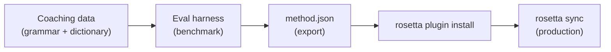

# Hướng dẫn: Xây dựng một Plugin dịch thuật

Xây dựng một phương pháp dịch tùy chỉnh từ đầu, đánh giá hiệu suất (benchmark) và triển khai nó dưới dạng một rosetta plugin. Đây là quy trình làm việc hoàn chỉnh để thêm một cặp ngôn ngữ mới mà không có API có sẵn nào hỗ trợ.

**Những gì bạn sẽ xây dựng:** Một plugin dịch thuật có hướng dẫn (coached translation) cho tiếng Pháp trang trọng với các thuật ngữ bắt buộc, quy tắc ngữ pháp và điểm đánh giá hiệu suất.

**Thời gian:** 30–45 phút

**Điều kiện tiên quyết:**
- Đã cài đặt i18n-rosetta (`npm install --save-dev i18n-rosetta`)
- Một API key của OpenRouter (`OPENROUTER_API_KEY`)
- Python 3.10+ (dành cho eval harness)

---

## Bước 1: Xác định vấn đề

Bạn đang dịch một SaaS dashboard sang tiếng Pháp. Phương pháp `llm` mặc định tạo ra các bản dịch chính xác nhưng không nhất quán:

- Đôi khi "dashboard" được dịch thành "tableau de bord," lúc khác lại là "panneau de contrôle"
- Giọng văn thay đổi luân phiên giữa các hình thức `tu` và `vous`
- Các thuật ngữ kỹ thuật bị Anh hóa một cách không nhất quán

Bạn cần **bắt buộc sử dụng thuật ngữ** (terminology enforcement) và **kiểm soát ngữ điệu** (register control) mà prompt LLM thông thường không cung cấp được.

## Bước 2: Tạo dữ liệu hướng dẫn (Coaching Data)

Tạo một file hướng dẫn mã hóa các yêu cầu ngôn ngữ của bạn:

```bash
mkdir -p .rosetta/coaching
```

```json title=".rosetta/coaching/fr.json"
{
  "grammar_rules": [
    "Always use the 'vous' form for formal register",
    "French adjectives agree in gender and number with their noun",
    "Use the present tense for UI instructions, not the imperative",
    "Preserve sentence-final punctuation style from the source"
  ],
  "dictionary": {
    "dashboard": "tableau de bord",
    "deployment": "déploiement",
    "settings": "paramètres",
    "environment variable": "variable d'environnement",
    "webhook": "webhook",
    "API key": "clé API",
    "sign in": "se connecter",
    "sign out": "se déconnecter",
    "repository": "dépôt",
    "pull request": "demande de tirage"
  },
  "style_notes": "Formal technical French. Prefer native French terms over anglicisms where established equivalents exist. Keep UI labels concise — 3 words maximum where possible."
}
```

**Chức năng của từng trường:**
- **`grammar_rules`** — Được đưa vào system prompt của LLM dưới dạng các ràng buộc rõ ràng
- **`dictionary`** — Được đối chiếu với các key nguồn; khi một thuật ngữ trong từ điển xuất hiện, nó sẽ được đưa vào prompt dưới dạng "thuật ngữ bắt buộc"
- **`style_notes`** — Được thêm vào cuối system prompt như một hướng dẫn văn phong chung

## Bước 3: Cấu hình cặp ngôn ngữ

Yêu cầu rosetta sử dụng `llm-coached` cho tiếng Pháp:

```json title="i18n-rosetta.config.json"
{
  "version": 3,
  "inputLocale": "en",
  "localesDir": "./locales",
  "pairs": {
    "en:fr": {
      "method": "llm-coached",
      "model": "google/gemini-3.5-flash"
    }
  },
  "languages": {
    "fr": {
      "register": "Formal technical French (vous-form)",
      "name": "French"
    }
  }
}
```

## Bước 4: Kiểm thử

```bash
npx i18n-rosetta sync --dry
```

Xem lại kết quả của quá trình chạy thử (dry-run). Hãy kiểm tra xem:
- ✅ Các thuật ngữ trong từ điển được sử dụng nhất quán ("tableau de bord," không phải "panneau de contrôle")
- ✅ Hình thức `vous` được sử dụng xuyên suốt
- ✅ Các thuật ngữ kỹ thuật khớp với từ điển của bạn

Sau đó chạy đồng bộ thực tế:

```bash
npx i18n-rosetta sync
```

## Bước 5: Đánh giá hiệu suất với Eval Harness (Tùy chọn)

Nếu bạn muốn có điểm chất lượng — và chắc chắn là bạn muốn, vì các plugin đi kèm với dữ liệu benchmark — hãy sử dụng công cụ eval harness đi kèm.

### Cài đặt Harness

```bash
git clone https://github.com/gamedaysuits/gds-mt-eval-harness.git
cd gds-mt-eval-harness
pip install -r requirements.txt
```

### Tạo một Reference Corpus (Tập ngữ liệu tham chiếu)

Tạo một file chứa các chuỗi nguồn và các bản dịch đã được xác nhận là tốt:

```json title="corpus/french-formal.json"
[
  {
    "source": "Dashboard",
    "reference": "Tableau de bord"
  },
  {
    "source": "Sign in to your account",
    "reference": "Connectez-vous à votre compte"
  },
  {
    "source": "Your deployment is ready",
    "reference": "Votre déploiement est prêt"
  },
  {
    "source": "Environment variables",
    "reference": "Variables d'environnement"
  }
]
```

### Chạy Benchmark

```bash
python harness.py eval \
  --corpus corpus/french-formal.json \
  --source en \
  --target fr \
  --method llm-coached \
  --model google/gemini-3.5-flash
```

Harness sẽ xuất ra:
- **chrF++** — Điểm F-score cấp độ ký tự (0–100). Trên 70 là mức tốt.
- **BLEU** — Độ trùng lặp N-gram (0–100). Trên 40 là mức ổn định cho dịch thuật có hướng dẫn (coached translation).
- **Exact match rate** — Tỷ lệ các bản dịch khớp chính xác hoàn toàn với bản tham chiếu.

### Xuất Plugin

Khi bạn đã hài lòng với các điểm số:

```bash
python harness.py export \
  --name french-formal-v1 \
  --output ./french-formal-v1/
```

Lệnh này sẽ tạo ra:

```
french-formal-v1/
├── method.json          # Manifest with config + benchmarks
└── coaching/
    └── fr.json          # Your coaching data
```

## Bước 6: Cài đặt Plugin vào Rosetta

```bash
npx i18n-rosetta plugin install ./french-formal-v1/
```

Lệnh này sao chép plugin vào `.rosetta/methods/french-formal-v1/`.

Cập nhật cấu hình của bạn để sử dụng nó:

```json title="i18n-rosetta.config.json"
{
  "pairs": {
    "en:fr": {
      "methodPlugin": "french-formal-v1"
    }
  }
}
```

## Bước 7: Xác minh

```bash
# Check plugin is installed and shows benchmark scores
npx i18n-rosetta status

# Run a sync with the plugin
npx i18n-rosetta sync

# Audit licensing status
npx i18n-rosetta provenance
```

Đầu ra `status` sẽ hiển thị:

```
en → fr
  Method:    french-formal-v1 (llm-coached)
  Model:     google/gemini-3.5-flash
  Quality:   high
  chrF++:    74.2
  BLEU:      46.8
  Exact:     42%
```

## Những gì bạn đã xây dựng



Bây giờ bạn đã có:
1. **Dữ liệu hướng dẫn (Coaching data)** — Các quy tắc ngữ pháp và thuật ngữ giúp đảm bảo tính nhất quán
2. **Điểm benchmark** — Chất lượng được định lượng đi kèm với plugin
3. **Một plugin di động** — `method.json` + dữ liệu hướng dẫn, có thể cài đặt trên bất kỳ máy nào
4. **Triển khai production** — Được tích hợp vào luồng đồng bộ (sync pipeline) của bạn

## Các bước tiếp theo

- **[Đặc tả Plugin](/docs/reference/plugin-spec)** — Tài liệu tham khảo đầy đủ về định dạng manifest
- **[Các phương pháp dịch thuật](/docs/guides/translation-methods)** — So sánh cả bốn phương pháp
- **[Ngôn ngữ ít tài nguyên](https://mtevalarena.org/docs/community/low-resource-languages)** — Áp dụng mô hình này cho các ngôn ngữ không được API hỗ trợ
- **[Dịch 30 ngôn ngữ](/docs/tutorials/translate-30-languages)** — Mở rộng quy mô dự án của bạn đến khán giả toàn cầu