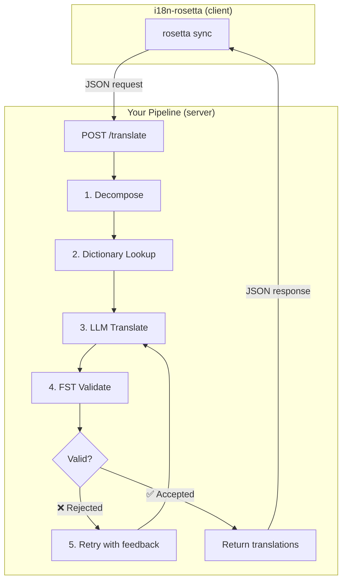
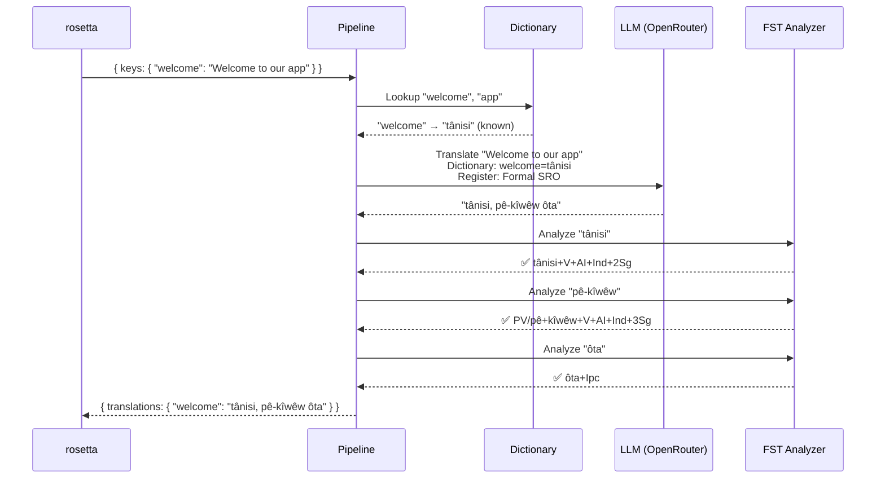
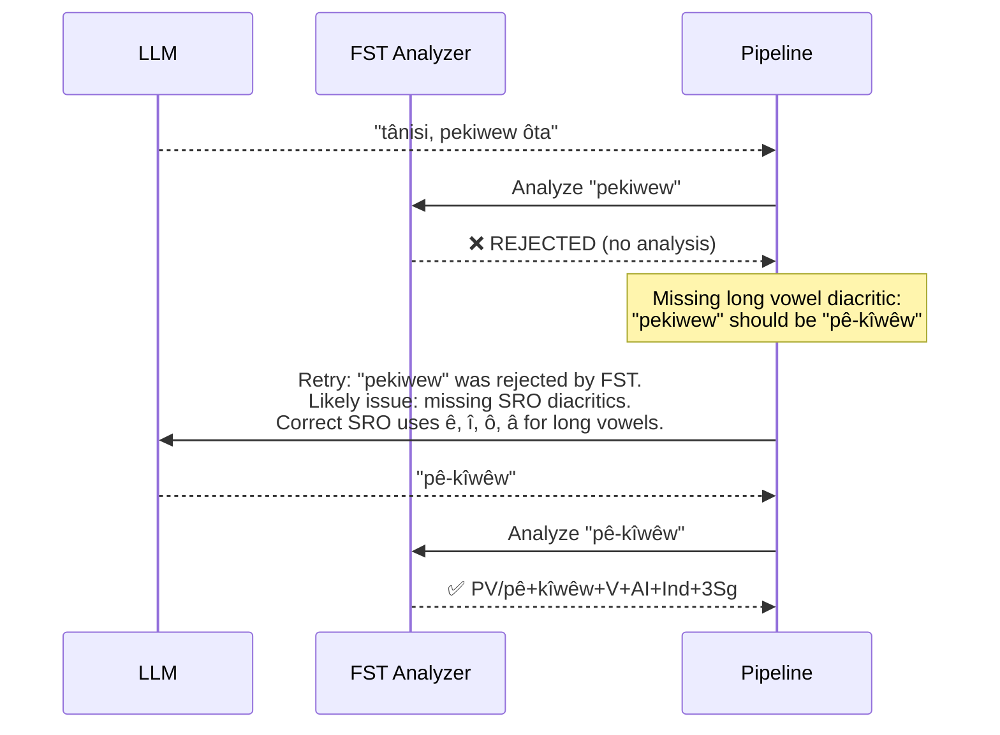
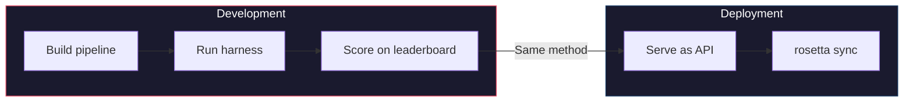

# Cookbook: Pipeline dịch thuật kiểm soát bằng FST

Xây dựng một pipeline dịch thuật nhiều giai đoạn giúp phân tách văn bản nguồn, dịch qua LLM, xác thực đầu ra bằng finite-state transducer (FST - máy trạng thái hữu hạn), và phục vụ toàn bộ hệ thống như một HTTP endpoint mà rosetta gọi thông qua phương thức `api`.

**Những gì bạn sẽ xây dựng:** Một API dịch thuật cho tiếng Plains Cree giúp bắt các bản dịch không hợp lệ về mặt hình thái học *trước khi* chúng được đưa vào các file locale của bạn.

:::info Điều kiện tiên quyết
- Một FST binary đang chạy (ví dụ: từ [trình phân tích tiếng Plains Cree của ALTLab](https://github.com/UAlbertaALTLab/lang-crk))
- Node.js 20+ hoặc Python 3.10+
- Một API key của OpenRouter cho bước LLM
:::

---

## Kiến trúc

Pipeline chạy như một HTTP service độc lập. rosetta không biết hoặc không quan tâm đến những gì xảy ra bên trong — nó chỉ gửi các key và nhận lại các bản dịch.



### Tại sao lại chọn kiến trúc này

Mỗi giai đoạn có một nhiệm vụ cụ thể:

| Giai đoạn | Chức năng | Tầm quan trọng |
|-------|-------------|---------------|
| **Phân tách** | Chia nhỏ các chuỗi UI phức hợp thành các phân đoạn có thể dịch được | Các ngôn ngữ hỗn nhập (polysynthetic) mã hóa toàn bộ câu trong các từ đơn — LLM cần các đơn vị nhỏ hơn |
| **Tra cứu từ điển** | Kiểm tra từ điển song ngữ cho các bản dịch đã biết | Bắt buộc sử dụng đúng thuật ngữ cho các từ đã biết thay vì dựa vào sự phỏng đoán của LLM |
| **Dịch bằng LLM** | Gửi phân đoạn đến một LLM kèm theo ngữ cảnh về văn phong và ngữ pháp | Xử lý các cụm từ mới và tạo ra đầu ra trôi chảy |
| **Xác thực bằng FST** | Chạy đầu ra qua một trình phân tích hình thái học | Bắt các dạng từ không hợp lệ — nếu FST từ chối một từ, từ đó không hợp lệ trong ngôn ngữ đích |
| **Thử lại** | Gửi lại các từ bị từ chối kèm theo phản hồi lỗi của FST | Cung cấp cho LLM thông tin cụ thể về lý do *tại sao* từ đó bị sai |

---

## Luồng dữ liệu

Dưới đây là những gì xảy ra với một key duy nhất (`"welcome": "Welcome to our app"`) khi nó đi qua pipeline:



### Khi FST từ chối



---

## Triển khai

### Bước 1: Bộ khung Server

Server triển khai [API method contract](/docs/guides/serving-a-method) của rosetta — một endpoint `POST /translate` duy nhất.

```javascript title="server.js"
import express from 'express';
import { translateBatch } from './pipeline.js';

const app = express();
app.use(express.json());

/**
 * rosetta API contract:
 *
 * Request:  { source_locale, target_locale, method, keys: { "key": "source" } }
 * Response: { translations: { "key": "translated" }, meta: { ... } }
 */
app.post('/translate', async (req, res) => {
  const { source_locale, target_locale, method, keys } = req.body;

  // Validate request
  if (!keys || typeof keys !== 'object') {
    return res.status(400).json({ error: { message: 'Missing keys object' } });
  }

  try {
    const startTime = Date.now();
    const { translations, stats } = await translateBatch(keys, {
      sourceLang: source_locale,
      targetLang: target_locale,
    });

    res.json({
      translations,
      meta: {
        model: 'custom-pipeline/fst-gated-v1',
        method: 'decompose-lookup-translate-validate',
        elapsed_ms: Date.now() - startTime,
        fst_acceptance_rate: stats.fstAccepted / stats.total,
        retries: stats.retries,
      },
    });
  } catch (err) {
    console.error('[ERR] Pipeline failed:', err.message);
    res.status(500).json({ error: { message: err.message } });
  }
});

// Health check for rosetta connectivity verification
app.get('/health', (req, res) => res.json({ status: 'ok' }));

app.listen(3001, () => {
  console.log('FST-gated pipeline running on http://localhost:3001');
});
```

### Bước 2: Pipeline

Mỗi giai đoạn là một hàm. Pipeline liên kết chúng lại với nhau.

```javascript title="pipeline.js"
import { lookupDictionary } from './dictionary.js';
import { callLLM } from './llm.js';
import { analyzeWithFST } from './fst.js';

const MAX_RETRIES = 3;

/**
 * Translate a batch of keys through the full pipeline.
 *
 * @param {object} keys - Map of key → source string
 * @param {object} options - { sourceLang, targetLang }
 * @returns {{ translations: object, stats: object }}
 */
export async function translateBatch(keys, options) {
  const translations = {};
  const stats = { total: 0, fstAccepted: 0, retries: 0, dictionaryHits: 0 };

  for (const [key, sourceText] of Object.entries(keys)) {
    stats.total++;
    translations[key] = await translateSingle(sourceText, options, stats);
  }

  return { translations, stats };
}

/**
 * Translate a single string through all pipeline stages.
 */
async function translateSingle(sourceText, options, stats) {

  // ── Stage 1: Decompose ──────────────────────────────────
  // Split compound strings into segments the LLM can handle.
  // For UI strings this is often a no-op, but for longer content
  // it prevents the LLM from losing context in long prompts.
  const segments = decompose(sourceText);

  // ── Stage 2: Dictionary Lookup ──────────────────────────
  // Check each segment against the bilingual dictionary.
  // Known terms are forced — the LLM won't override them.
  const knownTerms = {};
  for (const segment of segments) {
    const entry = lookupDictionary(segment.toLowerCase());
    if (entry) {
      knownTerms[segment] = entry;
      stats.dictionaryHits++;
    }
  }

  // ── Stage 3: LLM Translate ──────────────────────────────
  let translation = await callLLM(sourceText, {
    ...options,
    knownTerms,
    register: 'nêhiyawêwin (Plains Cree). Use SRO orthography. '
            + 'Professional register for educational contexts.',
  });

  // ── Stage 4: FST Validate ──────────────────────────────
  // Split the translation into words and check each one.
  let { accepted, rejected } = await validateWords(translation);

  // ── Stage 5: Retry Loop ─────────────────────────────────
  // If any words were rejected, retry with FST feedback.
  let attempt = 0;
  while (rejected.length > 0 && attempt < MAX_RETRIES) {
    attempt++;
    stats.retries++;

    const feedback = rejected
      .map(w => `"${w}" was rejected by the morphological analyzer`)
      .join('; ');

    translation = await callLLM(sourceText, {
      ...options,
      knownTerms,
      register: 'nêhiyawêwin (Plains Cree). Use SRO orthography.',
      feedback: `Previous attempt had invalid words. ${feedback}. `
              + 'Use correct SRO diacritics (ê, î, ô, â for long vowels). '
              + 'Ensure verb forms match expected conjugation patterns.',
    });

    ({ accepted, rejected } = await validateWords(translation));
  }

  if (rejected.length === 0) stats.fstAccepted++;

  return translation;
}

/**
 * Decompose source text into translatable segments.
 *
 * For simple key-value UI strings, this usually returns the
 * original string as a single segment. For longer content,
 * it splits on sentence boundaries.
 */
function decompose(text) {
  // Simple sentence-boundary split. Replace with your own
  // morphological decomposition for more complex needs.
  return text
    .split(/(?<=[.!?])\s+/)
    .filter(s => s.trim().length > 0);
}

/**
 * Validate each word in a translation against the FST.
 *
 * @returns {{ accepted: string[], rejected: string[] }}
 */
async function validateWords(translation) {
  // Split on whitespace and punctuation, keeping only words
  const words = translation
    .split(/[\s,;:.!?'"()[\]{}]+/)
    .filter(w => w.length > 0);

  const accepted = [];
  const rejected = [];

  for (const word of words) {
    const analyses = await analyzeWithFST(word);
    if (analyses.length > 0) {
      accepted.push(word);
    } else {
      rejected.push(word);
    }
  }

  return { accepted, rejected };
}
```

### Bước 3: Wrapper cho FST

Bọc FST binary của bạn dưới dạng một hàm async. Ví dụ này sử dụng trình phân tích tiếng Plains Cree dựa trên HFST của ALTLab.

```javascript title="fst.js"
import { execFile } from 'node:child_process';
import { promisify } from 'node:util';

const execFileAsync = promisify(execFile);

// Path to your FST analyzer binary
const FST_PATH = process.env.FST_ANALYZER_PATH || './bin/crk-analyzer';

/**
 * Run a word through the FST morphological analyzer.
 *
 * Returns an array of analyses. Empty array = rejected.
 *
 * Example:
 *   analyzeWithFST("tânisi")
 *   → ["tânisi+V+AI+Ind+2Sg", "tânisi+V+AI+Cnj+2Sg"]
 *
 *   analyzeWithFST("pekiwew")
 *   → []  // rejected — missing diacritics
 *
 * @param {string} word - A single word in SRO orthography
 * @returns {string[]} Array of FST analyses (empty = rejected)
 */
export async function analyzeWithFST(word) {
  try {
    // HFST lookup: pipe the word to stdin, read analyses from stdout
    const { stdout } = await execFileAsync(
      FST_PATH,
      ['--quiet'],
      { input: word + '\n', timeout: 5000 }
    );

    // Parse HFST output: each line is "input\tanalysis\tweight"
    // Lines with "+?" indicate unrecognized forms
    return stdout
      .split('\n')
      .filter(line => line.includes('\t') && !line.includes('+?'))
      .map(line => line.split('\t')[1]);

  } catch (err) {
    // If the FST binary isn't available, log and reject
    console.error(`[WARN] FST analysis failed for "${word}": ${err.message}`);
    return [];
  }
}
```

### Bước 4: Các module Từ điển và LLM

```javascript title="dictionary.js"
/**
 * Simple bilingual dictionary backed by a JSON file.
 *
 * In production, you'd load from the coaching data directory
 * or query itwêwina (https://itwewina.altlab.app/) via API.
 */
const DICTIONARY = {
  'hello': 'tânisi',
  'welcome': 'tânisi',
  'thank you': 'kinanâskomitin',
  'home': 'kīwēwin',
  'search': 'nānātawāpahtam',
  'settings': 'isi-nākatohkēwin',
  'help': 'nīsōhkamākēwin',
  'back': 'kīwē',
};

/**
 * @param {string} term - Lowercase English term
 * @returns {string|null} Cree translation or null
 */
export function lookupDictionary(term) {
  return DICTIONARY[term] || null;
}
```

```javascript title="llm.js"
/**
 * Call an LLM via OpenRouter for translation.
 */
const OPENROUTER_API = 'https://openrouter.ai/api/v1/chat/completions';

export async function callLLM(sourceText, options) {
  const { knownTerms = {}, register, feedback } = options;

  // Build the system prompt with register and known terms
  let systemPrompt = `You are translating English to Plains Cree.\n\n`;
  systemPrompt += `Register: ${register}\n\n`;

  if (Object.keys(knownTerms).length > 0) {
    systemPrompt += `Required terminology (use these exact translations):\n`;
    for (const [en, crk] of Object.entries(knownTerms)) {
      systemPrompt += `  "${en}" → "${crk}"\n`;
    }
    systemPrompt += '\n';
  }

  if (feedback) {
    systemPrompt += `IMPORTANT correction from previous attempt:\n${feedback}\n\n`;
  }

  systemPrompt += `Rules:\n`;
  systemPrompt += `- Use Standard Roman Orthography (SRO)\n`;
  systemPrompt += `- Use macron/circumflex for long vowels: ê, î, ô, â\n`;
  systemPrompt += `- Return ONLY the Cree translation, nothing else\n`;

  const response = await fetch(OPENROUTER_API, {
    method: 'POST',
    headers: {
      'Authorization': `Bearer ${process.env.OPENROUTER_API_KEY}`,
      'Content-Type': 'application/json',
    },
    body: JSON.stringify({
      model: 'google/gemini-2.5-pro',
      messages: [
        { role: 'system', content: systemPrompt },
        { role: 'user', content: sourceText },
      ],
      temperature: 0.2,
    }),
  });

  const json = await response.json();
  return json.choices[0].message.content.trim();
}
```

---

## Kết nối với rosetta

### Cấu hình cặp ngôn ngữ

Trỏ cặp ngôn ngữ của bạn tới service đang chạy:

```json title="i18n-rosetta.config.json"
{
  "version": 3,
  "inputLocale": "en",
  "pairs": {
    "en:crk": {
      "method": "api",
      "endpoint": "http://localhost:3001/translate"
    }
  },
  "languages": {
    "crk": {
      "name": "Plains Cree",
      "register": "SRO syllabics with grammatical precision."
    }
  }
}
```

### Thiết lập API key

```bash
export ROSETTA_API_KEY="your-service-auth-token"
export OPENROUTER_API_KEY="sk-or-v1-..."  # for the LLM step inside the pipeline
```

### Chạy thử

```bash
# Start the pipeline
node server.js

# In another terminal, run rosetta
npx i18n-rosetta sync
```

rosetta gửi POST các key tiếng Anh của bạn tới pipeline. Pipeline sẽ phân tách, tra cứu, dịch, xác thực, thử lại và trả về các bản dịch tiếng Cree. rosetta ghi chúng vào `crk.json`.

---

## Đánh giá Pipeline của bạn

Cùng một pipeline có thể được đánh giá bằng [eval harness](/docs/eval/harness). Harness sử dụng cùng một pattern JSON-in/JSON-out:

```bash
# Clone the harness
git clone https://github.com/gamedaysuits/gds-mt-eval-harness.git
cd gds-mt-eval-harness

# Run against the EDTeKLA dataset
python eval/baseline_experiment.py \
  --dataset data/edtekla-dev-v1.json \
  --model google/gemini-2.5-pro \
  --fst-analyzer ./bin/crk-analyzer \
  --condition fst-gated-v1 \
  --submit
```

Cờ `--fst-analyzer` yêu cầu harness chạy xác thực FST trên mọi đầu ra — giống hệt quá trình xác thực mà pipeline của bạn thực hiện. Điều này cho phép bạn so sánh điểm số pipeline của mình với mức cơ sở (baseline).



**Chứng minh hiệu quả, sau đó sử dụng.** Phương thức bạn benchmark trong harness cũng chính là phương thức mà rosetta gọi trong môi trường production.

---

## Đóng gói thành Plugin

Khi pipeline của bạn đã có điểm số trên bảng xếp hạng (leaderboard), hãy đóng gói nó thành một plugin của rosetta để người khác có thể sử dụng:

```json title="crk-fst-gated-v1/method.json"
{
  "name": "crk-fst-gated-v1",
  "type": "api",
  "version": "1.0.0",
  "description": "FST-gated Plains Cree translation with morphological validation",
  "author": "Your Name",

  "config": {
    "endpoint": "https://your-server.example.com/translate"
  },

  "locales": ["crk"],

  "benchmarks": {
    "crk": {
      "date": "2026-06-01T00:00:00Z",
      "corpus_size": 124,
      "exact_match_rate": 0.12,
      "corpus_chrf": 48.7,
      "model": "google/gemini-2.5-pro",
      "harness_version": "2.0"
    }
  },

  "provenance": {
    "resources": [
      { "name": "ALTLab CRK Analyzer", "license": "LGPL-3.0", "type": "fst" },
      { "name": "Wolvengrey Dictionary", "license": "CC-BY-NC-SA-4.0", "type": "dictionary" }
    ],
    "commercialReady": false,
    "flags": ["nc-resource"]
  }
}
```

Cài đặt plugin:

```bash
i18n-rosetta plugin install ./crk-fst-gated-v1/
```

Giờ đây, bất kỳ ai có quyền truy cập vào server của bạn đều có thể sử dụng plugin này:

```json title="i18n-rosetta.config.json"
{
  "pairs": {
    "en:crk": { "methodPlugin": "crk-fst-gated-v1" }
  }
}
```

---

## Mở rộng Pattern này

Cookbook này minh họa một kiến trúc pipeline. Bạn có thể điều chỉnh nó cho bất kỳ ngôn ngữ hoặc phương thức nào:

| Biến thể | Những thay đổi |
|-----------|-------------|
| **FST khác** | Thay đổi đường dẫn binary. Bạn có thể tải xuống các FST đã biên dịch sẵn (như các binary `.hfstol` hoặc `lttoolbox`) cho hơn 100 ngôn ngữ từ [GiellaLT GitHub](https://github.com/giellalt) hoặc [Apertium GitHub](https://github.com/apertium). |
| **Không có sẵn FST** | Loại bỏ giai đoạn thực thi FST và sử dụng [các file mô hình UniMorph phẳng](https://huggingface.co/datasets/unimorph/universal_morphologies) từ Hugging Face để thực hiện xác thực tra cứu cơ sở dữ liệu tĩnh cho các dạng từ biến tố. |
| **Nhiều LLM** | Liên kết các model: một model nhanh cho bản nháp ban đầu, một model suy luận (reasoning model) để sửa lỗi. |
| **Có sự tham gia của con người (Human-in-the-loop)** | Thêm một giai đoạn hàng đợi (queue) để giữ lại các bản dịch không chắc chắn cho chuyên gia đánh giá trước khi trả về. |
| **Model đã tinh chỉnh (Fine-tuned)** | Thay thế lệnh gọi OpenRouter bằng một model cục bộ (Ollama, vLLM, v.v.). |
| **Ngôn ngữ khác** | Thay đổi từ điển, FST và văn phong (register). Kiến trúc vẫn giữ nguyên. |

Pipeline là một pattern. Các giai đoạn có thể thay thế cho nhau. Hãy xây dựng những gì phù hợp với ngôn ngữ của bạn, chứng minh hiệu quả của nó trên [bảng xếp hạng](/leaderboard), và triển khai nó.

---

## Xem thêm

- **[Phục vụ một Phương thức qua API](/docs/guides/serving-a-method)** — đặc tả API contract
- **[Đặc tả Plugin](/docs/reference/plugin-spec)** — định dạng manifest method.json
- **[Hỗ trợ Ngôn ngữ ít tài nguyên](/docs/guides/low-resource-languages)** — bối cảnh rộng hơn và các nguyên tắc OCAP
- **[Đánh giá MT (Dịch máy)](/docs/eval/)** — các phương thức tốt và xấu, những gì sẽ bị loại
- **[Eval Harness](/docs/eval/harness)** — cách benchmark pipeline của bạn
- **[Bảng xếp hạng Phương thức](/leaderboard)** — gửi điểm số của bạn
- **[ALTLab](https://altlab.artsrn.ualberta.ca/)** — Phòng thí nghiệm Công nghệ Ngôn ngữ Alberta (FST tiếng Plains Cree)
- **[Các phương thức Dịch thuật](/docs/guides/translation-methods)** — cách hoạt động của từng phương thức tích hợp sẵn