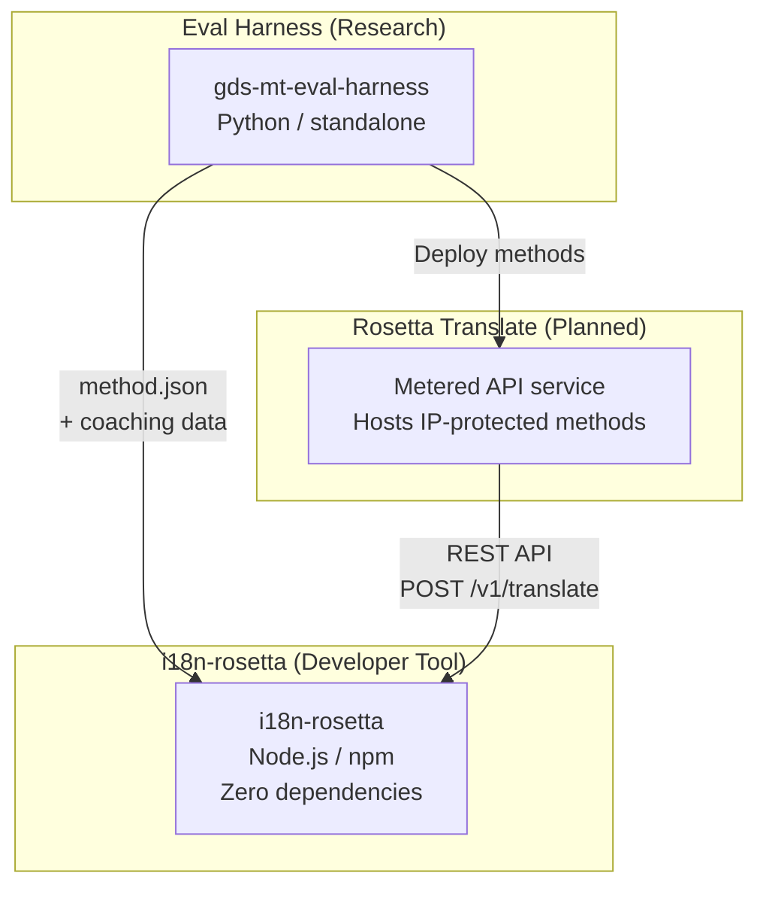
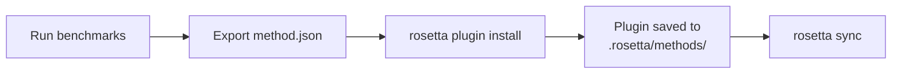
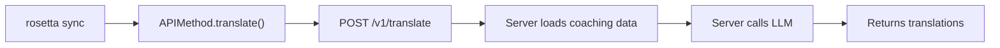
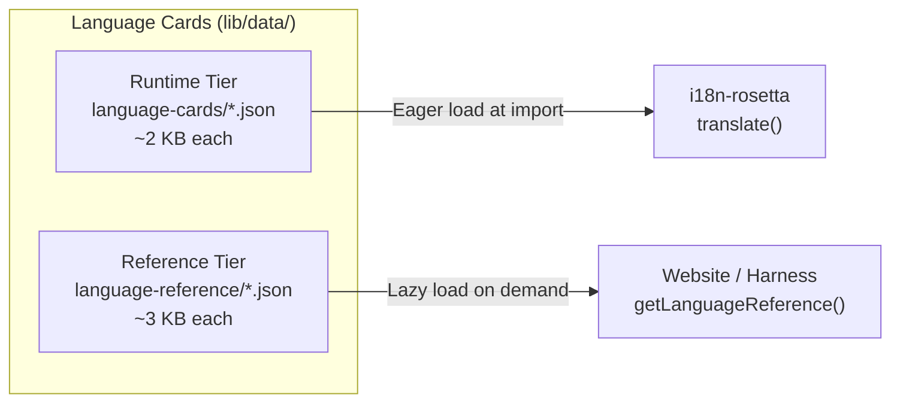

# 架构

Rosetta 翻译生态系统由三个独立的工具组成，它们通过明确定义的契约协同工作。在构建时，它们互不依赖。它们通过共享的**方法插件格式**和 **REST API 契约**进行通信。

## 三个组成部分



### i18n-rosetta（本项目）

开源开发者工具。使用可插拔的方法翻译本地化文件。零依赖，配置可选，开箱即用。

**内置方法：**
- `llm` → OpenRouter / 任何 LLM（200 多种模型）
- `llm-coached` → LLM + 语法/词典指导
- `openai` → 直接调用 OpenAI API（GPT-4o, GPT-4o-mini）
- `anthropic` → 直接调用 Anthropic API（Claude Sonnet, Haiku, Opus）
- `gemini` → 直接调用 Google Gemini API（Flash, Pro — 提供免费额度）
- `google-translate` → Google Cloud Translation API v2
- `deepl` → 支持术语表的 DeepL API
- `microsoft-translator` → Azure Cognitive Services Translator
- `libretranslate` → 自托管 LibreTranslate（AGPL，免费）
- `api` → 连接任何远程 REST 端点的轻量级管道

### Eval Harness（配套项目）

用于开发、测试和对翻译方法进行基准测试的研究工具。当某种方法达到可接受的质量时，harness 会导出一个**方法插件**——包含 `method.json` 清单文件和可选的指导数据文件。

harness 从不在 rosetta 内部运行。它是一个独立的工具，用于生成静态输出（JSON 文件）。Rosetta 只是读取这些文件。

[→ GitHub 上的 Eval Harness](https://github.com/gamedaysuits/gds-mt-eval-harness)

### Rosetta Translate（计划中）

按量计费的 API 服务，在服务端托管专有翻译方法——提示词、指导数据和语言处理管道永远不会离开服务器。

## 它们如何连接

### Eval Harness → i18n-rosetta（单向导出）



**契约**：[插件规范](/docs/reference/plugin-spec)

### Rosetta Translate → i18n-rosetta（运行时 API）



Rosetta 的 `APIMethod` 是一个**简单管道**（dumb pipe）。它负责发送键名并接收返回的翻译结果。它不包含任何翻译逻辑，也不包含任何专有内容。

## 各组件对彼此的了解

| 工具 | 了解 rosetta 吗？ | 了解 Rosetta Translate 吗？ | 了解 harness 吗？ |
|------|---------------------|-------------------------------|---------------------|
| **i18n-rosetta** | *（本身就是 rosetta）* | 是 — `api` 方法会调用它 | 否 — 仅读取插件导出文件 |
| **Rosetta Translate** | 是 — 为其请求提供服务 | *（本身就是 Rosetta Translate）* | 否 — 接收已部署的方法 |
| **Eval Harness** | 是 — 导出插件格式 | 否 — 方法单独部署 | *（本身就是 harness）* |

## 用户场景

### 场景 1：免费，零配置（大多数用户）

```bash
export OPENROUTER_API_KEY=sk-...
npx i18n-rosetta sync
```

使用内置的 `llm` 方法。没有插件，没有 Rosetta Translate，也没有 harness。

### 场景 2：Google Translate 基准

```bash
export GOOGLE_TRANSLATE_API_KEY=AIza...
npx i18n-rosetta sync
```

使用内置的 `google-translate` 方法。不需要插件。

### 场景 3：带有捆绑指导数据的开放插件

```bash
rosetta plugin install ./french-formal-v1/
rosetta sync
```

插件包含 `type: "llm-coached"` → rosetta 使用用户自己的 OpenRouter 密钥。指导数据在本地（不调用服务器）。

### 场景 4：DIY 指导（无插件，无 harness）

```json title="i18n-rosetta.config.json"
{
  "pairs": {
    "en:fr": { "method": "llm-coached" }
  }
}
```

用户在 `.rosetta/coaching/fr.json` 中维护自己的语法规则和词典。

## 语言卡片

rosetta 中的每种语言都通过**语言卡片**进行配置——这是一个 JSON 文件，包含语域预设、正式程度规则、方法支持标志和排版约定。语言卡片是驱动语域控制翻译的单语言配置。



为了在大规模使用时保证性能（目标是支持 700 多种语言），卡片分为两个层级：

- **运行时层级** (`language-cards/`)：预先加载——翻译引擎所需的字段（语域、正式程度、方法支持、排版规则）。
- **参考层级** (`language-reference/`)：延迟加载——开发者文档（语言学挑战、语系、NLP 资源）。

这两个层级均使用 `scripts/generate-language-card.mjs` 从权威数据源（IANA、CLDR、Glottolog）生成，然后经过人工校对以确保语言学上的准确性。

## 设计原则

1. **无循环依赖。** 桥接是单向的。
2. **Rosetta 是轻量级核心。** 零依赖，配置可选。插件和 API 是附加的。
3. **IP 保护是架构层面的。** 专有技术保留在服务端。npm 包不包含任何专有内容。
4. **插件格式即契约。** 一切都通过 `method.json` 流转。
5. **每个工具各司其职。** Harness → 开发方法。Rosetta Translate → 托管方法。Rosetta → 翻译文件。

---

## 另请参阅

- [翻译方法](/docs/guides/translation-methods) — 每个内置方法的工作原理
- [插件规范](/docs/reference/plugin-spec) — method.json 清单格式
- [Eval Harness](https://mtevalarena.org/docs/specifications/harness) — 配套的研究工具
- [通过 API 提供方法服务](/docs/guides/serving-a-method) — 托管自定义翻译管道
- [支持低资源语言](https://mtevalarena.org/docs/community/low-resource-languages) — 推动此架构设计的用例