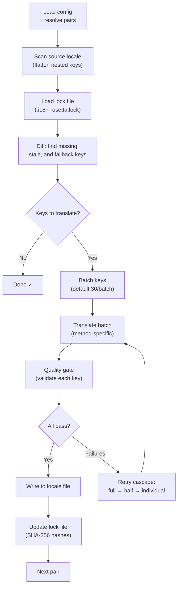

# 同步工作原理

`sync` 命令是 rosetta 的核心操作。以下是运行 `npx i18n-rosetta sync` 时发生的情况。

## 流程概览



## 步骤详解

### 1. 配置解析

Rosetta 加载 `i18n-rosetta.config.json`（或自动检测设置）。它会解析：
- 源语言环境和目标语言环境
- 配对图（要处理的 源→目标 组合）
- 每个配对的方法、模型和质量设置

### 2. 源文件扫描

加载源语言环境文件并将其展平为 键→值 映射：

```json
// Input (nested)
{ "hero": { "title": "Welcome", "subtitle": "Build" } }

// Flattened
{ "hero.title": "Welcome", "hero.subtitle": "Build" }
```

### 3. 变更检测

Rosetta 读取 `.i18n-rosetta.lock`，其中存储了先前翻译的源值的 SHA-256 哈希值。对于每个键，它会检查：

| 条件 | 操作 |
|-----------|--------|
| 目标中缺少该键 | **翻译** |
| 自上次同步后源哈希已更改 | **重新翻译**（已过期） |
| 目标值以 `[EN]` 开头 | **重新翻译**（后备占位符） |
| 源哈希未更改且键存在 | **跳过** |

这就是为什么 rosetta 只翻译已更改的内容——它不会在每次同步时重新翻译整个文件。

### 4. 批处理

键被分组为批次（默认：LLM 为 30 个键/批次，Google Translate 为 128 个键/批次）。批处理减少了 API 往返次数，同时保持提示词（prompts）处于可控状态。

### 5. 翻译

每个批次都会发送到配置的翻译方法：

- **`llm`**：向 OpenRouter 发送带有语域（register）指令的结构化提示词
- **`llm-coached`**：同上，但注入了语法规则、词典和样式说明
- **`google-translate`**：Google Cloud Translation API v2 批量请求
- **`api`**：向远程端点发送 HTTP POST 请求

对于给定的语言环境，跨批次的系统消息（语域、规则）是相同的，这启用了**提示词缓存 (prompt caching)**——Anthropic 和 Google 等提供商会缓存重复的系统消息，从而降低 token 成本。

### 6. 质量门禁

每次翻译在写入磁盘之前都会经过验证。将运行五项检查：

| 检查项 | 捕获内容 | 示例 |
|-------|----------------|---------|
| **空/空白** | 模型未返回任何内容 | `""` |
| **源文回显** | 模型返回了英文输入 | 日语的 `"Welcome"` |
| **幻觉循环** | 重复的三元组 (trigrams) | `"Qo' Qo' Qo' Qo'"` |
| **长度膨胀** | 输出比源文长 4 倍以上 | 10 字符源文 → 50 字符输出 |
| **字符集规范** | 语言环境的字符集错误 | 阿拉伯语环境出现拉丁文本 |

失败记录将带有 `[GATE]` 前缀。没有静默后备机制。

有关详细信息，请参阅 [质量门禁](/docs/concepts/quality-gate)。

### 7. 级联重试

在 JSON 解析失败或批次级别错误时，rosetta 会使用逐渐减小的批次进行重试：

```
Full batch (30 keys) → Failed
Half batch (15 keys) → Failed
Individual keys (1 each) → Isolates the problem key
```

重试预算受 `maxRetries`（默认值：3）限制，以防止 token 消耗失控。

### 8. 写入与锁定

通过验证的翻译将写入目标语言环境文件，并保留原始嵌套结构。锁定文件将更新为新的 SHA-256 哈希值。

## 部分成功

一个失败的批次不会阻塞其余批次。如果 10 个批次中有 9 个成功，则会写入这 9 个批次。失败的批次会被记录，您可以重新运行 `sync` 进行重试。

## 试运行

预览将要更改的内容，而不写入任何文件：

```bash
npx i18n-rosetta sync --dry
```

## 强制重新翻译

强制重新翻译特定键，即使它们未更改：

```bash
npx i18n-rosetta sync --force-keys "hero.title,nav.about"
```

## 成本估算

在翻译之前，rosetta 会生成一份**同步前成本报告**，显示每个配对的估算成本。这在每次 `sync` 期间自动运行——您会在进行任何 API 调用之前看到它。

```
╔══════════════════════════════════════════════════════════╗
║  Cost Estimate                                          ║
╠════════════╦═══════╦════════════╦════════════════════════╣
║ Pair       ║ Keys  ║ Est. Cost  ║ Method                 ║
╠════════════╬═══════╬════════════╬════════════════════════╣
║ en → fr    ║   142 ║ $0.07      ║ google-translate       ║
║ en → ja    ║    38 ║   —        ║ llm (model-dependent)  ║
║ en → crk   ║    38 ║   —        ║ llm-coached            ║
╚════════════╩═══════╩════════════╩════════════════════════╝
```

### 估算内容

每种翻译方法都提供自己的成本估算：

| 方法 | 成本基准 | 精度 |
|--------|-----------|-----------|
| `google-translate` | Google 公布的费率（$20/百万字符） | 准确 |
| `llm` | 因 OpenRouter 模型而异 | 取决于模型——请查看 [OpenRouter 定价](https://openrouter.ai/models) |
| `llm-coached` | 与 `llm` 相同，外加指导上下文 token | 取决于模型 |
| `api` | 由服务器决定 | 未知——不查询端点则无法估算 |

当某种方法无法确定成本（LLM 方法、远程 API）时，rosetta 会报告 `—` 而不是进行猜测。使用 `--dry` 可以在不实际翻译的情况下查看成本估算。