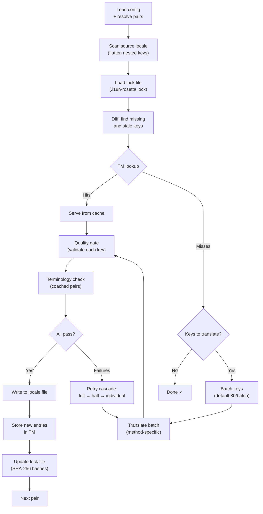

# 同步工作原理

`sync` 命令是 rosetta 的核心操作。以下是运行 `npx i18n-rosetta sync` 时发生的过程。

## 流程概述



## 逐步解析

### 1. 配置解析

rosetta 会加载 `i18n-rosetta.config.json`（或自动检测设置）。它将解析：
- 源语言和目标语言
- 语言对图谱（要处理哪些源语言→目标语言组合）
- 每个语言对的翻译方法、模型和质量设置

在扫描文件之前，rosetta 会打印启动信息头：

```
i18n-rosetta v3.3.1

[INFO] Detected format: json (auto)
[INFO] Detected framework: Hugo
```

- **版本信息**：显示已安装的版本，用于调试和问题报告。
- **格式检测**：报告文件格式以及它是自动检测的 `(auto)` 还是显式配置的 `(config)`。支持 `json`、`toml` 和 `yaml`。
- **框架检测**：当设置了 `contentDir` 时，识别框架 (`Hugo`) 以确认内容同步已激活。

### 2. 源文件扫描

加载源语言文件并将其展平为 key→value 映射：

```json
// Input (nested)
{ "hero": { "title": "Welcome", "subtitle": "Build" } }

// Flattened
{ "hero.title": "Welcome", "hero.subtitle": "Build" }
```

### 3. 变更检测

rosetta 读取 `.i18n-rosetta.lock`，该文件存储了先前已翻译源值的 SHA-256 哈希值。对于每个键，它会检查：

| 条件 | 操作 |
|-----------|--------|
| 目标文件中缺少该键 | **翻译** |
| 自上次同步后源哈希已更改 | **重新翻译** (已过期) |
| 目标值以 `[EN]` 开头 | **重新翻译** (旧版回退标记) |
| 源哈希未更改，且键存在 | **跳过** |

这就是为什么 rosetta 只翻译发生变更的内容——它不会在每次同步时重新翻译整个文件。

### 4. 批处理

键会被分组为批次（默认：LLM 为 80 个键/批次，Google Translate 为 128 个）。批处理减少了 API 的往返次数，同时保持 prompt 处于可控状态。

在翻译过程中，rosetta 会显示一个内联进度条，在每个批次完成后更新：

```
[INFO] fr.json — 2,847 missing
     ████████████████░░░░░░░░░░░░░░░░ 1,440/2,847 keys
```

进度条使用 `\r` 回车符进行原地更新渲染——不会滚动。在 `--quiet` 和 `--json` 模式下会被隐藏。

### 4b. 翻译记忆库

在批处理之前，rosetta 会检查翻译记忆库缓存 (`.rosetta/tm.json`)。如果键的源文本 + 语言 + 方法与之前的翻译匹配，则直接从缓存中即时提供——无需调用 API。

```
  [TM] 142 key(s) served from cache
  Translating 3 key(s) to French (llm)... [OK]
```

翻译记忆库 (TM) 是主要的成本节约机制。在单个键更改后重新运行同步，只会翻译该键，而不是整个文件。详情请参阅 [翻译记忆库](/docs/concepts/translation-memory)。

要在单次运行中绕过缓存：`i18n-rosetta sync --no-tm`

### 5. 翻译

每个批次都会发送到配置的翻译方法：

- **`llm`**：发送给 OpenRouter 的结构化 prompt，包含语气和性别指导说明
- **`llm-coached`**：同上，但注入了语法规则、词典和样式说明
- **`google-translate`**：Google Cloud Translation API v2 批量请求
- **`api`**：向远程端点发送 HTTP POST 请求

对于特定语言，系统消息（语气、性别指导、规则）在所有批次中都是相同的，这启用了 **prompt 缓存**——Anthropic 和 Google 等提供商会缓存重复的系统消息，从而降低 token 成本。

### 6. 质量关卡

每条翻译在写入磁盘之前都会经过验证。将运行五项检查：

| 检查项 | 捕获内容 | 示例 |
|-------|----------------|---------|
| **空值/空白** | 模型未返回任何内容 | `""` |
| **源文回显** | 模型返回了输入的英文 | 日语返回 `"Welcome"` |
| **幻觉循环** | 重复的三元组 (trigrams) | `"Qo' Qo' Qo' Qo'"` |
| **长度膨胀** | 输出比源文长 4 倍以上 | 10 字符源文 → 50 字符输出 |
| **字符集规范** | 语言的字符集错误 | 阿拉伯语返回拉丁文本 |

失败记录会带有 `[GATE]` 前缀。没有静默回退。

详情请参阅 [质量关卡](/docs/concepts/quality-gate)。

### 6b. 术语验证

对于配置了词典的 coached 语言对，rosetta 会在翻译后检查 LLM 是否实际使用了要求的术语。违规情况将记录为 `[TERM]` 警告：

```
[TERM] en→fr: 2 term violation(s)
  • "dashboard" → expected "tableau de bord" but got "panneau"
```

这些只是警告，并非阻塞性错误——翻译仍会被写入。

### 7. 级联重试

在 JSON 解析失败或批次级别错误时，rosetta 会使用逐渐减小的批次进行重试：

```
Full batch (80 keys) → Failed
  └→ Half batch (40 keys) → 1 failure
      └→ Individual keys (1 each) → Isolates the problem key
```

重试预算受 `maxRetries` 限制（默认：3），以防止 token 消耗失控。

### 8. 写入与锁定

通过验证的翻译会被写入目标语言文件，并保留原始的嵌套结构。锁定文件会更新为新的 SHA-256 哈希值。

### 9. 验证

处理完所有语言对后，rosetta 会从磁盘重新读取已写入的语言文件并运行验证（除非设置了 `--no-verify`）。这能捕获同步报告成功但键实际上存在错误之间的差异：

- **键对齐** — 所有源键都存在于每个目标文件中
- **`[EN]` 回退标记** — 之前运行遗留的标记
- **空翻译** — 漏网的空白值
- **字符集规范** — 非拉丁语系中仅包含 ASCII 的翻译
- **占位符保留** — ICU 占位符与源文匹配
- **编码问题** — BOM 标记、不可见字符

这也可以作为独立的 `i18n-rosetta verify` 命令用于 CI 门禁。

## 内容翻译（第 2 阶段）

对于 Docusaurus 和 Hugo 项目，`sync` 会在 JSON 键翻译之后运行第二个阶段。此阶段使用相同的方法和质量关卡来翻译 Markdown 和 MDX 文件（文档、博客文章、教程）。

### 工作原理

1. rosetta 通过遍历 content/docs 目录来发现所有源内容文件（`.md`、`.mdx`）
2. 对于每个文件 × 语言对，它会检查单独的内容锁定文件 (`.i18n-rosetta-content.lock`) 以查看 SHA-256 哈希变更
3. 更改或丢失的文件会被收集到一个扁平的工作项池中
4. 该池使用**并行并发**进行处理（默认：同时进行 12 个 API 调用）

```
Phase 2: content (79 translations to process, 341 skipped, concurrency: 12)

    [1/79] (1%)  docs/concepts/security.md → ja [RE-TRANSLATE] (~3328s left)
    [2/79] (3%)  docs/concepts/security.md → th [RE-TRANSLATE] (~1821s left)
    ...
    [79/79] (100%) blog/v3-2-quality.md → de [OK]

  [OK] Created 79 content file(s), 341 unchanged
```

### 并行处理

第 1 阶段（JSON 键）和第 2 阶段（内容）现在都并行运行：

- **第 1 阶段**：所有语言的翻译同时触发（默认：同时处理 50 种语言）。在每种语言内部，API 批处理也并行运行（4 个并发批次）。包含 120 个键的 12 种语言同步可在约 1 分钟内完成，而不是约 15 分钟。
- **第 2 阶段**：所有 文件×语言 组合作为一个扁平池进行翻译（默认：同时进行 12 个 API 调用）。不同的文件和不同的语言同时进行翻译。

使用 `--json-concurrency`、`--content-concurrency` 或 `--concurrency`（同时设置两者）来控制并行度：

```bash
# Faster JSON sync (more parallel locale translations)
npx i18n-rosetta sync --json-concurrency 30

# Faster content sync (more parallel API calls)
npx i18n-rosetta sync --content-concurrency 20

# Slower (gentler on rate limits)
npx i18n-rosetta sync --concurrency 4
```

### 内容保护

在翻译过程中，rosetta 会屏蔽不可翻译的内容：

- **代码块**（围栏式和缩进式）会被替换为占位符
- 不在 `translatableFields` 列表中的 **Frontmatter** 字段将保持原样
- **链接**、图片路径和 HTML 标签受到保护
- **短代码 (Shortcodes)** 和插值变量（例如 `{count}`、`{{.Params.title}}`）会被屏蔽

翻译后，所有占位符都会被还原并验证。如果存在任何缺失或损坏，该翻译将被拒绝并重试。

## 部分成功

一个批次失败不会阻塞其余批次。如果 10 个批次中有 9 个成功，则会写入这 9 个批次。失败的批次会被记录，你可以重新运行 `sync` 进行重试。

## 模拟运行

预览将要发生的更改，而不写入任何文件：

```bash
npx i18n-rosetta sync --dry-run
```

## 强制重新翻译

强制重新翻译特定的键，即使它们未发生更改：

```bash
npx i18n-rosetta sync --force-keys "hero.title,nav.about"
```

## 成本估算

在翻译之前，rosetta 会生成一份**同步前成本报告**，显示每个语言对的估算成本。这会在每次执行 `sync` 时自动运行——你会在进行任何 API 调用之前看到它。

```
╔══════════════════════════════════════════════════════════╗
║  Cost Estimate                                          ║
╠════════════╦═══════╦════════════╦════════════════════════╣
║ Pair       ║ Keys  ║ Est. Cost  ║ Method                 ║
╠════════════╬═══════╬════════════╬════════════════════════╣
║ en → fr    ║   142 ║ $0.07      ║ google-translate       ║
║ en → ja    ║    38 ║   —        ║ llm (model-dependent)  ║
║ en → crk   ║    38 ║   —        ║ llm-coached            ║
╚════════════╩═══════╩════════════╩════════════════════════╝
```

### 估算内容

每种翻译方法都提供自己的成本估算：

| 方法 | 成本基准 | 精度 |
|--------|-----------|-----------|
| `google-translate` | Google 公布的费率（$20/百万字符） | 准确 |
| `llm` | 因 OpenRouter 模型而异 | 取决于模型 — 查看 [OpenRouter 定价](https://openrouter.ai/models) |
| `llm-coached` | 与 `llm` 相同，外加 coaching 上下文 token | 取决于模型 |
| `api` | 由服务器决定 | 未知 — 不查询端点则无法估算 |

当某种方法无法确定成本时（LLM 方法、远程 API），rosetta 会报告 `—` 而不是进行猜测。使用 `--dry` 可以在不实际翻译的情况下查看成本估算。

---

## 另请参阅

- [CLI 参考 — sync](/docs/reference/cli#sync) — 命令标志和选项
- [翻译记忆库](/docs/concepts/translation-memory) — 缓存和成本节约
- [质量关卡](/docs/concepts/quality-gate) — 翻译如何被验证
- [翻译方法](/docs/guides/translation-methods) — 每种方法的工作原理
- [与专业译者合作](/docs/guides/professional-translators) — XLIFF 工作流
- [配置](/docs/getting-started/configuration) — 配置参考
- [CI/CD 指南](/docs/guides/ci-cd) — 在流水线中自动化同步