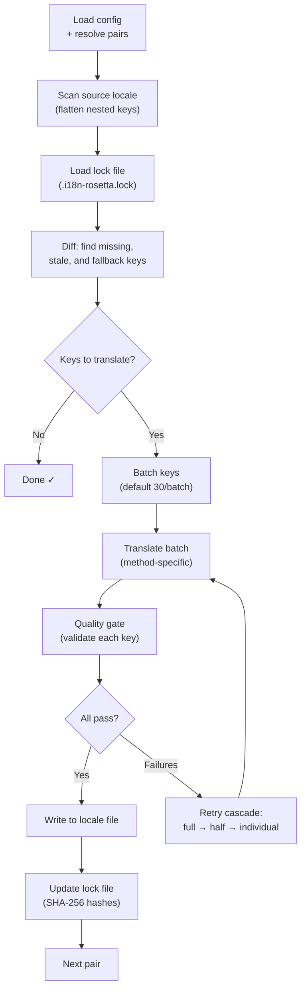

# 同步工作原理

`sync` 命令是 rosetta 的核心操作。以下是你运行 `npx i18n-rosetta sync` 时发生的过程。

## 流程概述



## 详细步骤

### 1. 解析配置

Rosetta 会加载 `i18n-rosetta.config.json`（或自动检测设置）。它会解析：
- 源语言和目标语言
- 语言对图（要处理哪些源语言→目标语言的组合）
- 每个语言对的翻译方法、模型和质量设置

### 2. 扫描源文件

加载源语言文件并将其展平为键值对（key→value）映射：

```json
// Input (nested)
{ "hero": { "title": "Welcome", "subtitle": "Build" } }

// Flattened
{ "hero.title": "Welcome", "hero.subtitle": "Build" }
```

### 3. 变更检测

Rosetta 会读取 `.i18n-rosetta.lock`，其中存储了先前已翻译的源值的 SHA-256 哈希值。对于每个键，它会检查：

| 条件 | 操作 |
|-----------|--------|
| 目标文件中缺少该键 | **翻译** |
| 自上次同步后源哈希值已更改 | **重新翻译**（已过期） |
| 目标值以 `[EN]` 开头 | **重新翻译**（后备占位符） |
| 源哈希值未变，且键存在 | **跳过** |

这就是为什么 rosetta 只翻译发生更改的内容——它不会在每次同步时重新翻译整个文件。

### 4. 批量处理

键会被分组为多个批次（默认：LLM 为 30 个键/批次，Google Translate 为 128 个键/批次）。批量处理可减少 API 的往返次数，同时保持提示词（prompts）在可控范围内。

### 5. 翻译

每个批次都会发送到配置的翻译方法：

- **`llm`**：向 OpenRouter 发送结构化提示词，包含语气（register）和性别指导说明
- **`llm-coached`**：同上，但注入了语法规则、词典和样式说明
- **`google-translate`**：Google Cloud Translation API v2 批量请求
- **`api`**：向远程端点发送 HTTP POST 请求

对于特定的语言，系统消息（语气、性别指导、规则）在各个批次中是相同的，这启用了**提示词缓存（prompt caching）**——像 Anthropic 和 Google 这样的提供商会缓存重复的系统消息，从而降低 token 成本。

### 6. 质量门禁

每次翻译在写入磁盘之前都会经过验证。将运行五项检查：

| 检查项 | 捕获内容 | 示例 |
|-------|----------------|---------|
| **空值/空白** | 模型未返回任何内容 | `""` |
| **源文本回显** | 模型返回了输入的英文 | 针对日语的 `"Welcome"` |
| **幻觉循环** | 重复的三元组（trigrams） | `"Qo' Qo' Qo' Qo'"` |
| **长度膨胀** | 输出比源文本长 4 倍以上 | 10 个字符的源文本 → 50 个字符的输出 |
| **书写系统合规性** | 语言的书写系统错误 | 阿拉伯语使用了拉丁文本 |

失败项会以 `[GATE]` 前缀记录在日志中。没有静默降级（silent fallbacks）。

详情请参阅 [质量门禁](/docs/concepts/quality-gate)。

### 7. 级联重试

当 JSON 解析失败或出现批次级别的错误时，rosetta 会使用逐渐缩小的批次进行重试：

```
Full batch (30 keys) → Failed
Half batch (15 keys) → Failed
Individual keys (1 each) → Isolates the problem key
```

重试次数上限由 `maxRetries` 控制（默认：3），以防止 token 消耗失控。

### 8. 写入与锁定

通过验证的翻译将被写入目标语言文件，并保留原始的嵌套结构。锁定文件（lock file）将更新为新的 SHA-256 哈希值。

## 部分成功

一个批次失败不会阻塞其余批次。如果 10 个批次中有 9 个成功，这 9 个将被写入。失败的批次会被记录，你可以重新运行 `sync` 进行重试。

## 试运行

预览将要更改的内容，而不写入任何文件：

```bash
npx i18n-rosetta sync --dry
```

## 强制重新翻译

强制重新翻译特定的键，即使它们未发生更改：

```bash
npx i18n-rosetta sync --force-keys "hero.title,nav.about"
```

## 成本估算

在翻译之前，rosetta 会生成一份**同步前成本报告**，显示每个语言对的估算成本。这会在每次执行 `sync` 时自动运行——你会在任何 API 调用发生之前看到它。

```
╔══════════════════════════════════════════════════════════╗
║  Cost Estimate                                          ║
╠════════════╦═══════╦════════════╦════════════════════════╣
║ Pair       ║ Keys  ║ Est. Cost  ║ Method                 ║
╠════════════╬═══════╬════════════╬════════════════════════╣
║ en → fr    ║   142 ║ $0.07      ║ google-translate       ║
║ en → ja    ║    38 ║   —        ║ llm (model-dependent)  ║
║ en → crk   ║    38 ║   —        ║ llm-coached            ║
╚════════════╩═══════╩════════════╩════════════════════════╝
```

### 估算内容

每种翻译方法都提供自己的成本估算：

| 方法 | 成本依据 | 精度 |
|--------|-----------|-----------|
| `google-translate` | Google 公布的费率（20 美元/百万字符） | 准确 |
| `llm` | 因 OpenRouter 模型而异 | 取决于模型——请查看 [OpenRouter 定价](https://openrouter.ai/models) |
| `llm-coached` | 与 `llm` 相同，加上指导上下文的 token | 取决于模型 |
| `api` | 由服务器决定 | 未知——不查询端点则无法估算 |

当某种方法无法确定成本时（LLM 方法、远程 API），rosetta 会报告 `—` 而不是进行猜测。使用 `--dry` 可以在不实际执行翻译的情况下查看成本估算。

---

## 另请参阅

- [CLI 参考 — sync](/docs/reference/cli#sync) — 命令标志和选项
- [质量门禁](/docs/concepts/quality-gate) — 翻译是如何验证的
- [翻译方法](/docs/guides/translation-methods) — 每种方法的工作原理
- [配置](/docs/getting-started/configuration) — 配置参考
- [CI/CD 指南](/docs/guides/ci-cd) — 在你的流水线中自动化同步