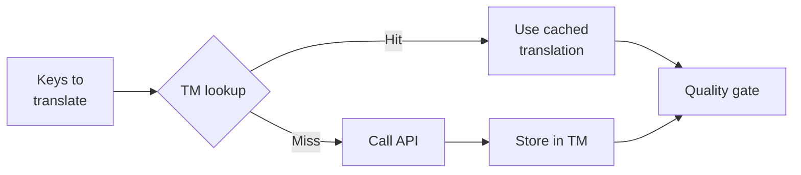

# 翻译记忆库

翻译记忆库 (Translation Memory, 简称 TM) 是 rosetta 的内置缓存层。它以源文本 + 语言环境 (locale) + 方法作为键 (key) 来存储每条翻译，因此重新运行 `sync` 时，只会为真正发生更改的键调用 API。

## 为什么需要 TM

如果没有 TM，每次 `sync` 都会重新翻译每个修改过的键——即使你在之前的运行中已经为相同的语言环境翻译过完全相同的英文文本。以下是常见的浪费资金的场景：

| 场景 | 不使用 TM | 使用 TM |
|----------|-----------|---------|
| 更改 1 个键后重新运行同步 (500 个键 × 10 种语言环境) | 5,000 次 API 调用 | 10 次 API 调用 |
| 将键恢复为之前的英文值 | 完整的 API 调用 | 瞬间命中缓存 |
| 同一短语出现在 3 个语言环境文件中 | 3 次 API 调用 | 1 次 API 调用 + 2 次命中缓存 |
| 试运行 → 实际同步 | 两次均产生完整的 API 调用 | 第一次运行缓存，第二次复用 |

TM **默认开启**，无需任何配置。在每次 `sync` 期间，翻译会被自动缓存，并在后续运行中提供。

## 工作原理

### 缓存键

每个 TM 条目都由三个值的 SHA-256 哈希作为键：

```
SHA-256( sourceValue + '\x00' + locale + '\x00' + method )
```

| 组成部分 | 为什么包含在键中 |
|-----------|-------------------|
| `sourceValue` | 不同的英文文本 → 不同的翻译 |
| `locale` | "Hello" 翻译成法语和日语是不同的 |
| `method` | Google Translate 的输出 ≠ GPT-4o 的输出 |

空字节分隔符 (`\x00`) 可防止 `"ab" + "c"` 和 `"a" + "bc"` 之间发生冲突。

### 同步期间



1. 在调用翻译 API 之前，rosetta 会将键划分为 **TM 命中 (hits)** 和 **TM 未命中 (misses)**
2. 命中的内容会立即从缓存中提供——无需 API 调用，没有延迟，没有成本
3. 未命中的内容将进入正常的翻译流程
4. 来自 API 的新翻译会存储在 TM 中，供将来运行使用
5. 所有翻译（缓存的 + 新鲜的）都会通过质量关卡

### 存储

TM 存储在项目根目录的 `.rosetta/tm.json` 中。该文件使用紧凑的 JSON 格式（不进行美化打印）以保持可控的文件大小。每个条目存储：

| 字段 | 描述 |
|-------|-------------|
| `t` | 翻译后的文本 |
| `ts` | 缓存时的 ISO-8601 时间戳 |
| `l` | 目标语言环境代码（用于统计/过滤） |
| `m` | 翻译方法名称（用于统计/过滤） |

按照 50 种语言 × 500 个键 = 25,000 个条目计算，该文件的大小约为 2-3 MB。

## 管理缓存

### 查看统计信息

```bash
i18n-rosetta tm stats
```

显示条目数量、文件大小以及按语言环境划分的明细：

```
  Translation Memory — .rosetta/tm.json

  Entries:      2,847
  File size:    1.2 MB
  Created:      2026-05-20
  Last entry:   2026-05-24

  By locale:
    fr       482 entries  (llm: 380, llm-coached: 102)
    de       471 entries  (llm: 471)
    ja       465 entries  (llm: 465)
```

### 清除缓存

```bash
# Clear everything (with confirmation prompt)
i18n-rosetta tm clear

# Clear without prompt (CI environments)
i18n-rosetta tm clear --yes

# Clear only one locale
i18n-rosetta tm clear --locale fr
```

### 单次运行跳过 TM

```bash
# Force fresh API calls for all keys (useful when switching providers)
i18n-rosetta sync --no-tm
```

这不会删除缓存——它只是在本次运行中忽略缓存，并且不会存储新的结果。

## TM 无法提供帮助的情况

在以下情况下，TM 不会产生缓存命中：

- **源文本已更改**——哈希值发生变化，因此未命中
- **方法已更改**——从 `llm` 切换到 `google-translate` 意味着不同的缓存键
- **首次运行**——冷启动，尚无任何条目
- **`--no-tm` 标志**——显式绕过缓存

## 你应该提交 `.rosetta/tm.json` 吗？

**通常不需要。** TM 是一项本地开发者优化。它在同步期间自动填充，并且仅在同一台机器上重新运行同步时才有帮助。但是，如果在以下情况，你可以考虑提交它：

- 你的团队共享一个用于同步翻译的 CI 运行器
- 你希望在没有 API 调用的情况下实现可重现的构建
- 你正在归档翻译以满足合规性要求

对于常规用法，请将 `.rosetta/tm.json` 添加到 `.gitignore` 中。

---

## 另请参阅

- [同步工作原理](/docs/concepts/how-sync-works) —— TM 在流程中的位置
- [CLI 参考 — tm](/docs/reference/cli#tm) —— 命令参考
- [CLI 参考 — sync --no-tm](/docs/reference/cli#sync) —— 绕过 TM