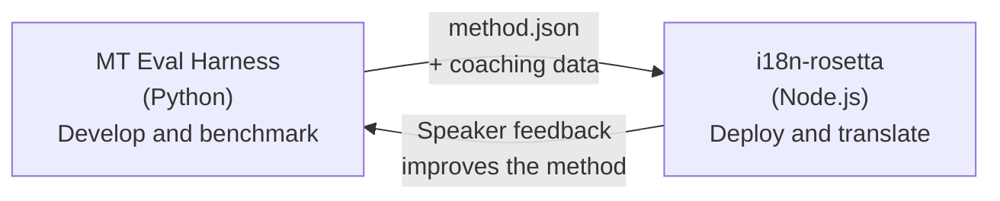

# Eval Harness 桥接

i18n-rosetta 和 MT Eval Harness 是构成同一个生态系统的两个独立工具。Harness 是**验证**翻译方法的地方。Rosetta 则是**部署**已验证方法的地方。它们通过共享的插件格式进行连接。



## 流程：研究 → 生产

### 1. 在 harness 中构建方法

任何实现了 `async translate(entries, config) → [{id, predicted}]` 的 Python 类都可以接入 harness。Harness 不关心其内部逻辑——无论是提示驱动的 LLM、自定义训练的模型、确定性规则，还是其他任何内容。

### 2. 进行基准测试

Harness 会使用标准化语料库对你的方法进行评分，并提供可复现的指标：chrF++、FST 接受度（针对形态丰富的语言）、形态准确率和语义评分。

### 3. 导出为插件

当你的方法达到可接受的质量时，将其打包为 rosetta 插件——一个包含可选指导数据的 `method.json` 清单。

:::info 导出 CLI 正在计划中
目前，你需要手动创建 method.json 清单。`mt-eval export` 命令将实现此过程的自动化。有关完整的插件格式，请参阅 [方法接口](https://mtevalarena.org/docs/specifications/methods)。
:::

### 4. 在 rosetta 中安装

```bash
i18n-rosetta plugin install ./my-method-plugin/
```

### 5. 翻译真实内容

```bash
i18n-rosetta sync
```

你经过基准测试的方法现在正在生产环境中生成真实的翻译。

## 流程：生产 → 研究

部署的翻译将由双语人员进行审查。他们的反馈能识别出系统性错误（错误的时态模式、缺失的词汇、不自然的表达）。研究人员在 harness 中更新该方法，重新进行基准测试、重新导出并重新部署。系统通过实际使用不断学习。

## 插件格式

`method.json` 清单是这两个工具之间的契约：

```json
{
  "name": "crk-coached-v3",
  "type": "llm-coached",
  "version": "3.0.0",
  "description": "Coached LLM translation for Plains Cree",
  "locales": ["crk"],
  "config": {
    "model": "google/gemini-3.5-flash",
    "temperature": 0.3
  },
  "benchmarks": {
    "crk": {
      "composite_score": 0.67,
      "fst_acceptance": 0.82,
      "corpus_size": 150
    }
  }
}
```

有关完整格式，请参阅 [插件规范](/docs/reference/plugin-spec)。

## 已构建与计划中

| 组件 | 状态 |
|-----------|--------|
| TranslationProcess 协议 | ✅ 已构建 |
| Harness 基准测试运行器 | ✅ 已构建 |
| method.json 插件格式 | ✅ 已构建 |
| `rosetta plugin install/remove/list` | ✅ 已构建 |
| 指导数据加载 | ✅ 已构建 |
| `mt-eval export` CLI | 🔲 计划中 |
| 社区审查界面 | 🔲 计划中 |
| 密码学测试集评估 | 🔲 计划中 |

## 延伸阅读

- [翻译方法](/docs/guides/translation-methods) — 所有可用的方法及其工作原理
- [插件规范](/docs/reference/plugin-spec) — method.json 格式
- [通过 API 提供方法](/docs/guides/serving-a-method) — 在服务器端托管方法
- [数据主权](https://mtevalarena.org/docs/sovereignty/data-sovereignty) — OCAP、CARE 和密码学保护
- [面向 MT 研究人员](https://mtevalarena.org/docs/leaderboard/rules) — eval harness 文档