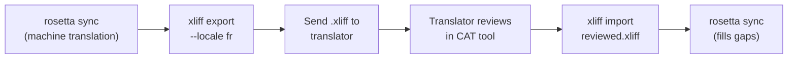

# 与专业译者合作

Rosetta 会生成机器翻译，但有些项目需要人工审核——例如合规内容、品牌敏感文案或高风险的 UI。XLIFF 工作流允许你导出翻译以供专业审核，并无缝导入回项目中。

## 什么是 XLIFF？

XLIFF（XML 本地化交换文件格式）是翻译工具的行业标准交换格式。所有专业的 CAT（计算机辅助翻译）工具都支持它：

- **memoQ** — 导入 XLIFF，在上下文中审核，导出审核后的文件
- **SDL Trados Studio** — 原生支持 XLIFF
- **Phrase (Memsource)** — 为译者团队上传 XLIFF 任务
- **Smartling** — XLIFF 导入流水线
- **OmegaT** — 支持 XLIFF 的免费/开源 CAT 工具

为了实现最大的工具兼容性，Rosetta 生成的是 XLIFF 1.2（普遍支持的版本），而不是 2.0+ 版本。

## 工作流



### 第 1 步：生成机器翻译

首先运行 `sync` 以获取基准机器翻译：

```bash
i18n-rosetta sync
```

### 第 2 步：导出 XLIFF

将源语言 + 目标语言对导出为 XLIFF：

```bash
i18n-rosetta xliff export --locale fr
```

这会写入 `.rosetta/xliff/fr.xliff`，其中包含：
- 每个源键及其英文值
- 当前的机器翻译（如果有）作为 `<target>`
- 未翻译的键标记为 `state="new"`

```xml
<trans-unit id="hero.title" xml:space="preserve">
  <source>Welcome to our platform</source>
  <target state="translated">Bienvenue sur notre plateforme</target>
</trans-unit>
```

### 第 3 步：发送给译者

将 `.xliff` 文件发送给你的译者，或将其上传到你的 CAT 平台。译者可以并排看到源语言和目标语言，并且可以：

- 编辑机器翻译
- 补充缺失的翻译
- 标记质量问题
- 应用他们自己的翻译记忆库和术语库

### 第 4 步：导入审核后的文件

当译者返回审核后的 `.xliff` 时，将其导入：

```bash
# Preview what will change
i18n-rosetta xliff import .rosetta/xliff/fr.xliff --dry

# Apply changes
i18n-rosetta xliff import .rosetta/xliff/fr.xliff
```

输出：
```
  ✓ Imported 142 translations for fr
    Updated:    23 (changed from existing)
    Added:      0 (new keys)
    Unchanged:  119
    Written to: locales/fr.json
```

### 第 5 步：填补空白

如果在导出 XLIFF 后添加了新键，请运行 `sync` 来翻译它们：

```bash
i18n-rosetta sync
```

Rosetta 只会翻译仍然缺失的键——从 XLIFF 导入的已审核翻译将被保留。

## 提示

### 导出自定义路径

```bash
# Export to a specific directory
i18n-rosetta xliff export --locale ja --out ./for-review/

# Export with a specific filename
i18n-rosetta xliff export --locale de --out ./review/german.xliff
```

### 多个区域设置

分别导出每个区域设置：

```bash
for locale in fr de ja ko; do
  i18n-rosetta xliff export --locale $locale
done
```

### 版本控制

将 `.rosetta/xliff/` 添加到 `.gitignore` 中——XLIFF 文件是临时产物，而不是项目源文件：

```gitignore
.rosetta/xliff/
```

### 何时使用 XLIFF 与仅使用 `sync`

| 场景 | 建议 |
|----------|---------------|
| 内部应用，90%+ 的质量即可接受 | 仅使用 `sync` — 机器翻译就足够了 |
| 面向用户的营销文案 | 导出 XLIFF 供人工审核 |
| 法律/合规内容 | 导出 XLIFF — 需要人工审核 |
| 50+ 个区域设置，时间紧迫 | 先运行 `sync`，仅为前 5 个区域设置导出 XLIFF |
| 译者已经在使用 CAT 工具 | XLIFF 是自然的交接格式 |

---

## 另请参阅

- [CLI 参考 — xliff](/docs/reference/cli#xliff) — 命令参考
- [翻译记忆库](/docs/concepts/translation-memory) — 缓存已审核的翻译
- [翻译方法](/docs/guides/translation-methods) — 机器翻译选项