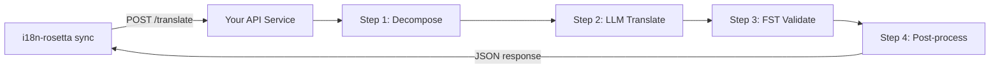

# 将自定义方法作为 API 提供服务

i18n-rosetta 的 **`api` 方法**允许你将任何翻译对指向外部 HTTP 端点。通过这种方式，你可以集成对于单个 LLM 提示词来说过于复杂的流水线——形态分析器、有限状态转换器 (FST)、多步 LLM 链，或者你构建的任何自定义研究方法。

## 为什么使用 API 服务？

有些翻译流水线无法在简单的提示-响应周期内运行：

| 流水线步骤 | 示例 |
|---|---|
| **形态分解** | 在翻译前将多式综合语单词拆分为语素 |
| **FST 验证** | 拒绝违反音系或形态规则的输出 |
| **多步 LLM 链** | 使用不同模型进行生成 → 验证 → 纠正循环 |
| **字典查找** | 在流水线中间交叉引用精选的双语字典 |
| **人在回路** | 将不确定的翻译排队等待专家审查 |

`api` 方法将你的流水线视为黑盒——i18n-rosetta 发送源字符串，你的服务返回翻译结果。内部发生的事情完全由你决定。

## 架构



## 设置你的服务

你的 API 服务必须实现一个接收并返回 JSON 的单一端点：

### 请求格式

rosetta 会发送这个确切的 JSON 请求体（参见 [api.js](https://github.com/gamedaysuits/i18n-rosetta/blob/main/lib/methods/api.js)）：

```json
POST /translate
Content-Type: application/json
Authorization: Bearer <ROSETTA_API_KEY>

{
  "source_locale": "en",
  "target_locale": "crk",
  "method": "crk-coached-v1",
  "keys": {
    "greeting": "Hello, welcome to our app",
    "farewell": "Goodbye and thanks"
  }
}
```

| 字段 | 类型 | 描述 |
|-------|------|-------------|
| `source_locale` | string | BCP 47 源语言代码 |
| `target_locale` | string | BCP 47 目标语言代码 |
| `method` | string | 插件名称或 `"default"` |
| `keys` | object | 键 → 要翻译的源字符串的映射 |
```

### Response Format

Your service must return a `translations` object. An optional `meta` object can include cost and diagnostic info:

```json
{
  "translations": {
    "greeting": "tânisi, pê-kîwêw ôta",
    "farewell": "ekosi mâka, kinanâskomitin"
  },
  "meta": {
    "model": "my-custom-pipeline/v1",
    "cost_usd": 0.0042,
    "method": "decompose-translate-validate"
  }
}
```

| Field | Type | Required | Description |
|-------|------|----------|-------------|
| `translations` | object | ✅ | Map of key → translated string |
| `meta` | object | — | Optional metadata |
| `meta.cost_usd` | number | — | If present, displayed in rosetta's output |
| `errors` | object | — | For partial success (HTTP 207): map of key → `{ message }` |

### Minimal Express Server

```javascript
import express from 'express';

const app = express();
app.use(express.json());

/**
 * rosetta API 契约：
 *
 * 请求： { source_locale, target_locale, method, keys: { "key": "source" } }
 * 响应： { translations: { "key": "translated" }, meta: { ... } }
 */
app.post('/translate', async (req, res) => {
  const { source_locale, target_locale, method, keys } = req.body;

  const translations = {};

  for (const [key, source] of Object.entries(keys)) {
    // --- 你的流水线在这里 ---
    // 第 1 步：形态分解
    const morphemes = await decompose(source, source_locale);

    // 第 2 步：带上下文的 LLM 翻译
    const draft = await llmTranslate(morphemes, target_locale);

    // 第 3 步：FST 验证
    const validated = await fstValidate(draft, target_locale);

    // 第 4 步：后处理（正字法标准化等）
    translations[key] = await postProcess(validated);
  }

  res.json({
    translations,
    meta: {
      model: 'my-custom-pipeline/v1',
      method: 'decompose-translate-validate',
    },
  });
});

app.listen(3001, () => {
  console.log('Translation API running on http://localhost:3001');
});
```

## Configuring i18n-rosetta

Point a translation pair at your running service in `i18n-rosetta.config.json`:

```json
{
  "inputLocale": "en",
  "pairs": {
    "en:crk": {
      "method": "api",
      "endpoint": "http://localhost:3001/translate",
      "register": "Formal Plains Cree. Use SRO orthography."
    }
  }
}
```

Then run sync as usual:

```bash
npx i18n-rosetta sync
```

i18n-rosetta will POST your source strings to the endpoint and write the returned translations to `crk.json`.

## Case Study: Plains Cree Pipeline

:::info Under Development
The Plains Cree pipeline described below is **under active development** and is not yet running in production. Details here reflect the current design direction and may change as the project evolves.
:::

The **gds-mt-eval-harness** project demonstrates this pattern. Its Plains Cree pipeline uses:

1. **Morphological decomposition** — Break polysynthetic Cree words into translatable morpheme chains
2. **LLM translation** — Context-enriched GPT-4o translation with coaching data (SRO orthography rules, register instructions)
3. **FST validation** — Finite-state transducer checks that outputs conform to Cree phonological rules
4. **Confidence scoring** — Each translation gets a confidence score based on FST pass rate and dictionary coverage

The entire pipeline runs as a single HTTP endpoint that i18n-rosetta calls via the `api` method.

### Running Evaluations

After translating, you can evaluate output quality using the harness directly:

```bash
# 克隆测试工具
git clone https://github.com/gamedaysuits/gds-mt-eval-harness.git
cd gds-mt-eval-harness
pip install -e .

# 针对你的方法输出运行评估
python eval/baseline_experiment.py --dataset data/edtekla-dev-v1.json --submit
```

This produces structured evaluation records with chrF++, BLEU, and exact match scores that can be used as regression baselines.

## Authentication

If your API requires authentication, set the `apiKey` field or use an environment variable:

```json
{
  "pairs": {
    "en:crk": {
      "method": "api",
      "endpoint": "https://my-mt-service.example.com/translate",
      "apiKey": "${CRK_API_KEY}"
    }
  }
}
```

## Data Sovereignty & OCAP Principles

The `api` method is particularly important for **Indigenous language communities**. By self-hosting the translation pipeline, a community keeps full control over:

- **Proprietary coaching data** — register instructions, orthography rules, and domain glossaries never leave community infrastructure.
- **Linguistic resources** — curated dictionaries, FST grammars, and elder-verified translations remain under community ownership.
- **Access policies** — the community decides who can call the endpoint and under what terms.

This aligns with [OCAP® principles](https://mtevalarena.org/docs/community/low-resource-languages#ocap-principles) (Ownership, Control, Access, Possession), ensuring that sensitive language data is governed by the community rather than a third-party platform.

:::tip
Combine the `api` method with a private deployment (e.g., a community-hosted VM or on-prem server) for the strongest data-sovereignty posture. See [Support a Low-Resource Language](https://mtevalarena.org/docs/community/low-resource-languages) for a full walkthrough.
:::

## Cost Estimation

The `api` method returns `null` for cost estimation by default — your service controls pricing. If you want to provide cost transparency, have your API return a `cost` field in the metadata:

```json
{
  "translations": { "...": "..." },
  "metadata": {
    "cost": {
      "estimatedCost": 0.0042,
      "currency": "USD",
      "source": "my-service-pricing"
    }
  }
}
```

## 最佳实践

1. **失败时返回空字符串** — 不要将源字符串作为“翻译”返回。返回 `""`，让 i18n-rosetta 的回退前缀机制来处理。
2. **包含置信度分数** — 如果你的流水线可以评估质量，请在元数据中返回它。这有助于质量审计。
3. **实现健康检查** — 添加一个 `GET /health` 端点，以便 i18n-rosetta 在开始大规模同步之前验证连接。
4. **优雅地处理速率限制** — 如果你的流水线有吞吐量限制，请返回 `429` 状态码。i18n-rosetta 的批处理系统会自动退避。
5. **记录一切** — 多步流水线可能会静默失败。记录每个步骤的输入/输出以便于调试。

## 许可协议

`api` 方法模式是完全开放的——将你自己的翻译流水线封装为 HTTP 服务没有任何许可限制。`gds-mt-eval-harness` 在 MIT 许可下提供，可作为参考实现。

## 另请参阅

- [翻译方法](/docs/guides/translation-methods) — 所有内置方法的概述（`openai`、`google`、`api` 等）
- [插件规范](/docs/reference/plugin-spec) — `i18n-rosetta.config.json` 的完整架构，包含 `api` 方法字段
- [支持低资源语言](https://mtevalarena.org/docs/community/low-resource-languages) — 针对资源匮乏语言的端到端指南，包含 OCAP 原则
- [架构](/docs/concepts/architecture) — i18n-rosetta 的同步循环、批处理和方法分发的工作原理
- [机器翻译评估](https://mtevalarena.org/docs/leaderboard/rules) — 评估方法、指标和排行榜提交流程
- [方法排行榜](/leaderboard) — 跨方法和语言对的实时质量排名