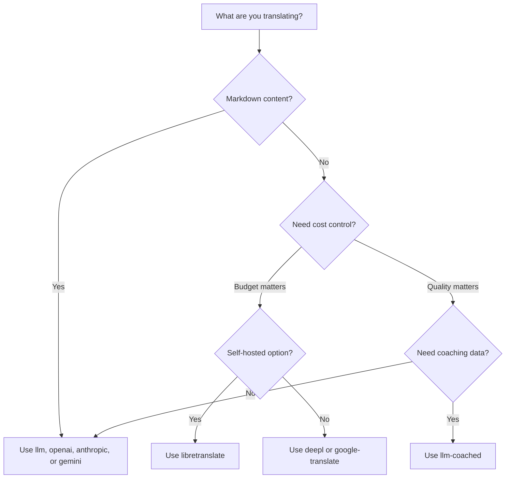

# 翻译方法

Rosetta 支持十种翻译方法。每个语言对都可以使用不同的方法——你不必在整个项目中局限于一种方案。

## 方法对比

### LLM 提供商

注重质量，支持 Markdown，兼容辅导（coaching）功能。最适合内容密集的项目。

| 方法 | 键名 | 功能说明 |
|--------|-----|-------------|
| `llm`（默认） | `OPENROUTER_API_KEY` | 通过 OpenRouter 调用 LLM — 200+ 模型，自动路由 |
| `llm-coached` | `OPENROUTER_API_KEY` | LLM + 语法规则、词典、样式说明 |
| `openai` | `OPENAI_API_KEY` | 直连 OpenAI API (gpt-4o, gpt-4o-mini) |
| `anthropic` | `ANTHROPIC_API_KEY` | 直连 Anthropic API (Claude Sonnet, Haiku, Opus) |
| `gemini` | `GEMINI_API_KEY` | 直连 Google Gemini API (Flash, Pro) — 提供免费额度 |

### 传统机器翻译 (MT)

注重速度和成本。最适合大量的键值对。

| 方法 | 键名 | 功能说明 |
|--------|-----|-------------|
| `google-translate` | `GOOGLE_TRANSLATE_API_KEY` | Google Cloud Translation API v2（130+ 语言） |
| `deepl` | `DEEPL_API_KEY` | 支持术语表的 DeepL API（30+ 语言） |
| `microsoft-translator` | `MICROSOFT_TRANSLATOR_API_KEY` | Azure Cognitive Services Translator（100+ 语言） |
| `libretranslate` | *(自托管)* | 自托管 LibreTranslate（AGPL，免费） |

### 基础设施

| 方法 | 键名 | 功能说明 |
|--------|-----|-------------|
| `api` | *(按提供商)* | 适用于任何 REST 翻译端点的轻量级 HTTP 客户端 |

## 决策树



---

## `llm` — LLM 翻译（默认）

通过 [OpenRouter](https://openrouter.ai) 上的任意 LLM 进行翻译。这是默认方法，也是最通用的方法。

**工作原理：**
1. 将键值分批（默认 30 个/批），并附带语域和上下文指令
2. 作为结构化提示词发送至 OpenRouter
3. 解析 JSON 响应
4. 通过[质量门禁](/docs/concepts/quality-gate)验证每条翻译
5. 写入通过的翻译，对失败的翻译进行重试或拒绝

**适用场景：** 大多数项目。特别是包含 Markdown 的内容密集型网站，这类网站需要保护代码块和短代码不受影响。

**配置：**

```json
{
  "defaultMethod": "llm",
  "model": "google/gemini-3.5-flash"
}
```

## `llm-coached` — 辅导式 LLM 翻译

与 `llm` 相同，但在每个提示词中注入了语法规则、术语词典和样式说明。

**工作原理：**
1. 从 `.rosetta/coaching/<locale>.json` 或插件的 `coaching/` 目录加载辅导数据
2. 将语法规则、词典术语和样式说明注入系统提示词
3. 与源键匹配的词典术语将作为必需术语包含在内
4. 翻译过程与 `llm` 相同，辅导数据可提高准确性

**适用场景：** 低资源语言、特定领域术语（法律、医疗）、正式语域，或任何通用 LLM 输出不够精确的场景。

**辅导数据格式：**

```json title=".rosetta/coaching/fr.json"
{
  "grammar_rules": [
    "French adjectives agree in gender and number with the noun they modify",
    "Use 'vous' for formal contexts, 'tu' for informal"
  ],
  "dictionary": {
    "dashboard": "tableau de bord",
    "deployment": "déploiement",
    "settings": "paramètres"
  },
  "style_notes": "Prefer active voice. Avoid anglicisms where a native French term exists."
}
```

另请参阅：[低资源语言指南](https://mtevalarena.org/docs/community/low-resource-languages)

---

## `openai` — 直连 OpenAI API

直接通过 OpenAI Chat Completions API 进行翻译。没有 OpenRouter 中间商——使用你自己的密钥、账户和用量面板。

**模型：** `gpt-4o`（默认），`gpt-4o-mini`

**特性：**
- ✅ 支持 Markdown（内容翻译）
- ✅ 支持辅导功能（语法规则、词典覆盖、样式说明）
- ✅ 支持 JSON 模式，用于结构化键值输出
- ✅ 带有重试机制的指数退避

**配置：**

```json
{
  "pairs": {
    "en:fr": { "method": "openai", "model": "gpt-4o-mini" }
  }
}
```

```bash
export OPENAI_API_KEY=sk-proj-...
```

在 [platform.openai.com/api-keys](https://platform.openai.com/api-keys) 获取你的密钥。

## `anthropic` — 直连 Anthropic API

直接通过 Anthropic Messages API 进行翻译。使用 `system` 参数处理辅导数据，从而启用 Anthropic 的提示词缓存功能。

**模型：** `claude-sonnet-4-6`（默认），`claude-haiku-4-5`，`claude-opus-4-7`

**特性：**
- ✅ 支持 Markdown（内容翻译）
- ✅ 支持辅导功能（语法规则、词典覆盖、样式说明）
- ✅ 系统提示词缓存（在批次间分摊辅导成本）
- ✅ 带有重试机制的指数退避

**配置：**

```json
{
  "pairs": {
    "en:ja": { "method": "anthropic", "model": "claude-haiku-4-5" }
  }
}
```

```bash
export ANTHROPIC_API_KEY=sk-ant-...
```

在 [console.anthropic.com](https://console.anthropic.com/settings/keys) 获取你的密钥。

## `gemini` — 直连 Google Gemini API

直接通过 Google Gemini `generateContent` API 进行翻译。**提供免费额度**——最佳的零成本起点。

**模型：** `gemini-2.5-flash`（默认），`gemini-2.5-pro`

**特性：**
- ✅ 支持 Markdown（内容翻译）
- ✅ 支持辅导功能（语法规则、词典覆盖、样式说明）
- ✅ 通过 `responseMimeType` 支持 JSON 响应模式
- ✅ 免费额度（慷慨的每日配额）
- ✅ 带有重试机制的指数退避

**配置：**

```json
{
  "pairs": {
    "en:ko": { "method": "gemini", "model": "gemini-2.5-pro" }
  }
}
```

```bash
export GEMINI_API_KEY=AI...
```

在 [aistudio.google.com/apikey](https://aistudio.google.com/apikey) 获取你的密钥。

### 模型验证

直连 LLM 提供商（`openai`、`anthropic`、`gemini`）会在首次使用时验证你的模型字符串。这可以捕获三类错误：

**方法格式错误** — 在直连提供商中使用了 OpenRouter 风格的模型路径：

```
[WARN] OpenAI: model "google/gemini-3.5-flash" looks like an OpenRouter path.
       Direct providers use bare model names (e.g., "gpt-4o").
       To use OpenRouter models, set method to 'llm' instead.
```

**提供商错误** — 使用了完全不同提供商的模型：

```
[WARN] Gemini: model "claude-sonnet-4-6" is an Anthropic model.
       This provider (gemini) cannot serve Anthropic models.
       Use --method anthropic or set "method": "anthropic" in config.
```

**模型已弃用或拼写错误** — 在首次 API 调用时，rosetta 会获取提供商的实时模型列表，并对照检查你的模型：

```
[WARN] Gemini: model "gemini-1.5-flash" not found in available models.
       Similar models: gemini-2.0-flash, gemini-2.5-flash, gemini-2.5-pro
       The API call will proceed — the provider will give the final verdict.
```

:::note 这些是警告，不是错误
模型验证会记录警告，但不会阻止 API 调用。提供商 API 会给出最终裁决——未来的模型名称可能会匹配不同的模式，我们不想基于启发式规则进行拦截。
:::

---

## `google-translate` — Google Cloud Translation API

直接集成 Google Cloud Translation API v2。使用 REST API——无需 SDK，无需服务账号。只需 API 密钥。

**适用场景：** 速度和成本比细微语义更重要的大量键值字符串对。开箱即用支持 130 多种语言。

**局限性：**
- ⚠️ **不支持 Markdown。** 会破坏代码块、短代码和插值变量。
- 无语域/语气控制
- 无辅导功能或术语强制执行

```bash
npx i18n-rosetta sync --method google-translate
```

:::tip 自动检测
如果仅设置了 `GOOGLE_TRANSLATE_API_KEY`（没有 OpenRouter 密钥），rosetta 会自动切换到 Google Translate。无需更改配置。
:::

## `deepl` — DeepL API

直接集成 DeepL 翻译 API。支持术语表以保持术语一致性。

**适用场景：** DeepL 擅长的欧洲语言（德语、法语、西班牙语、荷兰语、波兰语等）。术语表支持可在没有辅导数据的情况下强制保持术语一致。

**特性：**
- ✅ 自动检测免费/专业版端点（免费密钥带有 `:fx` 后缀）
- ✅ 术语表创建与管理
- ✅ 正式程度控制
- ⚠️ **不支持 Markdown** — 仅限键值对

**配置：**

```json
{
  "pairs": {
    "en:de": { "method": "deepl" }
  }
}
```

```bash
export DEEPL_API_KEY=your-key-here
```

在 [deepl.com/pro-api](https://www.deepl.com/pro-api) 获取你的密钥。

## `microsoft-translator` — Azure Cognitive Services

直接集成 Microsoft Translator Text API v3。

**适用场景：** 拥有现有 Azure 基础设施的企业环境。支持 100 多种语言，包括许多 Google Translate 未覆盖的语言。

**特性：**
- ✅ 每次请求最多 100 个片段（高吞吐量）
- ✅ 可选区域参数以优化延迟
- ⚠️ **不支持 Markdown** — 仅限键值对
- ⚠️ **不支持内容翻译** — 仅限键值对

**配置：**

```json
{
  "pairs": {
    "en:ar": { "method": "microsoft-translator" }
  }
}
```

```bash
export MICROSOFT_TRANSLATOR_API_KEY=your-key
export MICROSOFT_TRANSLATOR_REGION=global  # optional
```

从 [Azure Portal](https://portal.azure.com) → Cognitive Services → Translator 获取你的密钥。

## `libretranslate` — 自托管翻译

使用 LibreTranslate 进行自托管开源翻译。在本地或你自己的基础设施上运行——零 API 成本，完全的数据主权。

**适用场景：** 需要离线翻译、数据隐私合规 (GDPR) 或零成本运行的项目。特别适用于不应依赖外部 API 的 CI 流水线。

**特性：**
- ✅ 自托管 — 无外部 API 调用
- ✅ 免费且开源 (AGPL-3.0)
- ✅ 提供 Docker 部署
- ⚠️ **不支持 Markdown** — 仅限键值对
- ⚠️ **不支持内容翻译** — 仅限键值对
- ⚠️ 质量因语言对而异

**设置：**

```bash
# Run LibreTranslate locally with Docker
docker run -d -p 5000:5000 libretranslate/libretranslate

# Configure (optional — defaults to localhost:5000)
export LIBRETRANSLATE_API_URL=http://localhost:5000/translate
```

```json
{
  "pairs": {
    "en:es": { "method": "libretranslate" }
  }
}
```

---

## `api` — 远程翻译 API

适用于社区托管或受知识产权保护的翻译端点的轻量级 HTTP 客户端。Rosetta 发送键值并接收翻译结果——它本身不包含任何翻译逻辑。

**适用场景：** 当翻译方法托管在服务端时（例如，专有辅导数据、微调模型、无法分发的 FST 流水线）。

```json
{
  "pairs": {
    "en:crk": {
      "method": "api",
      "endpoint": "https://api.example.com/v1/translate",
      "apiKey": "your-key"
    }
  }
}
```

:::note 兼容 OCAP 的社区翻译
`api` 方法是通往**兼容 OCAP 的社区托管翻译**的桥梁。原住民和少数语种社区可以托管自己的翻译端点——将辅导数据、微调模型和语言知识产权保留在社区控制之下——而 Rosetta 则作为轻量级客户端连接到它们。

有关完整的社区托管演练，请参阅[支持低资源语言](https://mtevalarena.org/docs/community/low-resource-languages)；有关端点要求，请参阅[通过 API 提供方法](/docs/guides/serving-a-method)。
:::

---

## 语言对独立配置

真正的强大之处在于为每个语言对混合使用不同的方法：

```json title="i18n-rosetta.config.json"
{
  "version": 3,
  "pairs": {
    "en:fr": { "method": "deepl" },
    "en:ja": { "method": "openai", "model": "gpt-4o" },
    "en:ko": { "method": "gemini" },
    "en:ar": { "method": "microsoft-translator" },
    "en:crk": { "methodPlugin": "crk-coached-v1" }
  }
}
```

这将通过 DeepL 翻译法语（支持术语表），通过 OpenAI 翻译日语（注重质量），通过 Gemini 翻译韩语（免费额度），通过 Microsoft Translator 翻译阿拉伯语（覆盖面广），并通过辅导插件翻译平原克里语（专业化）。

## 插件

插件是针对特定语言对的预打包翻译配方。它们是 JSON 清单（而非代码），用于告诉 rosetta 使用哪种方法、什么设置，以及已经过基准测试的质量水平。

:::tip 一键从评估工具链投入生产
在[评估工具链](https://mtevalarena.org/docs/specifications/harness)中开发并验证的插件可以直接安装——你在那里验证的方法只需一条 `plugin install` 命令即可在此处部署。有关完整的评估工作流，请参阅 [MT 评估](https://mtevalarena.org/docs/leaderboard/rules)。
:::

```bash
i18n-rosetta plugin install ./french-formal-v1/
i18n-rosetta plugin list
i18n-rosetta plugin remove french-formal-v1
```

有关完整的清单格式，请参阅[插件规范](/docs/reference/plugin-spec)。

---

## 切换提供商

在不同方法之间切换？模型格式和环境变量会发生变化——以下是对照表：

### OpenRouter → 直连提供商

```diff title="i18n-rosetta.config.json"
 {
   "pairs": {
     "en:fr": {
-      "method": "llm",
-      "model": "openai/gpt-4o"
+      "method": "openai",
+      "model": "gpt-4o"
     }
   }
 }
```

```diff title="Environment variables"
- export OPENROUTER_API_KEY=sk-or-v1-...
+ export OPENAI_API_KEY=sk-proj-...
```

**主要区别：**
- OpenRouter 使用 `provider/model` 格式（例如 `openai/gpt-4o`）。直连提供商使用纯模型名称（例如 `gpt-4o`）。
- 每个直连提供商都有自己的环境变量（`OPENAI_API_KEY`、`ANTHROPIC_API_KEY`、`GEMINI_API_KEY`）。
- 如果使用了错误的模型格式，rosetta 会发出警告——请参阅[模型验证](#model-validation)。

### 直连提供商 → OpenRouter

```diff title="i18n-rosetta.config.json"
 {
   "pairs": {
     "en:ja": {
-      "method": "anthropic",
-      "model": "claude-sonnet-4-6"
+      "method": "llm",
+      "model": "anthropic/claude-sonnet-4-6"
     }
   }
 }
```

:::tip 何时使用 OpenRouter 与直连
**使用 OpenRouter** 的场景：希望在不更改环境变量的情况下切换模型，或者希望通过单个密钥访问 200 多个模型。**使用直连提供商**的场景：希望计费更简单、延迟更低（无中间商），或者需要使用提供商的特定功能（如 Anthropic 的提示词缓存）。
:::

---

## 成本对比

每翻译 1,000 个键的预估成本（假设每个键约 10 个 token，每批 30 个键）：

| 方法 | 成本 / 1K 键 | 速度 | 质量 | 最适合 |
|--------|----------------|-------|---------|----------|
| `gemini` (Flash) | **免费**（额度内） | 快 | 良好 | 入门、个人项目 |
| `google-translate` | ~$0.02 | 最快 | 尚可 | 大批量、欧洲语言 |
| `deepl` | ~$0.02 | 快 | 良好 | 欧洲语言、术语 |
| `microsoft-translator` | ~$0.01 | 快 | 尚可 | Azure 用户、广泛的语言覆盖 |
| `libretranslate` | **免费**（自托管） | 视情况而定 | 一般 | 物理隔离、GDPR、CI 流水线 |
| `gemini` (Pro) | ~$0.07 | 中等 | 极佳 | 注重质量、免费配额 |
| `openai` (GPT-4o-mini) | ~$0.01 | 快 | 良好 | 经济型 LLM |
| `openai` (GPT-4o) | ~$0.10 | 中等 | 极佳 | 注重质量 |
| `anthropic` (Haiku) | ~$0.01 | 快 | 良好 | 经济型 LLM |
| `anthropic` (Sonnet) | ~$0.10 | 中等 | 极佳 | 注重质量 |
| `anthropic` (Opus) | ~$0.50 | 慢 | 完美 | 追求极致质量 |
| `llm` (OpenRouter) | 因模型而异 | 视情况而定 | 视情况而定 | 模型对比、实验 |

:::note 这些是预估值
实际成本取决于你的源文本长度、批次大小以及提供商的定价变化。请查看各提供商当前的定价页面以获取准确费率。
:::

---

## 另请参阅

- [支持的语言](/docs/reference/supported-languages)
- [辅导数据](/docs/concepts/coaching-data)
- [支持低资源语言](https://mtevalarena.org/docs/community/low-resource-languages)
- [插件规范](/docs/reference/plugin-spec)
- [通过 API 提供方法](/docs/guides/serving-a-method)
- [质量门禁](/docs/concepts/quality-gate)
- [架构](/docs/concepts/architecture)
- [故障排除](/docs/guides/troubleshooting) — 模型错误、API 问题