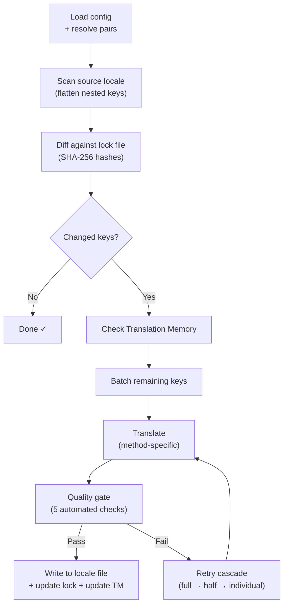

# i18n-rosetta 工作原理

i18n-rosetta 只需一条命令即可翻译你应用的本地化文件。以下是它的底层工作原理。

## 处理流程

当你运行 `npx i18n-rosetta sync` 时，rosetta 会执行一个分为六个阶段的处理流程：



**关键设计决策：**

- **基于 SHA-256 哈希的变更检测。** Rosetta 在 `.i18n-rosetta.lock` 中使用哈希跟踪每个源值。当你更新一个英文字符串时，只有该键会被重新翻译。这就是为什么 `sync` 在重复运行时速度很快——它只做最少的工作。

- **翻译记忆库缓存。** 在进行任何 API 调用之前，rosetta 会在 `.rosetta/tm.json` 中检查缓存的翻译（以源文本 + 语言环境 + 方法为键）。在更改一个键后的典型重新同步过程中，有 142 个键来自缓存，只有 1 个键会调用 API。

- **写入前的质量关卡。** 每次翻译在写入你的文件之前，都会经过五项自动检查（空值、源文本回显、幻觉循环、长度膨胀、书写系统合规性）。失败情况会被记录，绝不会被静默接受。

- **失败时的级联重试。** 如果某个批次失败（JSON 解析错误、API 超时），rosetta 会使用逐渐减小的批次进行重试：全部 → 一半 → 单个。这样可以隔离出有问题的键，而不会阻塞其余部分。

## 翻译方法

Rosetta 支持四种翻译方法，每种方法适用于不同的场景：

| 方法 | 工作原理 | 最适用场景 |
|--------|-------------|----------|
| **`llm`** | 向任何 OpenRouter 模型发送结构化提示词 | 资源丰富的语言 |
| **`llm-coached`** | 相同的提示词 + 语法规则、词典和风格说明 | LLM 容易犯可预测错误的语言 |
| **`google-translate`** | Google Cloud Translation API 批量请求 | 拥有良好 GT 支持的高资源语言 |
| **`api`** | 向你自己的端点发送 HTTP POST 请求 | 自定义处理流程、社区控制的模型 |

方法是按语言对配置的。你可能对法语使用 `google-translate`，而对 Plains Cree 使用 `llm-coached`——每种语言对都会使用最适合它的方法。

## 辅导数据

对于 `llm-coached` 语言对，辅导数据为 LLM 提供了明确的语言知识：语法规则、强制术语和风格偏好。这些数据会作为结构化上下文注入到每个提示词中。

```json title="coaching/crk.json"
{
  "grammar_rules": ["Animate nouns take different plural forms than inanimate nouns"],
  "dictionary": {"welcome": "ᑕᓂᓯ", "settings": "ᐃᑕᐢᑌᐘᐃᓇ"},
  "style_notes": "Use Standard Roman Orthography (SRO) unless explicitly configured otherwise."
}
```

辅导数据是在不微调模型的情况下提高翻译质量的主要机制。更改规则 → 重新运行同步 → 查看是否有帮助。迭代是即时的。

## 插件

插件是针对特定语言对的预打包翻译方案。它们是 JSON 清单（而不是代码），用于告诉 rosetta 使用哪种方法、什么设置以及已经基准测试出的质量水平。

```bash
i18n-rosetta plugin install ./crk-coached-v3/
i18n-rosetta sync   # uses the installed plugin for en→crk
```

插件弥合了研究与生产之间的差距：在 [MT Eval Arena](https://mtevalarena.org) 中得分较高的方法可以打包为插件并部署在这里。

## 宏观视角

i18n-rosetta 是由两部分组成的生态系统中的一半：

- **[MT Eval Arena](https://mtevalarena.org)** — 在这里，翻译方法通过可重复的基准测试得到**开发和验证**
- **i18n-rosetta** — 在这里，经过验证的方法被**部署**以翻译实际内容

[Eval Harness Bridge](/docs/guides/bridge) 将两者连接起来。在 Arena 中证明有效的方法会部署在这里。来自生产环境的母语者反馈将用于改进下一个版本。

---

## 深入了解

- [同步工作原理](/docs/concepts/how-sync-works) — 详细的逐步处理流程演练
- [质量关卡](/docs/concepts/quality-gate) — 五项自动检查
- [翻译记忆库](/docs/concepts/translation-memory) — 缓存与成本节约
- [翻译方法](/docs/guides/translation-methods) — 详细的方法比较
- [架构](/docs/concepts/architecture) — 系统设计概述