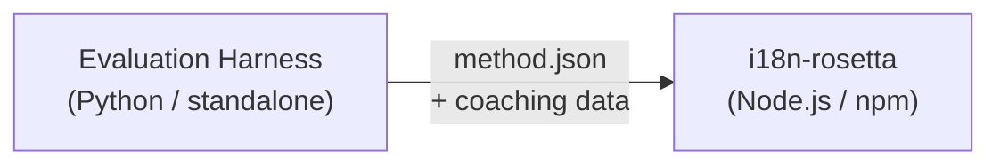

# 方法插件规范

> **版本**: 1.1  
> **受众**: 插件开发者  
> **规范 Schema**: [`schemas/rosetta-plugin.schema.json`](https://github.com/gamedaysuits/i18n-rosetta/blob/main/schemas/rosetta-plugin.schema.json)

## 概述

i18n-rosetta 使用**可插拔的方法系统**。每个语言对可以使用不同的翻译方法（LLM、coached、script-converter 等）。方法在 `lib/translate.js` 中注册，并通过 `lib/pairs.js` 按语言对解析。

eval harness 的工作是**开发、测试和导出**翻译方法。i18n-rosetta 的工作是**消费和执行**它们。harness 从不在 rosetta 内部运行。

### 数据流



---

## 方法插件格式

方法插件是一个单独的 JSON 文件（`method.json`），可包含可选的 coaching 数据文件。

### `method.json` — 必填

```json
{
  "name": "french-formal-v1",
  "type": "llm-coached",
  "version": "1.0.0",
  "description": "Formally-tuned French with terminology enforcement and grammar coaching",
  "author": "Plugin Author",

  "config": {
    "model": "google/gemini-3.5-flash",
    "register": "formal",
    "batchSize": 80,
    "temperature": 0.2
  },

  "locales": ["fr"],

  "benchmarks": {
    "fr": {
      "date": "2026-05-11T00:00:00Z",
      "corpus_size": 500,
      "exact_match_rate": 0.42,
      "corpus_chrf": 72.3,
      "corpus_bleu": 45.1,
      "model": "google/gemini-3.5-flash",
      "harness_version": "1.0.0"
    }
  },

  "provenance": {
    "resources": [],
    "commercialReady": false,
    "flags": ["license-unclear"]
  },

  "coaching": {
    "dir": "coaching"
  }
}
```

### 字段参考

| 字段 | 类型 | 必填 | 描述 |
|-------|------|----------|-------------|
| `name` | string | ✅ | 唯一方法标识符（kebab-case） |
| `type` | string | ✅ | Rosetta 方法类型：`llm`, `llm-coached`, `api`, `google-translate`, `deepl`, `microsoft-translator`, `libretranslate`, `openai`, `anthropic`, `gemini` |
| `version` | string | ✅ | 语义化版本（例如 `1.0.0`） |
| `locales` | string[] | ✅ | 此方法适用的区域代码（至少 1 个） |
| `description` | string | — | 易读的描述 |
| `author` | string | — | 谁开发/测试了此方法 |
| `config.model` | string | — | OpenRouter 模型标识符 |
| `config.register` | string | — | 目标语言的语域/语气 |
| `config.batchSize` | number | — | 每个 API 批次的键数（1–200，默认：80） |
| `config.temperature` | number | — | LLM 温度（0.0–2.0，默认：0.3） |
| `benchmarks` | object | — | 每个区域的基准测试结果 |
| `provenance` | object | — | 许可与资源依赖 |
| `coaching.dir` | string | — | coaching 数据目录的相对路径 |

### Benchmark 对象（按区域）

| 字段 | 类型 | 必填 | 描述 |
|-------|------|----------|-------------|
| `date` | string | ✅ | 基准测试运行的 ISO 8601 时间戳 |
| `corpus_size` | number | ✅ | 评估的条目数量 |
| `exact_match_rate` | number | ✅ | 0.0–1.0，完全匹配的比例 |
| `corpus_chrf` | number | — | chrF++ 分数（0–100） |
| `corpus_bleu` | number | — | BLEU 分数（0–100） |
| `model` | string | ✅ | 评估期间使用的模型 |
| `harness_version` | string | ✅ | 使用的 evaluation harness 版本 |

:::info 显示哪些指标？
`rosetta status` 命令会显示 benchmark 块中的 **chrF++** 和**完全匹配率**（exact match rate）。清单中接受 `corpus_bleu`，但目前没有任何 rosetta 命令显示或使用它。[方法排行榜](/leaderboard)会跟踪 chrF++、完全匹配率和 FST 接受率。
:::

---

### Provenance 对象

provenance 块用于传达插件捆绑资源的许可状态。

| 字段 | 类型 | 默认值 | 描述 |
|-------|------|---------|-------------|
| `resources` | object[] | `[]` | 包含 `name`、`license` 和 `type` 的捆绑资源列表 |
| `commercialReady` | boolean | `false` | 插件是否已获准进行商业分发 |
| `flags` | string[] | `["license-unclear"]` | 机器可读的状态标志 |

**默认状态** — 导出的插件带有 `commercialReady: false` 和 `flags: ["license-unclear"]`。

**获准状态** — 当许可已验证时：设置 `commercialReady: true` 并清除标志。

---

## Coaching 数据格式

如果 `type` 为 `llm-coached`，插件应在 `coaching/` 子目录中包含 coaching 数据文件。

### `coaching/<locale>.json`

```json
{
  "grammar_rules": [
    "French adjectives agree in gender and number with the noun they modify",
    "Use 'vous' for formal contexts, 'tu' for informal"
  ],
  "dictionary": {
    "dashboard": "tableau de bord",
    "deployment": "déploiement",
    "settings": "paramètres"
  },
  "style_notes": "Prefer active voice. Avoid anglicisms where a native French term exists."
}
```

| 字段 | 类型 | 必填 | 描述 |
|-------|------|----------|-------------|
| `grammar_rules` | string[] | — | 注入到该区域每个 LLM 提示词中的规则 |
| `dictionary` | object | — | 术语 → 翻译的映射。匹配的术语将作为必需的术语注入。 |
| `style_notes` | string | — | 附加到提示词末尾的自由格式样式说明 |

---

## 目录结构

```
french-formal-v1/
  method.json                 # Method manifest with benchmarks
  coaching/
    fr.json                   # Coaching data for French
```

对于多区域方法：

```
european-formal-v2/
  method.json                 # locales: ["fr", "de", "es", "it"]
  coaching/
    fr.json
    de.json
    es.json
    it.json
```

---

## Rosetta 如何消费插件

### 安装

```bash
i18n-rosetta plugin install ./french-formal-v1/
```

保存到 `.rosetta/methods/french-formal-v1/`。

### 配置

```json title="i18n-rosetta.config.json"
{
  "pairs": {
    "en:fr": {
      "methodPlugin": "french-formal-v1"
    }
  }
}
```

:::info 合并语义
插件定义了要使用*什么*方法（`type`）。语言对配置调整了*如何*运行它（`model`、`register`、`batchSize`）。如果语言对设置了 `model`，它将覆盖插件的默认值。
:::

### 运行时

1. Rosetta 从 `.rosetta/methods/french-formal-v1/` 读取 `method.json`
2. 插件的 `type` 字段设置翻译方法（例如 `llm-coached`）
3. 从插件的 `coaching/` 目录加载 coaching 数据
4. 使用 `config` 块填补模型/语域/温度的空白
5. `benchmarks` 块显示在 `rosetta status` 输出中
6. `rosetta provenance` 会检查 `provenance` 块以获取许可标志

---

## Schema 验证

在安装时，插件清单会根据 [`schemas/rosetta-plugin.schema.json`](https://github.com/gamedaysuits/i18n-rosetta/blob/main/schemas/rosetta-plugin.schema.json) 进行验证。

在你的 `method.json` 中引用 schema 以实现 IDE 自动补全：

```json
{
  "$schema": "./node_modules/i18n-rosetta/schemas/rosetta-plugin.schema.json",
  "name": "my-method-v1"
}
```

---

## 不要包含的内容

- ❌ 不要包含 Python 代码或 harness 依赖项
- ❌ 不要包含原始语料库数据或运行日志
- ❌ 不要包含 API 密钥或凭证
- ❌ 不要包含 harness 配置
- ❌ 不要包含内部提示词模板（这些存在于 rosetta 的方法实现中）

插件**仅包含数据**：配置、coaching 内容和基准测试结果。

---

## 另请参阅

- [翻译方法](/docs/guides/translation-methods) — 每个内置方法的工作原理
- [配置](/docs/getting-started/configuration) — 按语言对和按语言的配置
- [通过 API 提供方法服务](/docs/guides/serving-a-method) — 将方法托管为 HTTP 服务
- [Cookbook：FST 门控管道](https://mtevalarena.org/docs/tutorials/fst-gated-pipeline) — 构建和打包管道
- [MT 评估](https://mtevalarena.org/docs/leaderboard/rules) — 为提交排行榜对方法进行基准测试
- [支持低资源语言](https://mtevalarena.org/docs/community/low-resource-languages) — 社区插件的用例