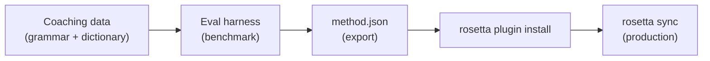

# 教程：构建翻译插件

从头开始构建自定义翻译方法，对其进行基准测试，并将其部署为 rosetta 插件。这是添加没有现成 API 支持的新语言对的完整工作流程。

**你将构建什么：** 一个针对正式法语的指导式翻译插件，包含强制术语、语法规则和基准测试分数。

**时间：** 30–45 分钟

**先决条件：**
- 已安装 i18n-rosetta (`npm install --save-dev i18n-rosetta`)
- OpenRouter API 密钥 (`OPENROUTER_API_KEY`)
- Python 3.10+（用于评估工具）

---

## 第 1 步：确定问题

你正在将一个 SaaS 仪表板翻译成法语。默认的 `llm` 方法生成的翻译虽然正确，但不一致：

- 有时 "dashboard" 被翻译成 "tableau de bord"，有时又变成 "panneau de contrôle"
- 语气在 `tu` 和 `vous` 形式之间交替
- 专业术语的英语化处理不一致

你需要通用 LLM 提示词无法提供的**术语强制执行**和**语域控制**。

## 第 2 步：创建指导数据

创建一个包含你语言要求的指导文件：

```bash
mkdir -p .rosetta/coaching
```

```json title=".rosetta/coaching/fr.json"
{
  "grammar_rules": [
    "Always use the 'vous' form for formal register",
    "French adjectives agree in gender and number with their noun",
    "Use the present tense for UI instructions, not the imperative",
    "Preserve sentence-final punctuation style from the source"
  ],
  "dictionary": {
    "dashboard": "tableau de bord",
    "deployment": "déploiement",
    "settings": "paramètres",
    "environment variable": "variable d'environnement",
    "webhook": "webhook",
    "API key": "clé API",
    "sign in": "se connecter",
    "sign out": "se déconnecter",
    "repository": "dépôt",
    "pull request": "demande de tirage"
  },
  "style_notes": "Formal technical French. Prefer native French terms over anglicisms where established equivalents exist. Keep UI labels concise — 3 words maximum where possible."
}
```

**各个字段的作用：**
- **`grammar_rules`** — 作为明确的约束条件注入到 LLM 系统提示词中
- **`dictionary`** — 与源键值进行匹配；当出现字典术语时，它会作为“必需术语”注入到提示词中
- **`style_notes`** — 附加到系统提示词中作为通用样式指南

## 第 3 步：配置语言对

告诉 rosetta 对法语使用 `llm-coached`：

```json title="i18n-rosetta.config.json"
{
  "version": 3,
  "inputLocale": "en",
  "localesDir": "./locales",
  "pairs": {
    "en:fr": {
      "method": "llm-coached",
      "model": "google/gemini-3.5-flash"
    }
  },
  "languages": {
    "fr": {
      "register": "Formal technical French (vous-form)",
      "name": "French"
    }
  }
}
```

## 第 4 步：进行测试

```bash
npx i18n-rosetta sync --dry
```

查看试运行输出。检查以下内容：
- ✅ 字典术语使用一致（使用 "tableau de bord"，而不是 "panneau de contrôle"）
- ✅ 全程使用 `vous` 形式
- ✅ 专业术语与你的字典匹配

然后运行真正的同步：

```bash
npx i18n-rosetta sync
```

## 第 5 步：使用评估工具进行基准测试（可选）

如果你需要质量分数（你肯定需要，因为插件会附带基准测试数据），请使用配套的评估工具。

### 安装评估工具

```bash
git clone https://github.com/gamedaysuits/gds-mt-eval-harness.git
cd gds-mt-eval-harness
pip install -r requirements.txt
```

### 创建参考语料库

创建一个包含源字符串和已知优质翻译的文件：

```json title="corpus/french-formal.json"
[
  {
    "source": "Dashboard",
    "reference": "Tableau de bord"
  },
  {
    "source": "Sign in to your account",
    "reference": "Connectez-vous à votre compte"
  },
  {
    "source": "Your deployment is ready",
    "reference": "Votre déploiement est prêt"
  },
  {
    "source": "Environment variables",
    "reference": "Variables d'environnement"
  }
]
```

### 运行基准测试

```bash
python harness.py eval \
  --corpus corpus/french-formal.json \
  --source en \
  --target fr \
  --method llm-coached \
  --model google/gemini-3.5-flash
```

评估工具输出：
- **chrF++** — 字符级 F 分数（0–100）。高于 70 分表现优异。
- **BLEU** — N-gram 重叠度（0–100）。对于指导式翻译，高于 40 分即为可靠。
- **精确匹配率** — 与参考翻译完全匹配的翻译比例。

### 导出插件

当你对分数感到满意后：

```bash
python harness.py export \
  --name french-formal-v1 \
  --output ./french-formal-v1/
```

这将创建：

```
french-formal-v1/
├── method.json          # Manifest with config + benchmarks
└── coaching/
    └── fr.json          # Your coaching data
```

## 第 6 步：在 Rosetta 中安装插件

```bash
npx i18n-rosetta plugin install ./french-formal-v1/
```

这会将插件复制到 `.rosetta/methods/french-formal-v1/`。

更新你的配置以使用它：

```json title="i18n-rosetta.config.json"
{
  "pairs": {
    "en:fr": {
      "methodPlugin": "french-formal-v1"
    }
  }
}
```

## 第 7 步：验证

```bash
# Check plugin is installed and shows benchmark scores
npx i18n-rosetta status

# Run a sync with the plugin
npx i18n-rosetta sync

# Audit licensing status
npx i18n-rosetta provenance
```

`status` 输出将显示：

```
en → fr
  Method:    french-formal-v1 (llm-coached)
  Model:     google/gemini-3.5-flash
  Quality:   high
  chrF++:    74.2
  BLEU:      46.8
  Exact:     42%
```

## 你构建了什么



你现在拥有：
1. **指导数据** — 强制保持一致性的语法规则和术语
2. **基准测试分数** — 随插件提供的量化质量指标
3. **便携式插件** — `method.json` + 指导数据，可安装在任何机器上
4. **生产部署** — 已集成到你的同步管道中

## 后续步骤

- **[插件规范](/docs/reference/plugin-spec)** — 完整的清单格式参考
- **[翻译方法](/docs/guides/translation-methods)** — 比较所有四种方法
- **[低资源语言](https://mtevalarena.org/docs/community/low-resource-languages)** — 将此模式应用于没有 API 覆盖的语言
- **[翻译 30 种语言](/docs/tutorials/translate-30-languages)** — 将你的项目扩展到全球受众