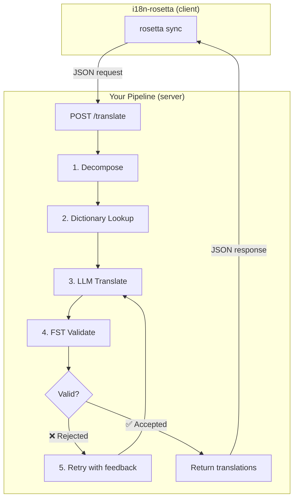
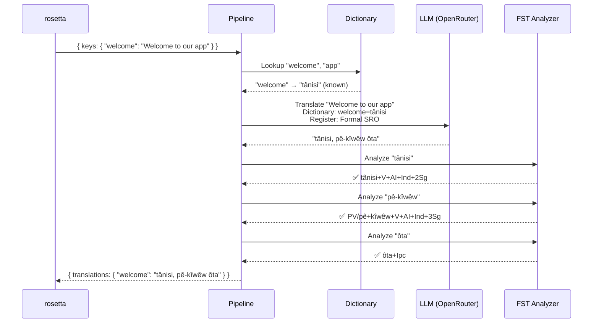
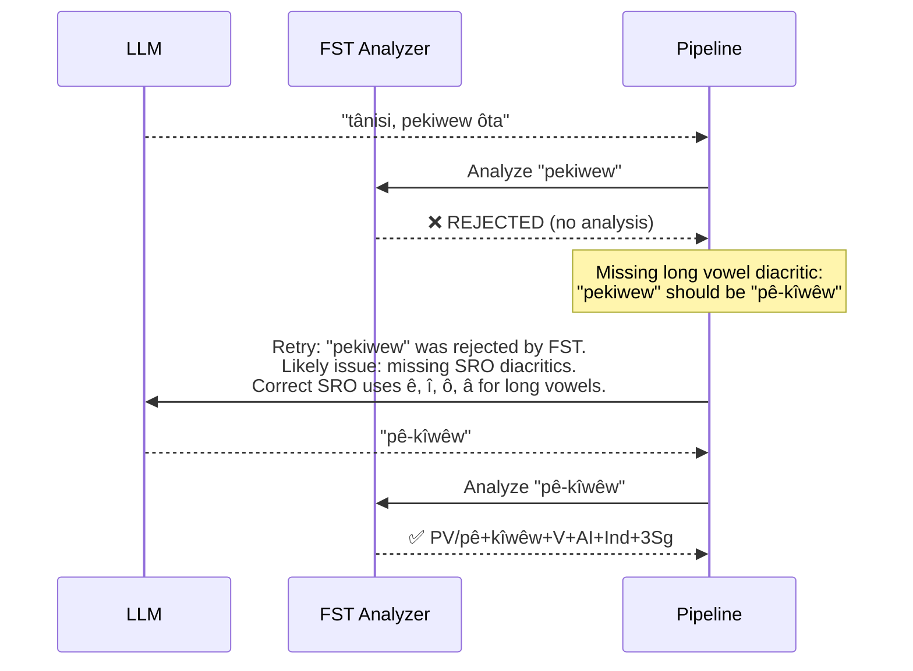
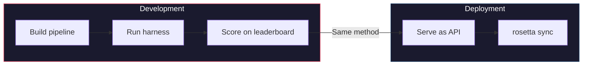

# 指南：FST 门控翻译流水线

构建一个多阶段翻译流水线，用于分解源文本、通过 LLM 进行翻译、使用有限状态转换器（FST）验证输出，并将整个流程作为 HTTP 端点提供服务，以便 rosetta 通过 `api` 方法进行调用。

**你将构建的内容：** 一个 Plains Cree 翻译 API，它能在形态学上无效的翻译到达你的语言环境文件*之前*将其拦截。

:::info 前提条件
- 运行中的 FST 二进制文件（例如，来自 [ALTLab 的 Plains Cree 分析器](https://github.com/UAlbertaALTLab/lang-crk)）
- Node.js 20+ 或 Python 3.10+
- 用于 LLM 步骤的 OpenRouter API 密钥
:::

---

## 架构

该流水线作为独立的 HTTP 服务运行。rosetta 不需要知道也不关心其内部发生了什么——它只负责发送键名（keys）并获取返回的翻译。



### 为什么选择这种架构

每个阶段都有特定的任务：

| 阶段 | 作用 | 重要性 |
|-------|-------------|---------------|
| **分解 (Decompose)** | 将复合 UI 字符串拆分为可翻译的片段 | 多式综合语将整个句子编码在单个词中——LLM 需要更小的单元 |
| **字典查找 (Dictionary Lookup)** | 在双语字典中查找已知的翻译 | 强制对已知术语使用正确的词汇，而不是依赖 LLM 的猜测 |
| **LLM 翻译 (LLM Translate)** | 将片段连同语域和语法上下文发送给 LLM | 处理新颖的短语并生成流畅的输出 |
| **FST 验证 (FST Validate)** | 将输出通过形态分析器运行 | 拦截无效的词形——如果 FST 拒绝某个词，说明它在该语言中是无效的 |
| **重试 (Retry)** | 带着 FST 的错误反馈重新发送被拒绝的词 | 为 LLM 提供关于该词*为什么*出错的具体信息 |

---

## 数据流

以下是单个键（`"welcome": "Welcome to our app"`）流经流水线时发生的过程：



### 当 FST 拒绝时



---

## 实现

### 第 1 步：服务器骨架

服务器实现了 rosetta 的 [API 方法契约](/docs/guides/serving-a-method)——即一个单一的 `POST /translate` 端点。

```javascript title="server.js"
import express from 'express';
import { translateBatch } from './pipeline.js';

const app = express();
app.use(express.json());

/**
 * rosetta API contract:
 *
 * Request:  { source_locale, target_locale, method, keys: { "key": "source" } }
 * Response: { translations: { "key": "translated" }, meta: { ... } }
 */
app.post('/translate', async (req, res) => {
  const { source_locale, target_locale, method, keys } = req.body;

  // Validate request
  if (!keys || typeof keys !== 'object') {
    return res.status(400).json({ error: { message: 'Missing keys object' } });
  }

  try {
    const startTime = Date.now();
    const { translations, stats } = await translateBatch(keys, {
      sourceLang: source_locale,
      targetLang: target_locale,
    });

    res.json({
      translations,
      meta: {
        model: 'custom-pipeline/fst-gated-v1',
        method: 'decompose-lookup-translate-validate',
        elapsed_ms: Date.now() - startTime,
        fst_acceptance_rate: stats.fstAccepted / stats.total,
        retries: stats.retries,
      },
    });
  } catch (err) {
    console.error('[ERR] Pipeline failed:', err.message);
    res.status(500).json({ error: { message: err.message } });
  }
});

// Health check for rosetta connectivity verification
app.get('/health', (req, res) => res.json({ status: 'ok' }));

app.listen(3001, () => {
  console.log('FST-gated pipeline running on http://localhost:3001');
});
```

### 第 2 步：流水线

每个阶段都是一个函数。流水线将它们链接在一起。

```javascript title="pipeline.js"
import { lookupDictionary } from './dictionary.js';
import { callLLM } from './llm.js';
import { analyzeWithFST } from './fst.js';

const MAX_RETRIES = 3;

/**
 * Translate a batch of keys through the full pipeline.
 *
 * @param {object} keys - Map of key → source string
 * @param {object} options - { sourceLang, targetLang }
 * @returns {{ translations: object, stats: object }}
 */
export async function translateBatch(keys, options) {
  const translations = {};
  const stats = { total: 0, fstAccepted: 0, retries: 0, dictionaryHits: 0 };

  for (const [key, sourceText] of Object.entries(keys)) {
    stats.total++;
    translations[key] = await translateSingle(sourceText, options, stats);
  }

  return { translations, stats };
}

/**
 * Translate a single string through all pipeline stages.
 */
async function translateSingle(sourceText, options, stats) {

  // ── Stage 1: Decompose ──────────────────────────────────
  // Split compound strings into segments the LLM can handle.
  // For UI strings this is often a no-op, but for longer content
  // it prevents the LLM from losing context in long prompts.
  const segments = decompose(sourceText);

  // ── Stage 2: Dictionary Lookup ──────────────────────────
  // Check each segment against the bilingual dictionary.
  // Known terms are forced — the LLM won't override them.
  const knownTerms = {};
  for (const segment of segments) {
    const entry = lookupDictionary(segment.toLowerCase());
    if (entry) {
      knownTerms[segment] = entry;
      stats.dictionaryHits++;
    }
  }

  // ── Stage 3: LLM Translate ──────────────────────────────
  let translation = await callLLM(sourceText, {
    ...options,
    knownTerms,
    register: 'nêhiyawêwin (Plains Cree). Use SRO orthography. '
            + 'Professional register for educational contexts.',
  });

  // ── Stage 4: FST Validate ──────────────────────────────
  // Split the translation into words and check each one.
  let { accepted, rejected } = await validateWords(translation);

  // ── Stage 5: Retry Loop ─────────────────────────────────
  // If any words were rejected, retry with FST feedback.
  let attempt = 0;
  while (rejected.length > 0 && attempt < MAX_RETRIES) {
    attempt++;
    stats.retries++;

    const feedback = rejected
      .map(w => `"${w}" was rejected by the morphological analyzer`)
      .join('; ');

    translation = await callLLM(sourceText, {
      ...options,
      knownTerms,
      register: 'nêhiyawêwin (Plains Cree). Use SRO orthography.',
      feedback: `Previous attempt had invalid words. ${feedback}. `
              + 'Use correct SRO diacritics (ê, î, ô, â for long vowels). '
              + 'Ensure verb forms match expected conjugation patterns.',
    });

    ({ accepted, rejected } = await validateWords(translation));
  }

  if (rejected.length === 0) stats.fstAccepted++;

  return translation;
}

/**
 * Decompose source text into translatable segments.
 *
 * For simple key-value UI strings, this usually returns the
 * original string as a single segment. For longer content,
 * it splits on sentence boundaries.
 */
function decompose(text) {
  // Simple sentence-boundary split. Replace with your own
  // morphological decomposition for more complex needs.
  return text
    .split(/(?<=[.!?])\s+/)
    .filter(s => s.trim().length > 0);
}

/**
 * Validate each word in a translation against the FST.
 *
 * @returns {{ accepted: string[], rejected: string[] }}
 */
async function validateWords(translation) {
  // Split on whitespace and punctuation, keeping only words
  const words = translation
    .split(/[\s,;:.!?'"()[\]{}]+/)
    .filter(w => w.length > 0);

  const accepted = [];
  const rejected = [];

  for (const word of words) {
    const analyses = await analyzeWithFST(word);
    if (analyses.length > 0) {
      accepted.push(word);
    } else {
      rejected.push(word);
    }
  }

  return { accepted, rejected };
}
```

### 第 3 步：FST 包装器

将你的 FST 二进制文件包装为异步函数。本示例使用 ALTLab 基于 HFST 的 Plains Cree 分析器。

```javascript title="fst.js"
import { execFile } from 'node:child_process';
import { promisify } from 'node:util';

const execFileAsync = promisify(execFile);

// Path to your FST analyzer binary
const FST_PATH = process.env.FST_ANALYZER_PATH || './bin/crk-analyzer';

/**
 * Run a word through the FST morphological analyzer.
 *
 * Returns an array of analyses. Empty array = rejected.
 *
 * Example:
 *   analyzeWithFST("tânisi")
 *   → ["tânisi+V+AI+Ind+2Sg", "tânisi+V+AI+Cnj+2Sg"]
 *
 *   analyzeWithFST("pekiwew")
 *   → []  // rejected — missing diacritics
 *
 * @param {string} word - A single word in SRO orthography
 * @returns {string[]} Array of FST analyses (empty = rejected)
 */
export async function analyzeWithFST(word) {
  try {
    // HFST lookup: pipe the word to stdin, read analyses from stdout
    const { stdout } = await execFileAsync(
      FST_PATH,
      ['--quiet'],
      { input: word + '\n', timeout: 5000 }
    );

    // Parse HFST output: each line is "input\tanalysis\tweight"
    // Lines with "+?" indicate unrecognized forms
    return stdout
      .split('\n')
      .filter(line => line.includes('\t') && !line.includes('+?'))
      .map(line => line.split('\t')[1]);

  } catch (err) {
    // If the FST binary isn't available, log and reject
    console.error(`[WARN] FST analysis failed for "${word}": ${err.message}`);
    return [];
  }
}
```

### 第 4 步：字典和 LLM 模块

```javascript title="dictionary.js"
/**
 * Simple bilingual dictionary backed by a JSON file.
 *
 * In production, you'd load from the coaching data directory
 * or query itwêwina (https://itwewina.altlab.app/) via API.
 */
const DICTIONARY = {
  'hello': 'tânisi',
  'welcome': 'tânisi',
  'thank you': 'kinanâskomitin',
  'home': 'kīwēwin',
  'search': 'nānātawāpahtam',
  'settings': 'isi-nākatohkēwin',
  'help': 'nīsōhkamākēwin',
  'back': 'kīwē',
};

/**
 * @param {string} term - Lowercase English term
 * @returns {string|null} Cree translation or null
 */
export function lookupDictionary(term) {
  return DICTIONARY[term] || null;
}
```

```javascript title="llm.js"
/**
 * Call an LLM via OpenRouter for translation.
 */
const OPENROUTER_API = 'https://openrouter.ai/api/v1/chat/completions';

export async function callLLM(sourceText, options) {
  const { knownTerms = {}, register, feedback } = options;

  // Build the system prompt with register and known terms
  let systemPrompt = `You are translating English to Plains Cree.\n\n`;
  systemPrompt += `Register: ${register}\n\n`;

  if (Object.keys(knownTerms).length > 0) {
    systemPrompt += `Required terminology (use these exact translations):\n`;
    for (const [en, crk] of Object.entries(knownTerms)) {
      systemPrompt += `  "${en}" → "${crk}"\n`;
    }
    systemPrompt += '\n';
  }

  if (feedback) {
    systemPrompt += `IMPORTANT correction from previous attempt:\n${feedback}\n\n`;
  }

  systemPrompt += `Rules:\n`;
  systemPrompt += `- Use Standard Roman Orthography (SRO)\n`;
  systemPrompt += `- Use macron/circumflex for long vowels: ê, î, ô, â\n`;
  systemPrompt += `- Return ONLY the Cree translation, nothing else\n`;

  const response = await fetch(OPENROUTER_API, {
    method: 'POST',
    headers: {
      'Authorization': `Bearer ${process.env.OPENROUTER_API_KEY}`,
      'Content-Type': 'application/json',
    },
    body: JSON.stringify({
      model: 'google/gemini-2.5-pro',
      messages: [
        { role: 'system', content: systemPrompt },
        { role: 'user', content: sourceText },
      ],
      temperature: 0.2,
    }),
  });

  const json = await response.json();
  return json.choices[0].message.content.trim();
}
```

---

## 连接到 rosetta

### 配置语言对

将你的语言对指向运行中的服务：

```json title="i18n-rosetta.config.json"
{
  "version": 3,
  "inputLocale": "en",
  "pairs": {
    "en:crk": {
      "method": "api",
      "endpoint": "http://localhost:3001/translate"
    }
  },
  "languages": {
    "crk": {
      "name": "Plains Cree",
      "register": "SRO syllabics with grammatical precision."
    }
  }
}
```

### 设置 API 密钥

```bash
export ROSETTA_API_KEY="your-service-auth-token"
export OPENROUTER_API_KEY="sk-or-v1-..."  # for the LLM step inside the pipeline
```

### 运行

```bash
# Start the pipeline
node server.js

# In another terminal, run rosetta
npx i18n-rosetta sync
```

rosetta 会将你的英文键名 POST 到流水线。流水线进行分解、查找、翻译、验证、重试，并返回 Cree 翻译结果。rosetta 将它们写入 `crk.json`。

---

## 评估你的流水线

可以使用 [评估工具](/docs/eval/harness) 评估相同的流水线。该工具使用相同的 JSON 输入/JSON 输出模式：

```bash
# Clone the harness
git clone https://github.com/gamedaysuits/gds-mt-eval-harness.git
cd gds-mt-eval-harness

# Run against the EDTeKLA dataset
python eval/baseline_experiment.py \
  --dataset data/edtekla-dev-v1.json \
  --model google/gemini-2.5-pro \
  --fst-analyzer ./bin/crk-analyzer \
  --condition fst-gated-v1 \
  --submit
```

`--fst-analyzer` 标志指示评估工具对每个输出运行 FST 验证——这与你的流水线执行的验证相同。这让你可以将流水线的得分与基准进行比较。



**先验证，后使用。** 你在评估工具中进行基准测试的方法，与 rosetta 在生产环境中调用的方法是同一个。

---

## 打包为插件

一旦你的流水线获得了排行榜分数，就可以将其打包为 rosetta 插件，供其他人使用：

```json title="crk-fst-gated-v1/method.json"
{
  "name": "crk-fst-gated-v1",
  "type": "api",
  "version": "1.0.0",
  "description": "FST-gated Plains Cree translation with morphological validation",
  "author": "Your Name",

  "config": {
    "endpoint": "https://your-server.example.com/translate"
  },

  "locales": ["crk"],

  "benchmarks": {
    "crk": {
      "date": "2026-06-01T00:00:00Z",
      "corpus_size": 124,
      "exact_match_rate": 0.12,
      "corpus_chrf": 48.7,
      "model": "google/gemini-2.5-pro",
      "harness_version": "2.0"
    }
  },

  "provenance": {
    "resources": [
      { "name": "ALTLab CRK Analyzer", "license": "LGPL-3.0", "type": "fst" },
      { "name": "Wolvengrey Dictionary", "license": "CC-BY-NC-SA-4.0", "type": "dictionary" }
    ],
    "commercialReady": false,
    "flags": ["nc-resource"]
  }
}
```

安装插件：

```bash
i18n-rosetta plugin install ./crk-fst-gated-v1/
```

现在，任何有权访问你服务器的人都可以使用该插件：

```json title="i18n-rosetta.config.json"
{
  "pairs": {
    "en:crk": { "methodPlugin": "crk-fst-gated-v1" }
  }
}
```

---

## 扩展此模式

本指南演示了一种流水线架构。你可以将其调整以适用于任何语言或方法：

| 变体 | 变更内容 |
|-----------|-------------|
| **不同的 FST** | 替换二进制文件路径。你可以从 [GiellaLT GitHub](https://github.com/giellalt) 或 [Apertium GitHub](https://github.com/apertium) 下载超过 100 种语言的预编译 FST（如 `.hfstol` 或 `lttoolbox` 二进制文件）。 |
| **没有可用的 FST** | 移除 FST 执行阶段，并使用来自 Hugging Face 的 [UniMorph flat paradigm files](https://huggingface.co/datasets/unimorph/universal_morphologies) 对屈折词形执行静态数据库查找验证。 |
| **多个 LLM** | 串联模型：使用快速模型生成初稿，使用推理模型进行修正。 |
| **人在回路 (Human-in-the-loop)** | 添加一个队列阶段，在返回之前保留不确定的翻译供专家审查。 |
| **微调模型** | 将 OpenRouter 调用替换为本地模型（Ollama、vLLM 等）。 |
| **不同语言** | 更改字典、FST 和语域。架构保持完全一致。 |

流水线是一种模式。各个阶段都是可互换的。构建适合你语言的流水线，在 [排行榜](/leaderboard) 上验证它，然后进行部署。

---

## 另请参阅

- **[通过 API 提供方法服务](/docs/guides/serving-a-method)** — API 契约规范
- **[插件规范](/docs/reference/plugin-spec)** — method.json 清单格式
- **[支持低资源语言](/docs/guides/low-resource-languages)** — 更广泛的背景和 OCAP 原则
- **[机器翻译评估](/docs/eval/)** — 优劣方法对比，以及什么情况会被取消资格
- **[评估工具](/docs/eval/harness)** — 如何对你的流水线进行基准测试
- **[方法排行榜](/leaderboard)** — 提交你的分数
- **[ALTLab](https://altlab.artsrn.ualberta.ca/)** — 艾伯塔语言技术实验室（Plains Cree FST）
- **[翻译方法](/docs/guides/translation-methods)** — 每个内置方法的工作原理